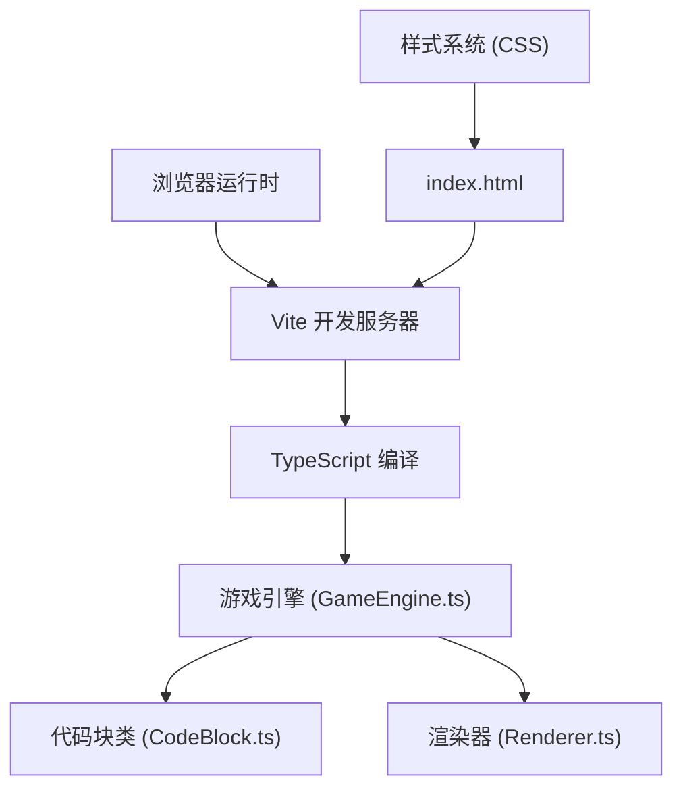
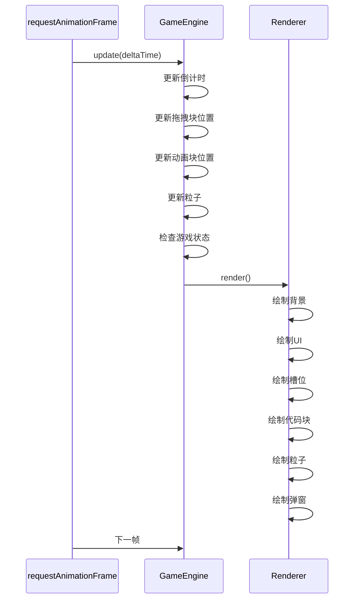

## 1. 架构设计



## 2. 技术描述

- **前端框架**：原生 TypeScript + HTML5 Canvas
- **构建工具**：Vite 5.x
- **编程语言**：TypeScript 5.x（严格模式，ESModule）
- **渲染技术**：Canvas 2D API + requestAnimationFrame
- **样式方案**：原生 CSS3，CSS 变量管理主题
- **性能要求**：稳定 30FPS 以上

## 3. 项目结构

```
auto72/
├── package.json          # 依赖配置与脚本
├── vite.config.js        # Vite 配置
├── tsconfig.json         # TypeScript 配置
├── index.html            # 入口 HTML
└── src/
    ├── main.ts           # 应用入口
    ├── GameEngine.ts     # 游戏主循环与逻辑
    ├── CodeBlock.ts      # 代码块类
    ├── Renderer.ts       # 渲染器
    └── types.ts          # 类型定义（可选）
```

## 4. 核心类设计

### 4.1 CodeBlock.ts

```typescript
class CodeBlock {
  id: string;
  text: string;           // 代码文本
  type: BlockType;        // 语法类型：keyword/identifier/symbol/string
  color: string;          // 块颜色
  x: number;              // 当前位置X
  y: number;              // 当前位置Y
  width: number;          // 宽度
  height: number;         // 高度（固定60px）
  isDragging: boolean;    // 是否被拖拽
  originalX: number;      // 原始位置X（用于归位）
  originalY: number;      // 原始位置Y
  slotIndex: number | null; // 所在槽位索引
  animating: boolean;     // 是否在动画中
  animationProgress: number; // 动画进度 0-1
  animationType: 'snap' | 'return' | 'bounce' | null;
  animationStartX: number;
  animationStartY: number;
  animationTargetX: number;
  animationTargetY: number;
  animationStartTime: number;
  animationDuration: number;
}

type BlockType = 'keyword' | 'identifier' | 'symbol' | 'string';
```

### 4.2 GameEngine.ts

```typescript
class GameEngine {
  currentLevel: number;        // 当前关卡 1-5
  timeRemaining: number;       // 剩余时间（秒）
  countdownStartTime: number;  // 倒计时开始时间戳
  isCountdownActive: boolean;
  slots: Slot[];               // 槽位数组
  blocks: CodeBlock[];         // 代码块数组
  draggedBlock: CodeBlock | null; // 当前拖拽的块
  dragOffsetX: number;         // 拖拽偏移量
  dragOffsetY: number;
  particles: Particle[];       // 粒子数组
  gameState: 'playing' | 'success' | 'failed';
  shakeStartTime: number;      // 晃动开始时间
  isShaking: boolean;
  successTime: number;         // 成功时间（用于延迟弹窗）
  showSuccessModal: boolean;
  onLevelComplete: () => void;
  onGameComplete: () => void;

  init(): void;               // 初始化游戏
  startLevel(level: number): void; // 开始关卡
  update(deltaTime: number): void; // 游戏循环更新
  handleMouseDown(x: number, y: number): void;
  handleMouseMove(x: number, y: number): void;
  handleMouseUp(x: number, y: number): void;
  runTest(): boolean;         // 运行测试验证
  resetLevel(): void;         // 重置当前关卡
  checkCompletion(): boolean; // 检查是否完成
  triggerSuccess(): void;     // 触发成功动画
  triggerFailure(): void;     // 触发失败动画
  spawnParticles(x: number, y: number): void; // 生成粒子
}

interface Slot {
  x: number;
  y: number;
  width: number;
  height: number;
  block: CodeBlock | null;
  isCorrect: boolean;
  pulsePhase: number;
  glowIntensity: number;
}

interface Particle {
  x: number;
  y: number;
  vx: number;
  vy: number;
  color: string;
  size: number;
  life: number;
  maxLife: number;
}
```

### 4.3 Renderer.ts

```typescript
class Renderer {
  canvas: HTMLCanvasElement;
  ctx: CanvasRenderingContext2D;
  engine: GameEngine;

  render(): void;            // 渲染主方法
  drawBackground(): void;    // 绘制渐变背景
  drawUI(): void;            // 绘制UI层（关卡信息、进度条等）
  drawBlockPool(): void;     // 绘制代码块池背景
  drawSlots(): void;         // 绘制槽位
  drawBlocks(): void;        // 绘制代码块
  drawParticles(): void;     // 绘制粒子
  drawSuccessModal(): void;  // 绘制成功弹窗
  applyShakeEffect(): void;  // 应用晃动效果
  drawRippleButton(button: Button): void; // 绘制水波纹按钮
}

interface Button {
  x: number;
  y: number;
  width: number;
  height: number;
  text: string;
  color: string;
  hoverColor: string;
  rippleEffects: Ripple[];
}

interface Ripple {
  x: number;
  y: number;
  startTime: number;
  duration: number;
}
```

## 5. 关卡配置数据

```typescript
const LEVELS = [
  {
    id: 1,
    slotCount: 4,
    functionCode: "function hello() { return 'hello'; }",
    blocks: [
      { text: 'function', type: 'keyword' },
      { text: 'hello', type: 'identifier' },
      { text: '()', type: 'symbol' },
      { text: '{', type: 'symbol' },
      { text: 'return', type: 'keyword' },
      { text: "'hello'", type: 'string' },
      { text: ';', type: 'symbol' },
      { text: '}', type: 'symbol' }
    ],
    correctOrder: [0, 1, 2, 3, 4, 5, 6, 7] // 正确的块索引顺序
  },
  // 第2-5关类似配置，槽位数分别为6,8,10,12
];

const BLOCK_COLORS = {
  keyword: '#9B59B6',
  identifier: '#3498DB',
  symbol: '#E67E22',
  string: '#2ECC71'
};
```

## 6. 动画系统设计

### 6.1 游戏循环时序



### 6.2 动画缓动函数

```typescript
// 弹性缓动（用于吸附动画）
function elasticOut(t: number): number {
  return Math.sin(-13 * (t + 1) * Math.PI / 2) * Math.pow(2, -10 * t) + 1;
}

// 标准缓出（用于归位动画）
function easeOutQuad(t: number): number {
  return t * (2 - t);
}

// 线性
function linear(t: number): number {
  return t;
}
```

## 7. 性能优化策略

1. **requestAnimationFrame** 驱动所有动画
2. **Canvas 脏矩形渲染**：仅重绘变化