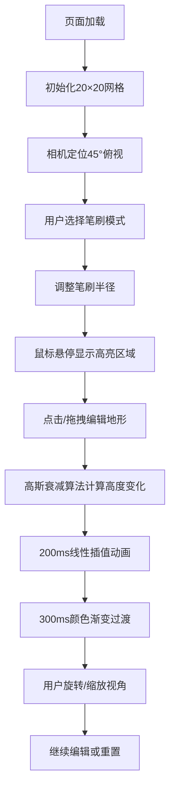

## 1. 产品概述
交互式3D地形编辑器是一款基于Web的三维地形创作工具，用户可以通过直观的笔刷操作在浏览器中塑造虚拟地形，类似简化版Minecraft地形生成器。
- 主要用途：快速可视化和创建三维地形模型，适用于游戏原型设计、地理教学演示、创意地形探索等场景
- 核心价值：提供零门槛、即时反馈的3D地形编辑体验，无需安装专业软件即可在浏览器中完成地形创作

## 2. 核心功能

### 2.1 用户角色
| 角色 | 注册方式 | 核心权限 |
|------|----------|----------|
| 普通用户 | 无需注册，直接访问 | 使用全部编辑功能、自由调整视角 |

### 2.2 功能模块
1. **3D场景视口**：20×20网格地形展示、实时渲染、视角控制
2. **工具栏系统**：抬升/凹陷笔刷切换、半径调节滑块、重置按钮
3. **地形编辑系统**：点击变形、高斯衰减算法、平滑过渡动画
4. **颜色映射系统**：根据海拔自动着色、平滑渐变过渡
5. **交互反馈**：笔刷悬停高亮、鼠标跟随指示器

### 2.3 页面详情
| 页面名称 | 模块名称 | 功能描述 |
|----------|----------|----------|
| 主编辑页 | 3D视口区域 | 展示20×20地形网格，支持鼠标右键旋转视角、滚轮缩放、阻尼平滑 |
| 主编辑页 | 左侧工具栏 | 抬升笔刷按钮、凹陷笔刷按钮、半径滑块（1-5格）、重置按钮 |
| 主编辑页 | 笔刷指示器 | 鼠标悬停时显示半透明蓝色圆形，半径与当前笔刷一致 |
| 主编辑页 | 实时反馈 | 点击后地形变形动画（200ms线性插值）、颜色渐变过渡（300ms） |

## 3. 核心流程
用户打开页面后，默认显示平整的20×20网格地形，相机呈45度俯视角度。用户选择笔刷类型（抬升或凹陷），调整笔刷半径，然后在地形上点击或拖拽进行编辑，每一次操作都会实时触发地形变形和颜色更新。用户可以通过右键拖拽旋转视角、滚轮缩放来观察编辑效果，需要时可点击重置按钮恢复初始状态。

## 4. 用户界面设计

### 4.1 设计风格
- **主色调**：深灰侧边栏（#2c3e50）+ 浅灰主区域（#ecf0f1）
- **地形配色**：海拔分段着色 - 深蓝(#1a3a5c)、浅蓝(#4a90d9)、绿色(#2ecc71)、棕色(#8b4513)、白色(#ecf0f1)
- **按钮风格**：圆角6px，悬停阴影效果，平滑过渡
- **字体**：使用系统无衬线字体，清晰易读
- **布局风格**：固定左侧边栏 + 自适应主视口区域，桌面端优先
- **视觉细节**：网格线半透明白色（不透明度0.15）、笔刷高亮半透明蓝色（不透明度0.3）

### 4.2 页面设计概述
| 页面名称 | 模块名称 | UI元素 |
|----------|----------|--------|
| 主编辑页 | 左侧工具栏 | 深灰背景、圆角按钮、滑块控件、清晰标签、悬停反馈动画 |
| 主编辑页 | 3D视口区域 | 浅灰背景、居中显示、自适应尺寸、响应窗口变化 |
| 主编辑页 | 笔刷指示器 | 半透明蓝色圆形、跟随鼠标、实时反映半径变化 |

### 4.3 响应式
- 桌面端优先设计，视口尺寸变化时3D场景自动填充可用区域
- 工具栏最小宽度240px，确保控件布局不拥挤
- 窗口resize事件监听，实时更新相机投影矩阵和渲染器尺寸

### 4.4 3D场景指导
- **环境与氛围**：简洁干净的专业工具风格，无多余装饰，专注地形本身
- **光照设置**：使用AmbientLight提供基础环境光，DirectionalLight模拟太阳光投射柔和阴影，突出地形起伏感
- **相机设置**：PerspectiveCamera，初始位置俯视45度，观察点位于网格中心
- **相机运动**：鼠标右键拖拽旋转（球坐标系统），滚轮控制距离，阻尼系数0.1实现平滑过渡
- **构图与焦点**：网格居中显示，占据视口主要区域，留出侧边栏空间
- **交互与动画**：变形动画使用线性插值200ms，颜色渐变300ms，笔刷高亮实时跟随
- **性能要求**：帧率稳定30FPS以上，网格更新仅修改顶点位置和颜色，避免重建几何体
