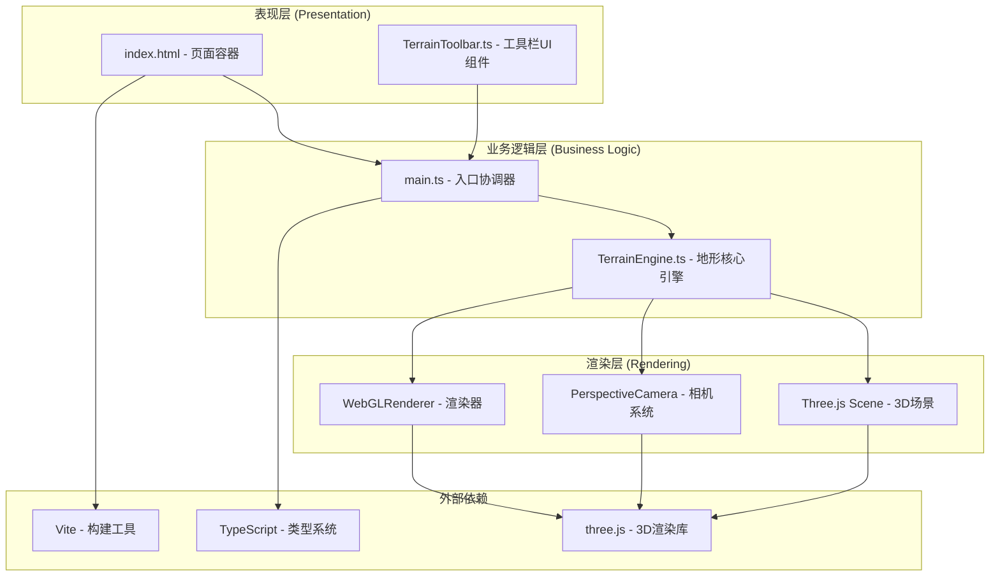

## 1. 架构设计

本项目为纯前端3D应用，采用分层架构设计，将UI交互、3D渲染引擎、业务逻辑清晰分离。



## 2. 技术描述
- **前端框架**：原生TypeScript（无UI框架），直接操作DOM，轻量高效
- **3D引擎**：Three.js（@types/three提供类型支持），用于WebGL渲染、网格几何体、材质、相机控制
- **构建工具**：Vite 5.x，提供快速开发服务器、TypeScript编译、HMR热更新
- **语言**：TypeScript 5.x，严格模式（strict: true），ESModule模块系统
- **样式**：原生CSS + 内联样式，无CSS预处理器
- **无后端**：纯前端应用，所有数据存储在浏览器内存中

## 3. 项目目录结构
```
auto74/
├── .trae/
│   └── documents/
│       ├── PRD.md
│       └── TECHNICAL_ARCHITECTURE.md
├── src/
│   ├── main.ts              # 应用入口，协调各模块初始化和交互
│   ├── TerrainEngine.ts     # 核心引擎：网格管理、变形算法、颜色映射
│   └── TerrainToolbar.ts    # 工具栏UI：笔刷切换、半径滑块、重置按钮
├── index.html               # 入口HTML，包含canvas容器和侧边栏
├── package.json             # 依赖声明和启动脚本
├── vite.config.js           # Vite基础配置
└── tsconfig.json            # TypeScript严格模式配置
```

## 4. 核心模块设计

### 4.1 TerrainEngine.ts - 地形核心引擎
**职责**：管理Three.js场景生命周期、地形几何体创建和更新、海拔变形算法、颜色映射逻辑、相机控制、射线拾取。

**核心类型定义**：
```typescript
export type BrushMode = 'raise' | 'lower';

export interface BrushSettings {
  mode: BrushMode;
  radius: number; // 1-5格，默认2
}

export interface HeightAnimation {
  targetY: number;
  startY: number;
  startTime: number;
  duration: number;
}

export interface ColorAnimation {
  targetColor: THREE.Color;
  startColor: THREE.Color;
  startTime: number;
  duration: number;
}
```

**关键方法**：
| 方法名 | 参数 | 返回值 | 说明 |
|--------|------|--------|------|
| `constructor(container: HTMLElement)` | DOM容器 | 实例 | 初始化场景、相机、光照、地形网格 |
| `setBrushMode(mode: BrushMode)` | 笔刷模式 | void | 设置当前笔刷类型 |
| `setBrushRadius(radius: number)` | 半径1-5 | void | 设置笔刷影响半径 |
| `resetTerrain()` | 无 | void | 重置所有顶点高度为0 |
| `dispose()` | 无 | void | 清理WebGL资源和事件监听 |

**内部算法**：
1. **高斯衰减**：`weight = exp(-(distance²) / (2 * σ²))`，其中σ = radius/2
2. **线性插值动画**：`progress = min(1, (now - startTime) / duration)`，`current = start + (target - start) * progress`
3. **海拔颜色映射**：分段函数，< -1深蓝，-1~0浅蓝，0~1绿色，1~2棕色，>2白色，段内线性插值

### 4.2 TerrainToolbar.ts - 工具栏UI组件
**职责**：创建侧边栏DOM元素，管理笔刷模式切换按钮状态、半径滑块值、重置按钮，暴露事件回调接口与引擎解耦。

**核心类型定义**：
```typescript
export interface ToolbarCallbacks {
  onBrushModeChange: (mode: BrushMode) => void;
  onRadiusChange: (radius: number) => void;
  onReset: () => void;
}
```

**关键方法**：
| 方法名 | 参数 | 返回值 | 说明 |
|--------|------|--------|------|
| `constructor(container: HTMLElement, callbacks: ToolbarCallbacks)` | 容器、回调 | 实例 | 创建工具栏DOM并绑定事件 |
| `setBrushMode(mode: BrushMode)` | 模式 | void | 外部同步按钮选中状态 |
| `setRadius(radius: number)` | 半径 | void | 外部同步滑块值 |
| `getRadius()` | 无 | number | 获取当前半径值 |
| `getBrushMode()` | 无 | BrushMode | 获取当前笔刷模式 |

### 4.3 main.ts - 入口协调器
**职责**：DOM就绪后初始化TerrainEngine和TerrainToolbar，建立两者间的事件连接，处理窗口resize事件。

## 5. 相机与交互系统

### 5.1 相机控制
- **类型**：THREE.PerspectiveCamera，fov=60，near=0.1，far=1000
- **初始位置**：球坐标转换，theta=45°（方位角），phi=45°（极角，从Y轴向下），距离=25
- **目标点**：网格中心点 (0, 0, 0)
- **旋转控制**：鼠标右键拖拽，修改theta和phi，限制phi范围(5°, 85°)避免翻转
- **缩放控制**：滚轮修改距离，限制范围(10, 60)
- **阻尼平滑**：目标值与当前值之间采用线性插值，阻尼系数0.1
- **每帧更新**：在requestAnimationFrame循环中根据目标值平滑过渡相机位置

### 5.2 射线拾取
- 使用THREE.Raycaster从相机发射射线
- 鼠标位置归一化到NDC坐标(-1, 1)范围
- 只与地形网格Mesh进行相交检测
- 取交点最近的三角形，计算其所在网格单元坐标(x, z)

## 6. 性能优化策略
- **几何体复用**：始终使用同一个BufferGeometry，仅更新position和color属性的needsUpdate标志
- **动画队列**：使用Map存储正在进行的高度和颜色动画，每帧批量处理，避免创建过多临时对象
- **相交检测优化**：只检测地形一个Mesh，不对辅助线和高亮指示器进行检测
- **事件节流**：鼠标移动事件进行帧同步处理，不做额外计算
- **TypedArray操作**：直接操作Float32Array进行顶点和颜色数据读写，避免对象创建开销

## 7. 数据模型

### 7.1 网格数据结构
- 网格尺寸：20×20单元，共21×21=441个顶点
- 顶点位置存储：Float32Array，长度=441×3=1323（每个顶点xyz）
- 三角形索引：每个单元2个三角形，共20×20×6=2400个索引
- 顶点颜色：Float32Array，长度=441×3=1323（每个顶点rgb）

### 7.2 坐标映射
- 网格单元索引 (gx, gz) 范围：gx∈[0,19], gz∈[0,19]
- 世界坐标转换：worldX = gx - 10, worldZ = gz - 10（居中）
- 顶点索引公式：vertexIndex = gz * 21 + gx（针对顶点网格21×21）
