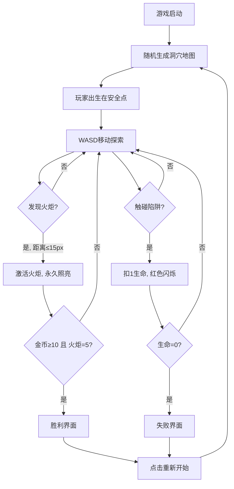

## 1. 产品概述

洞穴探险家是一款基于浏览器的2D生存探索游戏，使用TypeScript和Canvas技术构建。玩家在随机生成的地下洞穴中探索，通过动态光影系统体验沉浸式黑暗探索，激活远古火炬照亮未知区域，收集金币，同时躲避陷阱，最终完成洞穴探索。

- **核心问题**：传统洞穴类游戏缺乏即时动态光照和随机地形生成带来的沉浸感
- **目标用户**：喜欢探索类、生存类、洞穴探险类游戏的休闲玩家

## 2. 核心功能

### 2.1 功能模块

1. **游戏主界面**：全屏Canvas画布 + 半透明UI层，包含记分板、生命值显示
2. **洞穴地图系统**：120x120格随机生成洞穴，细胞自动机算法
3. **动态光照系统**：玩家光晕 + 火炬永久照明，径向渐变渲染
4. **交互系统**：火炬激活、金币收集、陷阱碰撞
5. **粒子特效系统**：火炬粒子、金币收集粒子、受击闪烁
6. **游戏状态管理**：进行中、胜利、失败状态切换

### 2.2 页面详情

| 页面名称 | 模块名称 | 功能描述 |
|----------|----------|----------|
| 游戏主界面 | Canvas画布 | 渲染洞穴地图、玩家、光照、粒子特效 |
| 游戏主界面 | 记分板UI | 左上角显示金币计数、火炬激活数、生命值 |
| 游戏主界面 | 胜利界面 | 全部火炬激活且金币≥10时弹出绿色蒙层提示 |
| 游戏主界面 | 失败界面 | 生命值归零时弹出红色蒙层提示 |

## 3. 核心流程

玩家进入游戏 → 随机生成洞穴地图 → 玩家出生在安全点 → WASD移动探索 → 玩家光晕照亮周围 → 发现并激活火炬(永久照明) → 收集金币 → 躲避陷阱 → (5火炬激活 + 10金币) → 胜利 / 生命归零 → 失败

## 4. 用户界面设计

### 4.1 设计风格

- **主色调**：深蓝色(#0A0A2E)作为洞穴底色，暖琥珀色(#FFB347)为光照主色
- **辅助色**：金黄色(火炬)、金色(金币)、红色(陷阱/生命)
- **UI风格**：半透明玻璃效果(rgba(20,20,50,0.8))，圆角8px，边缘微弱发光
- **字体**：白色敦实字体，标题32px，记分板14px
- **布局**：全屏Canvas + 浮动UI层
- **整体风格**：地下洞穴探险主题，深色暖色系搭配金色与红光点缀

### 4.2 页面设计概览

| 页面名称 | 模块名称 | UI元素 |
|----------|----------|--------|
| 游戏主界面 | Canvas画布 | 深蓝底色，动态光照径向渐变，岩石纹理填充 |
| 游戏主界面 | 记分板 | 半透明玻璃背景，白色字体，红色心形图标(16x16px) |
| 游戏主界面 | 胜利界面 | 绿色半透明蒙层，白色32px大字"洞穴探索完成！"，0.5秒淡入 |
| 游戏主界面 | 失败界面 | 深红色蒙层，白色大字"探索终止"，抖动动画 |

### 4.3 响应式

- 桌面优先设计，Canvas保持16:9比例
- 窗口缩小时自动缩放，最小800x600px
- 键盘WASD控制，无需触屏适配

### 4.4 动画过渡

- 火炬激活：照亮半径40px→120px，2秒easeOut曲线扩散
- 金币收集：0.3秒缩放至0 + 6道金色射线扩散
- 受击：屏幕边缘红色光晕(0.3不透明度，0.2秒)
- 胜利：0.5秒淡入
- 失败：抖动动画
