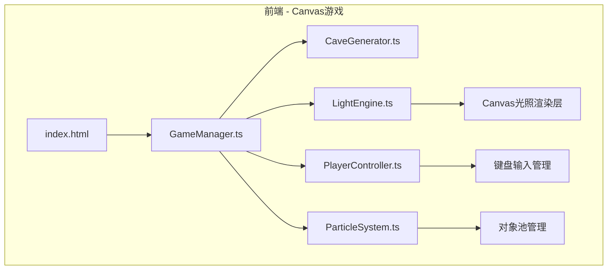

## 1. 架构设计



## 2. 技术说明

- **前端**：TypeScript + Canvas 2D + Vite
- **构建工具**：Vite
- **语言**：TypeScript (strict mode, ES2020, ESModule)
- **无后端**：纯前端单页应用
- **无数据库**：所有状态运行时管理

## 3. 文件结构

| 文件路径 | 用途 |
|----------|------|
| package.json | 项目依赖(vite, typescript)与启动脚本 |
| vite.config.js | Vite基础配置 |
| tsconfig.json | TypeScript严格模式配置 |
| index.html | 入口HTML，深色背景，Canvas容器+UI层 |
| src/CaveGenerator.ts | 细胞自动机洞穴地图生成 |
| src/LightEngine.ts | 动态光照系统与火炬管理 |
| src/PlayerController.ts | 玩家移动、碰撞、交互、生命管理 |
| src/ParticleSystem.ts | 粒子特效与对象池优化 |
| src/GameManager.ts | 游戏主循环、帧率管理、状态切换 |

## 4. 模块接口定义

### 4.1 CaveGenerator

```typescript
interface CaveMap {
  width: number;    // 120
  height: number;   // 120
  tileSize: number; // 16
  data: number[][]; // 0=通道, 1=墙壁
  rooms: { x: number; y: number; radius: number }[];
  spawnPoint: { x: number; y: number };
}

class CaveGenerator {
  generate(): CaveMap;
}
```

### 4.2 LightEngine

```typescript
interface Torch {
  x: number;
  y: number;
  activated: boolean;
  currentRadius: number;
  targetRadius: number;
  activateTime: number;
}

class LightEngine {
  update(playerX: number, playerY: number, deltaTime: number): void;
  render(ctx: CanvasRenderingContext2D): void;
  activateTorch(torch: Torch): void;
  getTorches(): Torch[];
}
```

### 4.3 PlayerController

```typescript
interface PlayerState {
  x: number;
  y: number;
  radius: number;
  health: number;
  coins: number;
  activatedTorches: number;
  isDead: boolean;
}

class PlayerController {
  update(keys: Set<string>, deltaTime: number): void;
  getState(): PlayerState;
  takeDamage(): void;
  collectCoin(): void;
}
```

### 4.4 ParticleSystem

```typescript
interface Particle {
  x: number;
  y: number;
  vx: number;
  vy: number;
  life: number;
  maxLife: number;
  color: string;
  size: number;
  active: boolean;
}

class ParticleSystem {
  update(deltaTime: number): void;
  render(ctx: CanvasRenderingContext2D): void;
  emitTorchParticles(x: number, y: number): void;
  emitCoinParticles(x: number, y: number): void;
}
```

### 4.5 GameManager

```typescript
type GameState = 'playing' | 'victory' | 'defeat';

class GameManager {
  init(): void;
  start(): void;
  restart(): void;
  getState(): GameState;
}
```

## 5. 渲染管线

每帧渲染顺序：
1. 清空画布(深蓝底色 #0A0A2E)
2. 渲染洞穴地图(仅光照覆盖区域显示墙壁纹理)
3. 渲染火炬光晕(径向渐变)
4. 渲染玩家光晕(径向渐变，暖琥珀色)
5. 渲染金币
6. 渲染陷阱
7. 渲染玩家
8. 渲染粒子特效
9. 渲染黑暗遮罩层(未照亮区域全黑)
10. 渲染UI层(记分板、生命值)
11. 渲染游戏状态界面(胜利/失败)

## 6. 性能优化策略

- 光照计算每帧更新，粒子效果每2帧更新一次(降采样)
- 粒子系统使用对象池，避免频繁GC
- Canvas离屏缓存岩石纹理图案，避免每帧重绘
- 只渲染视口内的可见区域(基于玩家位置裁剪)
- 帧率目标：稳定30FPS以上
