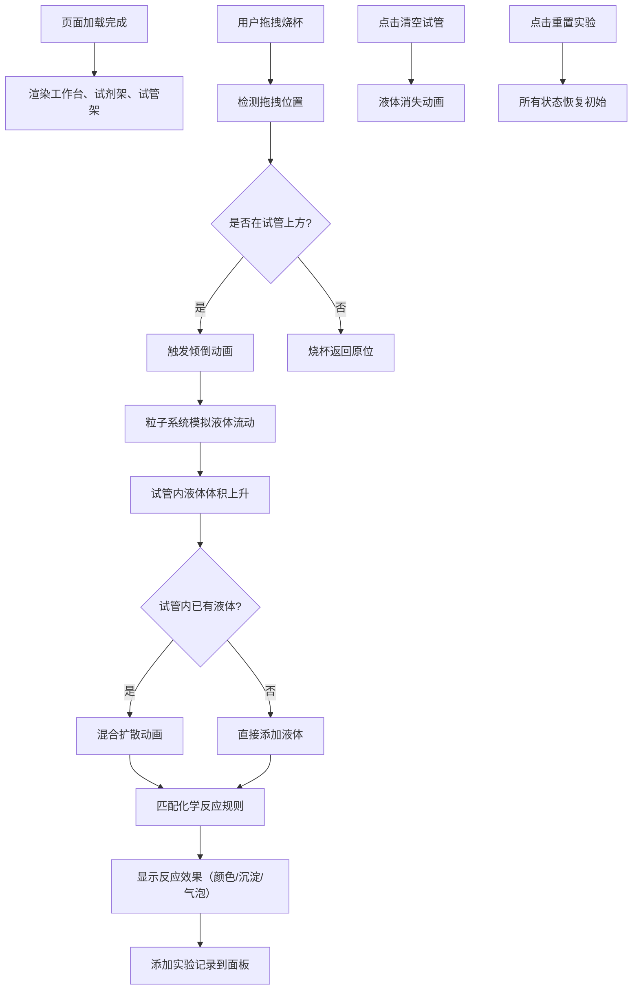

## 1. 产品概述

虚拟化学实验室是一款在浏览器中运行的交互式化学实验模拟应用，让用户能够以拖拽交互的方式进行虚拟化学实验，观察真实的化学反应效果。

- **核心目的**：提供安全、直观的化学实验体验，无需真实试剂和设备即可学习化学反应
- **目标用户**：学生、化学爱好者、教育工作者
- **市场价值**：降低化学实验门槛，减少安全风险，提供可重复的实验环境

## 2. 核心功能

### 2.1 用户角色
| 角色 | 注册方式 | 核心权限 |
|------|----------|----------|
| 访客用户 | 无需注册 | 完整使用所有实验功能 |

### 2.2 功能模块
1. **实验工作台**：试剂架、试管架、酒精灯、Canvas渲染区域
2. **拖拽交互系统**：烧杯拖拽、液体倾倒动画、目标检测
3. **化学反应引擎**：20组反应规则、颜色变化、沉淀生成、气泡效果
4. **粒子动画系统**：液体流动、混合扩散、沉淀颗粒、气泡上升
5. **实验记录面板**：时间线记录、自动滚动、最多10条记录
6. **工具控制系统**：清空试管、重置实验、加热功能

### 2.3 页面详情
| 页面名称 | 模块名称 | 功能描述 |
|----------|----------|----------|
| 实验主页面 | 试剂架模块 | 6个不同颜色的烧杯，半透明玻璃质感，带刻度和标签 |
| 实验主页面 | 试管架模块 | 3根固定试管，实时显示液体体积和反应效果 |
| 实验主页面 | 粒子渲染模块 | Canvas绘制液体倾倒、混合、沉淀、气泡动画 |
| 实验主页面 | 反应引擎模块 | 匹配反应规则，触发相应的视觉效果 |
| 实验主页面 | 记录面板模块 | 时间线形式展示实验操作和结果 |
| 实验主页面 | 工具条模块 | 清空试管、重置实验按钮 |

## 3. 核心流程

用户从试剂架拖拽烧杯到试管上方，松手后触发液体倾倒动画，液体流入试管后根据混合试剂匹配反应规则，显示相应的颜色变化、沉淀或气泡效果，同时在记录面板添加实验记录。

## 4. 用户界面设计

### 4.1 设计风格
- **主色调**：蓝灰色系 #37474F（主色）、#90A4AE（辅色）
- **背景色**：浅灰蓝色 #E8EAF6
- **高亮色**：试剂对应鲜艳颜色（红#FF5252、蓝#448AFF、绿#69F0AE、黄#FFD740、紫#E040FB、透明#B0BEC5）
- **设计风格**：扁平化设计搭配玻璃态质感（半透明背景+磨砂模糊backdrop-filter: blur(10px)）
- **圆角**：所有边缘圆角8px
- **阴影**：柔和投影 offset 0, blur 12px, rgba(0,0,0,0.15)
- **按钮动画**：点击缩放1.05，持续0.1秒
- **拖拽光标**：抓取状态（grab/grabbing）
- **过渡动画**：布局切换0.3秒 ease-in-out

### 4.2 页面设计概述
| 页面名称 | 模块名称 | UI元素 |
|----------|----------|--------|
| 实验主页面 | 试剂架 | 左侧垂直排列6个SVG烧杯，半透明玻璃渐变，刻度线，名称标签 |
| 实验主页面 | 实验区 | 右侧区域，中央试管架固定3根试管，底部酒精灯图标 |
| 实验主页面 | Canvas容器 | 全屏Canvas，覆盖所有动画区域，z-index: 0 |
| 实验主页面 | 记录面板 | 底部时间线布局，最多10条记录，自动滚动提示 |
| 实验主页面 | 工具条 | 顶部或底部，"清空试管"和"重置实验"按钮 |

### 4.3 响应式设计
- **桌面端（≥1280px）**：全宽展示，试剂架在左，实验区在右，水平布局
- **平板端（768px-1280px）**：上下布局，试剂架在上，实验区在下
- **移动端（<768px）**：单列滚动布局，所有元素垂直排列
- **字体缩放**：使用clamp()函数实现响应式字体
- **间距缩放**：使用CSS变量和calc()实现间距按比例调整
- **触控优化**：拖拽区域增大，按钮最小尺寸44x44px

### 4.4 动画效果规范
- **液体倾倒**：Canvas粒子系统，30-50个粒子，颜色与烧杯一致，下落速度150px/s
- **液体上升**：试管内液体体积动画，时长0.5秒
- **混合扩散**：波浪形边界交融，持续2秒
- **沉淀生成**：底部半透明颗粒聚积，直径2-4px，约50个
- **气泡上升**：圆形气泡，半径3-8px随机，上升速度60px/s，液面破裂散成小水珠
- **清空动画**：半透明水流动画，持续1秒
- **性能目标**：混合反应动画稳定30FPS，拖拽无卡顿
