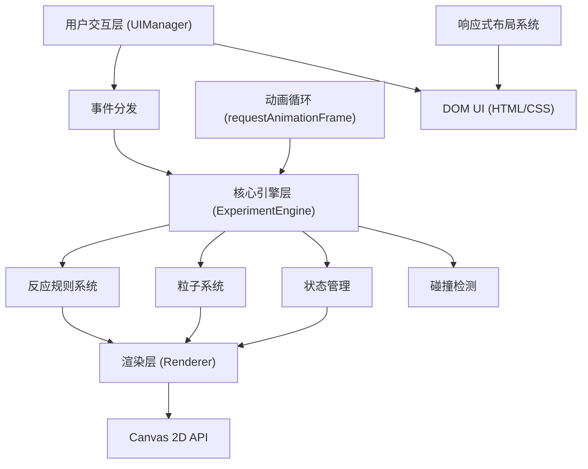

## 1. 架构设计

本项目采用纯前端架构，所有逻辑在浏览器端执行，使用Canvas进行高性能渲染，TypeScript确保类型安全。



## 2. 技术描述

- **前端框架**：原生TypeScript + Vite（无UI框架，保持轻量）
- **渲染技术**：Canvas 2D API（所有动画和效果使用Canvas绘制）
- **构建工具**：Vite 5.x
- **语言**：TypeScript 5.x（严格模式）
- **模块系统**：ESModule
- **样式方案**：原生CSS + CSS变量（玻璃态效果使用backdrop-filter）
- **动画方案**：requestAnimationFrame + 自定义时间线
- **状态管理**：ExperimentEngine内部状态机

**依赖清单（package.json）**：
- `vite` - 构建工具和开发服务器
- `typescript` - 类型系统
- `@types/node` - Node类型定义（可选，用于Vite配置）

## 3. 目录结构

```
auto79/
├── .trae/documents/
│   ├── PRD-虚拟化学实验室.md
│   └── 技术架构-虚拟化学实验室.md
├── package.json
├── vite.config.js
├── tsconfig.json
├── index.html
└── src/
    ├── ExperimentEngine.ts    # 核心引擎
    ├── UIManager.ts           # UI交互管理
    ├── renderer.ts            # Canvas渲染器
    └── main.ts                # 入口文件（可选，用于初始化）
```

## 4. 核心模块设计

### 4.1 ExperimentEngine.ts（核心引擎）
```typescript
// 主要职责：
// - 管理20组化学反应规则
// - 维护液体状态（颜色、体积、成分）
// - 粒子系统管理（倾倒、沉淀、气泡）
// - 动画循环控制
// - 碰撞检测（拖拽目标识别）
// - 接收UI事件并更新状态

// 核心类型定义：
interface Chemical {
  id: string;
  name: string;
  color: string;
  volume: number;
}

interface ReactionRule {
  reactants: [string, string];
  result: {
    color?: string;
    hasPrecipitate: boolean;
    precipitateColor?: string;
    hasBubbles: boolean;
    bubbleColor?: string;
    description: string;
  };
}

interface Particle {
  x: number;
  y: number;
  vx: number;
  vy: number;
  radius: number;
  color: string;
  alpha: number;
  life: number;
  type: 'liquid' | 'precipitate' | 'bubble' | 'splash';
}

interface TestTube {
  id: number;
  x: number;
  y: number;
  width: number;
  height: number;
  liquids: Chemical[];
  currentColor: string;
  volume: number;
  maxVolume: number;
  precipitateParticles: Particle[];
  bubbleParticles: Particle[];
  isHeating: boolean;
}

interface Beaker {
  id: string;
  name: string;
  chemicalId: string;
  color: string;
  x: number;
  y: number;
  width: number;
  height: number;
  volume: number;
  maxVolume: number;
  isDragging: boolean;
  dragOffsetX: number;
  dragOffsetY: number;
}
```

### 4.2 UIManager.ts（UI交互管理）
```typescript
// 主要职责：
// - 处理烧杯拖拽事件（mousedown/mousemove/mouseup, touchstart/touchmove/touchend）
// - 处理按钮点击事件（清空试管、重置实验、加热）
// - 响应式布局适配（监听resize事件）
// - 实验记录面板更新
// - 将用户操作转化为事件传递给ExperimentEngine

// 核心方法：
// - initDragAndDrop(): 初始化拖拽系统
// - initButtons(): 初始化按钮事件
// - initResponsiveLayout(): 响应式布局
// - updateRecordPanel(): 更新记录面板
// - emitEvent(type, payload): 向引擎发送事件
```

### 4.3 renderer.ts（Canvas渲染器）
```typescript
// 主要职责：
// - 接收ExperimentEngine的状态数据
// - 绘制烧杯（半透明玻璃质感SVG/Canvas）
// - 绘制试管（玻璃质感、液体、刻度）
// - 绘制粒子动画（倾倒、混合、沉淀、气泡）
// - 绘制试管架和酒精灯

// 核心方法：
// - render(): 主渲染入口
// - drawBeaker(beaker): 绘制单个烧杯
// - drawTestTube(tube): 绘制单个试管
// - drawLiquidParticles(particles): 绘制液体粒子
// - drawPrecipitate(particles): 绘制沉淀
// - drawBubbles(particles): 绘制气泡
// - drawMixingEffect(tube, progress): 绘制混合扩散效果
// - drawTestTubeRack(): 绘制试管架
// - drawAlcoholLamp(isHeating): 绘制酒精灯
```

### 4.4 main.ts（入口文件）
```typescript
// 主要职责：
// - 初始化ExperimentEngine
// - 初始化UIManager
// - 初始化Renderer
// - 建立三者之间的事件连接
// - 启动动画循环
```

## 5. 20组化学反应规则定义

| 编号 | 试剂1 | 试剂2 | 颜色变化 | 沉淀 | 气泡 | 描述 |
|------|-------|-------|----------|------|------|------|
| 1 | 盐酸 | 氢氧化钠 | 无色 | 无 | 无 | 中和反应，生成氯化钠和水 |
| 2 | 硫酸铜 | 氢氧化钠 | 蓝色 | 蓝色Cu(OH)₂ | 无 | 生成蓝色氢氧化铜沉淀 |
| 3 | 盐酸 | 碳酸钠 | 无色 | 无 | CO₂ | 产生二氧化碳气泡 |
| 4 | 酚酞 | 氢氧化钠 | 红色 | 无 | 无 | 酚酞遇碱变红 |
| 5 | 碘液 | 淀粉 | 蓝黑色 | 无 | 无 | 碘遇淀粉变蓝 |
| 6 | 氯化铁 | 氢氧化钠 | 黄褐色 | 红褐色Fe(OH)₃ | 无 | 生成红褐色氢氧化铁沉淀 |
| 7 | 盐酸 | 碳酸钙 | 无色 | 无 | CO₂ | 产生二氧化碳气泡 |
| 8 | 硫酸铜 | 铁 | 浅绿色 | 红色Cu | 无 | 置换反应，生成铜 |
| 9 | 过氧化氢 | 二氧化锰 | 无色 | 黑色MnO₂ | O₂ | 催化分解产生氧气 |
| 10 | 硝酸银 | 盐酸 | 无色 | 白色AgCl | 无 | 生成白色氯化银沉淀 |
| 11 | 氯化钡 | 硫酸 | 无色 | 白色BaSO₄ | 无 | 生成白色硫酸钡沉淀 |
| 12 | 氢氧化钙 | 碳酸钠 | 无色 | 白色CaCO₃ | 无 | 生成白色碳酸钙沉淀 |
| 13 | 硫酸 | 氢氧化钠 | 无色 | 无 | 无 | 中和反应 |
| 14 | 石蕊 | 盐酸 | 红色 | 无 | 无 | 石蕊遇酸变红 |
| 15 | 石蕊 | 氢氧化钠 | 蓝色 | 无 | 无 | 石蕊遇碱变蓝 |
| 16 | 醋酸 | 碳酸钠 | 无色 | 无 | CO₂ | 产生二氧化碳 |
| 17 | 碘化钾 | 氯水 | 棕色 | 无 | 无 | 置换出碘单质 |
| 18 | 高锰酸钾 | 草酸 | 褪色 | 无 | CO₂ | 氧化还原反应 |
| 19 | 硫酸铜 | 氨水 | 深蓝色 | 无 | 无 | 生成铜氨络离子 |
| 20 | 蒸馏水 | 任何 | 稀释 | 无 | 无 | 稀释作用 |

## 6. 性能优化策略

1. **Canvas分层**：静态元素（烧杯、试管架）和动态元素（粒子、液体）分层绘制
2. **粒子池化**：粒子对象复用，避免频繁GC
3. **脏矩形渲染**：只重绘变化区域
4. **帧率控制**：动画循环使用requestAnimationFrame，目标30FPS
5. **节流防抖**：resize和mousemove事件使用节流
6. **离屏Canvas**：复杂玻璃质感预渲染到离屏Canvas

## 7. 关键算法

1. **液体混合颜色算法**：基于体积加权平均的RGB颜色混合
2. **波浪边界算法**：正弦函数叠加生成不规则波浪边界
3. **粒子物理**：简单欧拉积分，重力和阻力模拟
4. **碰撞检测**：AABB包围盒检测拖拽目标
