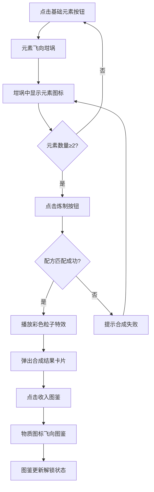

## 1. 产品概述

虚拟炼金术工坊是一款浏览器端的探索类休闲游戏，玩家扮演中世纪炼金术师，通过采集和组合四种基础元素（土、风、火、水）来发现新物质，解锁炼金图鉴。

- 核心玩法：元素采集 → 坩埚组合 → 炼制合成 → 图鉴解锁，形成探索闭环
- 目标用户：喜欢休闲益智、探索收集类游戏的玩家
- 产品价值：通过精美的粒子特效、音效反馈和中世纪美学营造沉浸式炼金体验

## 2. 核心功能

### 2.1 功能模块

1. **坩埚区域**：半圆形 SVG 坩埚，底部火焰动画，显示已添加的元素图标
2. **材料架**：四种基础元素按钮，各具独特视觉样式和动画
3. **炼制系统**：配方匹配判断，合成成功/失败反馈
4. **粒子特效**：Canvas 粒子系统，火焰动画和合成成功特效
5. **炼金图鉴**：12 种物质收集展示，已解锁/未解锁状态，配方提示

### 2.2 页面详情

| 页面名称 | 模块名称 | 功能描述 |
|-----------|-------------|---------------------|
| 主游戏页面 | 坩埚区域 | SVG 坩埚、三层渐变火焰动画、已添加元素展示 |
| 主游戏页面 | 材料架 | 四种基础元素按钮（土/风/火/水），点击触发抓取动画 |
| 主游戏页面 | 炼制按钮 | 铜质复古风格，悬停旋转，触发合成判断 |
| 主游戏页面 | 结果卡片 | 毛玻璃效果，展示合成结果，收入图鉴动画 |
| 主游戏页面 | 图鉴面板 | 深色半透明，已解锁/未解锁展示，悬停显示配方 |

## 3. 核心流程

玩家点击材料架上的基础元素 → 元素飞向坩埚并显示在坩埚中 → 放入 2-3 种元素后点击炼制按钮 → 系统匹配配方 → 成功则播放粒子特效并弹出结果卡片 → 点击"收入图鉴"后物质图标飞向图鉴栏 → 图鉴更新显示已解锁物质

## 4. 用户界面设计

### 4.1 设计风格

- **主色调**：暖色调，以木材褐色（#8B4513）和琥珀金色（#FFD700）为主
- **辅助色**：土褐色、风淡蓝、火红橙、水深蓝四种元素主题色
- **按钮风格**：圆形复古铜质按钮，带齿轮纹理和金属质感
- **字体**：衬线字体（Georgia/serif）营造中世纪古典感
- **布局风格**：深色木纹背景，左右分栏（工坊 + 图鉴），响应式适配
- **图标风格**：自定义 SVG 图标，每种物质独特造型

### 4.2 页面设计概述

| 页面名称 | 模块名称 | UI 元素 |
|-----------|-------------|-------------|
| 主游戏页面 | 坩埚区域 | 半圆形 SVG 坩埚，三层渐变火焰动画（白→橙→红），元素小图标 |
| 主游戏页面 | 材料架 | 垂直排列四按钮：土（褐色颗粒虚线边框）、风（淡蓝飘动箭头）、火（红橙脉冲光晕）、水（深蓝波纹） |
| 主游戏页面 | 炼制按钮 | 铜质圆形，齿轮纹理，悬停旋转10°，平滑过渡 |
| 主游戏页面 | 结果卡片 | 毛玻璃 rgba(255,215,0,0.15)，圆角16px，金色边框，阴影 |
| 主游戏页面 | 图鉴面板 | 宽320px，深色半透明 rgba(0,0,0,0.6)，金色装饰标题，已解锁彩色/未解锁灰色问号 |

### 4.3 响应式

- **1024px 以上**：工坊区域占左 70%，图鉴占右 30%
- **768px - 1023px**：图鉴折叠为可展开侧边抽屉
- **768px 以下**：工坊和图鉴上下排列

### 4.4 动画与特效

- 火焰动画：三层渐变 CSS 关键帧，高度 60px-100px 循环，周期 0.8s
- 元素抓取：点击后元素图标飞向坩埚，持续 0.5s
- 合成成功：Canvas 100 个彩色粒子（8-20px），速度 0.5-2 像素/帧，1.5s 淡出
- 收入图鉴：物质图标旋转飞向图鉴栏并归位
- 全局过渡：所有按钮/卡片悬停 transform 0.3s ease-out
- 性能目标：粒子和火焰动画保持 60fps
