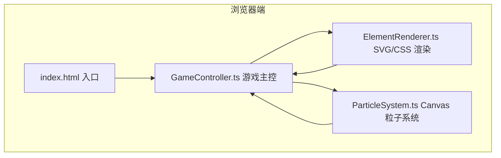

## 1. 架构设计



## 2. 技术描述

- **前端框架**：原生 TypeScript（无 UI 框架），使用 ESModule
- **构建工具**：Vite 5.x
- **渲染技术**：
  - UI 元素：SVG + CSS3（坩埚、元素按钮、图鉴、卡片）
  - 粒子特效：Canvas 2D API
  - 动画：CSS Keyframes + requestAnimationFrame
- **状态管理**：GameController 单例模式管理全局状态
- **无后端**：纯前端静态应用，数据存储于内存

## 3. 文件结构

| 文件路径 | 用途 |
|----------|------|
| `package.json` | 项目依赖：vite, typescript；启动脚本 npm run dev |
| `vite.config.js` | Vite 基础配置 |
| `tsconfig.json` | TypeScript 严格模式，ESModule |
| `index.html` | 入口 HTML，深色背景，全屏容器 |
| `src/GameController.ts` | 游戏主控：配方表、元素添加、炼制判断、图鉴解锁 |
| `src/ParticleSystem.ts` | Canvas 粒子系统：合成成功粒子特效、火焰动画更新 |
| `src/ElementRenderer.ts` | 渲染层：坩埚、元素按钮、图鉴面板等 SVG/CSS 交互元素 |

## 4. 数据模型

### 4.1 元素/物质定义

```typescript
interface Substance {
  id: string;          // 唯一标识，如 'earth', 'mud'
  name: string;        // 中文名称，如 '土', '泥浆'
  color: string;       // 主题色
  isBasic: boolean;    // 是否为基础元素
  icon: string;        // SVG 图标字符串
}
```

### 4.2 配方定义

```typescript
interface Recipe {
  ingredients: string[];  // 原料物质 id 数组（有序匹配）
  result: string;         // 合成结果物质 id
  description: string;    // 配方描述，如 '土+水=泥浆'
}
```

### 4.3 游戏状态

```typescript
interface GameState {
  crucibleElements: string[];  // 坩埚中已添加的元素 id
  unlockedSubstances: Set<string>;  // 已解锁物质 id 集合
  isAnimating: boolean;        // 是否正在播放动画
}
```

## 5. 配方表（12 种物质）

**基础元素（4 种）**：土(earth)、风(wind)、火(fire)、水(water)

**合成物质（8 种）**：
| 配方 | 结果 |
|------|------|
| 土 + 水 | 泥浆(mud) |
| 泥浆 + 火 | 陶器(pottery) |
| 陶器 + 风 | 风铃(windbell) |
| 火 + 水 | 蒸汽(steam) |
| 风 + 火 | 火焰(flame) |
| 土 + 火 | 熔岩(lava) |
| 熔岩 + 水 | 黑曜石(obsidian) |
| 蒸汽 + 风 | 云朵(cloud) |
