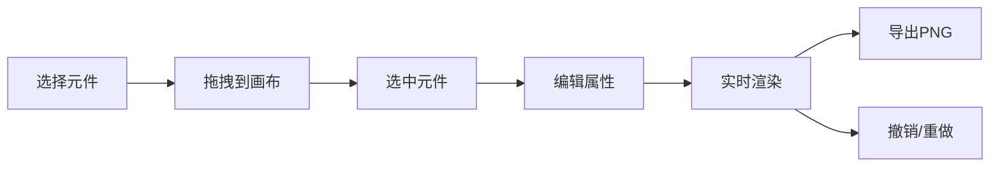

## 1. 产品概述

交互式图表编辑器是一款基于 Canvas 的可视化图表制作工具，用户通过拖拽组件和配置属性即可生成自定义数据可视化图表。面向需要快速制作数据图表的设计师、数据分析师和开发人员。

产品价值：降低数据可视化门槛，通过所见即所得的方式快速生成高质量图表。

## 2. 核心特性

### 2.1 功能模块

1. **组件面板**：提供折线图、柱状图、饼图、文本标签、矩形边框五种基础元件
2. **画布区域**：支持无限缩放和平移的 Canvas 绘图区域
3. **属性面板**：动态显示选中元件的可编辑属性
4. **工具栏**：撤销、重做、删除、导出PNG、清空画布

### 2.2 页面详情

| 页面名称 | 模块名称 | 功能描述 |
|---------|---------|----------|
| 编辑器主页 | 左侧组件面板 | 5种可拖拽图表元件，卡片式展示，hover上浮效果 |
| 编辑器主页 | 中部画布区域 | Canvas绘图，拖拽放置，滚轮缩放，中键平移 |
| 编辑器主页 | 右侧属性面板 | 位置/尺寸/颜色/透明度/数据源编辑 |
| 编辑器主页 | 顶部工具栏 | 撤销/重做/删除/导出PNG/清空，带二次确认 |

## 3. 核心流程

用户从左侧组件面板拖拽元件到画布 → 选中元件后在右侧属性面板编辑属性 → 数据实时更新渲染 → 可撤销/重做操作 → 最终导出为 PNG 图片

## 4. 用户界面设计

### 4.1 设计风格

- **主题**：深色主题，科技感数据可视化风格
- **主背景色**：#1a1a2e
- **左侧面板**：#16213e，宽度240px
- **右侧面板**：#0f3460，宽度280px
- **画布背景**：浅灰网格纸风格 #e8e8e8，2px间距网格线
- **组件卡片**：圆角8px，hover上浮3px，阴影rgba(0,0,0,0.3)
- **颜色选择器**：紧凑圆形色块，直径24px
- **过渡动画**：200ms ease-in-out

### 4.2 页面设计概览

| 页面名称 | 模块名称 | UI元素 |
|---------|---------|-------|
| 编辑器主页 | 组件面板 | 卡片式元件列表，拖拽预览，hover动效 |
| 编辑器主页 | 画布区域 | 网格背景，缩放平移，选中高亮，拖放定位 |
| 编辑器主页 | 属性面板 | 动态表单，颜色选择器，滑块，JSON编辑器 |
| 编辑器主页 | 工具栏 | 5个功能按钮，hover/click反馈 |

### 4.3 响应式

- 桌面端优先设计
- 768px以下宽度时，组件面板和属性面板收起为侧边栏
- 点击图标展开侧边栏
- 触控优化支持

### 4.4 动画效果

- 折线图：数据点沿X轴逐个出现，间隔100ms，支持平滑曲线
- 柱状图：从底部上升动画，每根柱子200ms
- 饼图：从12点钟方向顺时针旋转展开，持续500ms
- 所有过渡：200ms ease-in-out
