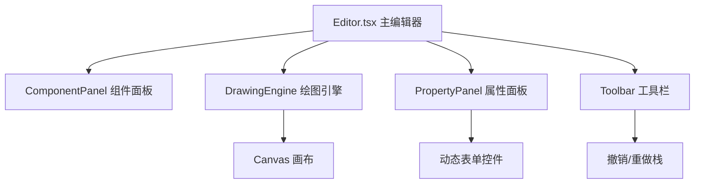

## 1. 架构设计



## 2. 技术描述

- **前端框架**：React 18 + TypeScript
- **构建工具**：Vite 5 + @vitejs/plugin-react
- **状态管理**：React useState/useReducer（撤销重做）
- **绘图引擎**：原生 Canvas 2D API
- **样式方案**：纯 CSS + CSS Variables
- **图标库**：lucide-react

## 3. 核心模块说明

### 3.1 DrawingEngine (Canvas 绘图引擎

职责：
- 管理 Canvas 上下文和动画帧循环 (requestAnimationFrame)
- 处理缩放和平移变换矩阵
- 绘制所有图表元件
- 处理拖拽交互（元件选中、移动
- 性能优化（帧率控制）

### 3.2 Editor.tsx (主编辑器组件)

职责：
- 管理全局状态（元件列表、选中元件、撤销重做栈
- 布局管理（三栏布局、可拖拽分隔线）
- 响应式布局切换

### 3.3 PropertyPanel.tsx (属性面板)

职责：
- 根据元件类型动态渲染属性表单
- 颜色选择器、滑块、JSON编辑器
- 实时更新元件属性

## 4. 数据模型

### 4.1 元件类型定义

```typescript
type ElementType = 'line' | 'bar' | 'pie' | 'text' | 'rect';

interface BaseElement {
  id: string;
  type: ElementType;
  x: number;
  y: number;
  width: number;
  height: number;
  color: string;
  opacity: number;
}

interface ChartElement extends BaseElement {
  data: { label: string; value: number }[];
}

interface TextElement extends BaseElement {
  text: string;
  fontSize: number;
}

interface RectElement extends BaseElement {
  borderWidth: number;
}
```

## 5. 文件结构

```
src/
├── main.tsx              # 应用入口
├── Editor.tsx            # 主编辑器组件
├── canvas/
│   └── DrawingEngine.ts # Canvas 绘图引擎
├── components/
│   ├── PropertyPanel.tsx   # 属性面板
│   ├── ComponentPanel.tsx  # 组件面板
│   └── Toolbar.tsx         # 工具栏
├── types/
│   └── index.ts          # 类型定义
└── utils/
    └── history.ts       # 撤销重做工具
```

## 6. 性能优化策略

1. **帧率控制**：
   - 50个元件以内：60fps
   - 超过80个元件：非选中元件降为15fps

2. **渲染优化**：
   - 使用 requestAnimationFrame 动画循环
   - 只在需要时重绘（脏标记机制）
   - 离屏 Canvas 缓存静态元素

3. **交互优化**：
   - 拖拽时只重绘受影响区域
   - 缩放平移使用 Canvas 变换矩阵

## 7. 动画实现

- **折线图**：数据点逐个出现，使用进度值控制绘制范围
- **柱状图**：高度从0到目标值插值动画
- **饼图**：起始角到结束角的扇形展开动画
- 所有动画使用 requestAnimationFrame + 时间插值
