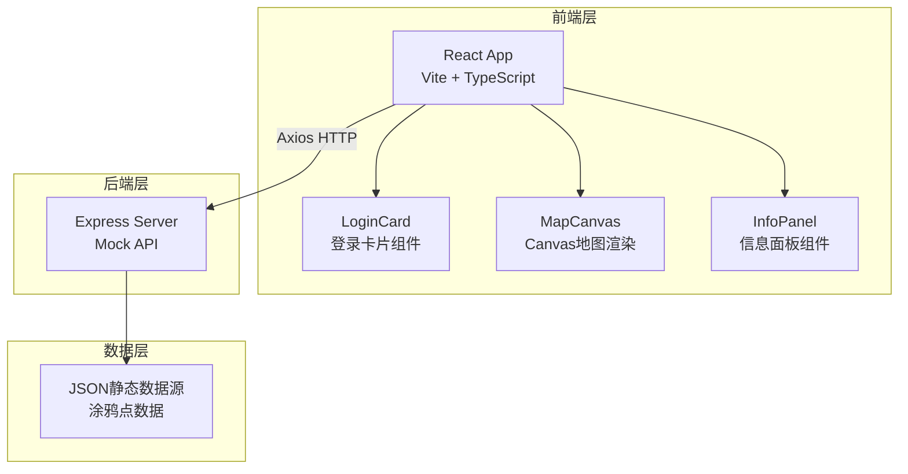
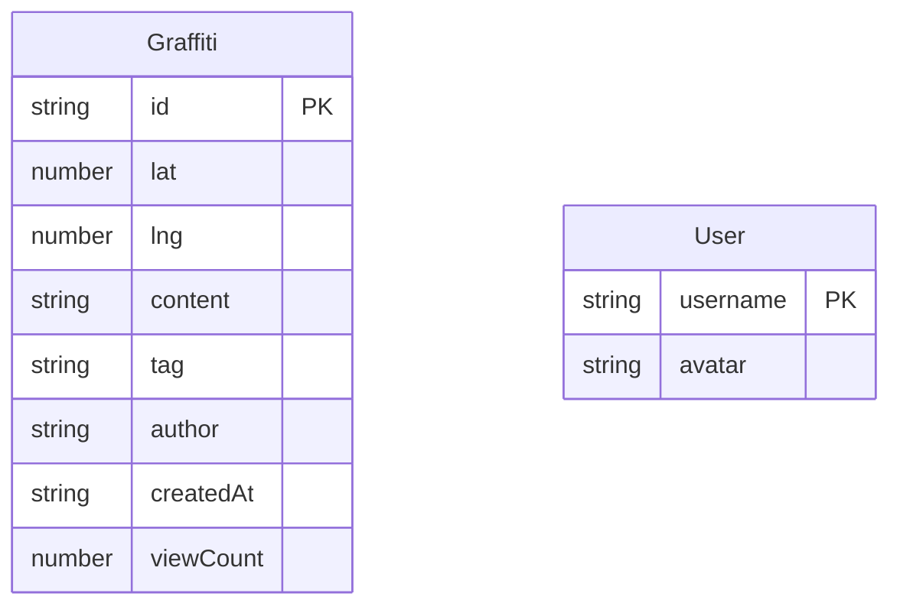

## 1. 架构设计



## 2. 技术说明

- 前端：React@18 + TypeScript + Vite + Tailwind CSS
- 初始化工具：vite-init（react-express-ts模板）
- 后端：Express@4（ESM + TypeScript）
- 数据库：JSON文件静态数据源（Mock数据）
- 状态管理：Zustand
- HTTP客户端：Axios

## 3. 路由定义

| 路由 | 用途 |
|------|------|
| /login | 登录页面 |
| /map | 地图主页（含画布和信息面板） |

## 4. API 定义

### 4.1 TypeScript 类型定义

```typescript
interface Graffiti {
  id: string;
  lat: number;
  lng: number;
  content: string;
  tag: '电影' | '美食' | '风景' | '音乐' | '运动';
  author: string;
  createdAt: string;
  viewCount: number;
}

interface User {
  username: string;
  avatar: string;
}
```

### 4.2 请求/响应模式

| 方法 | 路径 | 请求参数 | 响应数据 |
|------|------|----------|----------|
| GET | /api/graffiti | 无 | Graffiti[] |
| GET | /api/graffiti?tag=电影 | tag: string | Graffiti[] |
| POST | /api/login | {username, password} | {success, user} |

## 5. 服务端架构图

```mermaid
graph LR
    "Controller<br/>路由处理" --> "Service<br/>数据过滤" --> "Repository<br/>JSON文件读取"
```

## 6. 数据模型

### 6.1 数据模型定义



### 6.2 Mock数据说明

- 涂鸦点数据存储于 `src/data/db.ts`，生成20-30个涂鸦点
- 每个涂鸦点包含经纬度（模拟城市坐标范围）、内容、标签、作者、创建时间和浏览次数
- 标签分布：电影、美食、风景、音乐、运动五类
