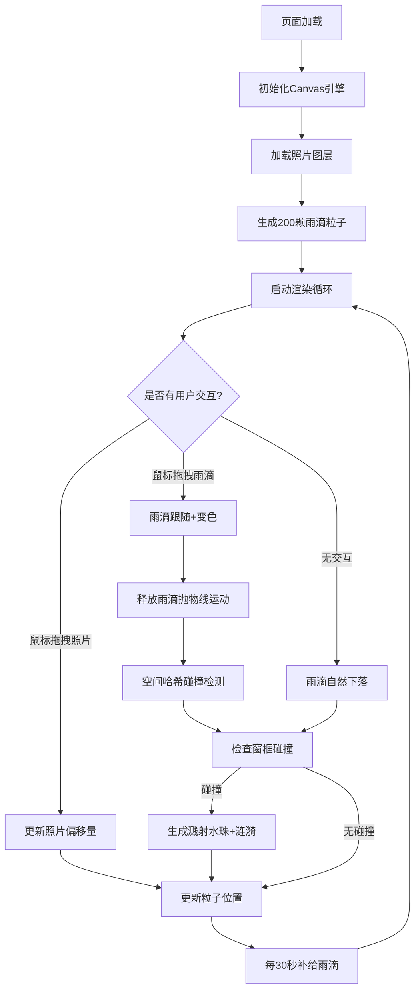

## 1. 产品概述
一款基于浏览器的交互式雨天窗景数字艺术品展示应用。独立摄影师可将雨天窗景照片转化为可交互的动态艺术作品，用户通过拖拽雨滴、观察水珠滑落和溅开效果，获得沉浸式的雨天视觉体验。

- 核心价值：将静态摄影作品转化为可交互的数字艺术品，增强观众参与感与沉浸体验
- 目标用户：独立摄影师、艺术爱好者、数字艺术收藏家

## 2. 核心功能

### 2.1 用户角色
无角色区分，所有用户享有相同权限。

### 2.2 功能模块
1. **画布渲染引擎**：Canvas初始化、尺寸适配、帧循环管理、图层叠加
2. **雨滴粒子系统**：物理模拟（重力、速度、碰撞检测）、粒子生命周期管理、拖影效果
3. **照片图层系统**：照片加载与缩放、透明度控制、鼠标拖拽移动、窗框碰撞区域
4. **交互系统**：雨滴拖拽、释放抛物线、弹性碰撞响应、溅射/涟漪动画
5. **控制面板**：雨量调节、重力强度、照片切换、重置功能

### 2.3 功能详情
| 模块名称 | 功能描述 |
|---------|---------|
| 照片图层 | 加载预设城市夜景照片（70%透明度），铺满画布，支持鼠标拖拽平移 |
| 雨滴渲染 | 初始200颗白色半透明细长椭圆雨滴，重力下落，带2帧残影拖影（15%透明度） |
| 雨滴拖拽 | 按住雨滴变亮蓝色(#00E5FF)跟随鼠标，释放后按释放速度做抛物线运动 |
| 弹性碰撞 | 拖拽释放的雨滴与周围雨滴发生等质量弹性碰撞（速度交换） |
| 窗框碰撞 | 雨滴撞击预设窗框矩形区域时碎裂为5-8个小水珠，飞散0.5秒消失，触发涟漪动画 |
| 涟漪效果 | 淡蓝色圆形涟漪，半径5→25px，透明度40%→0%，持续0.8秒 |
| 雨滴补给 | 每30秒自动补足至200颗，随机大小(4-8px长,1-3px宽)、白→浅灰颜色 |
| 控制面板 | 雨量滑块(0-500)、重力滑块(0.5-2.0x)、照片切换(3张淡入淡出)、重置按钮 |

## 3. 核心流程

## 4. 用户界面设计

### 4.1 设计风格
- **主色调**：深灰渐变背景(#1A1A2E → #16213E)，科技冷色系
- **强调色**：亮蓝(#00E5FF)、蓝青渐变(#00B4D8 → #90E0EF)、浅灰(#E0E0E0)
- **照片层**：70%透明度，暖色调夜景与冷色UI形成对比
- **控件样式**：半透明背景(rgba(0,0,0,0.4))、圆角8px、悬停亮度提升(rgba(255,255,255,0.15))
- **滑块轨道**：蓝→青线性渐变
- **动效**：照片切换0.5秒淡入淡出、雨滴入场0.5秒渐显、涟漪0.8秒扩散

### 4.2 页面设计
| 区域 | UI元素 |
|-----|--------|
| 全屏背景 | Canvas容器，深灰径向渐变，占满视口无滚动 |
| 画布层(下至上) | 渐变背景→模糊窗框轮廓→照片层→雨滴层→溅射层→涟漪层→控制面板 |
| 控制面板(右上角) | 宽180px，标题+雨量滑块+数值、重力滑块+倍数、照片切换按钮组、重置按钮 |
| 雨滴视觉 | 白色半透明细长椭圆，下落拖影，拖拽时亮蓝色高亮 |

### 4.3 响应式
- 桌面优先设计，Canvas自动适配窗口大小
- 监听window resize事件，重新计算画布尺寸和粒子分布
- 控制面板固定右上角，绝对定位不随缩放变形

### 4.4 性能约束
- 60FPS流畅运行目标
- 500颗雨滴时≥30FPS
- 空间哈希网格优化碰撞检测
- 局部重绘优化（脏矩形区域更新）
