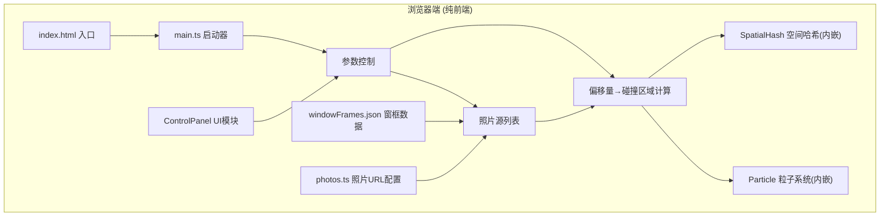

## 1. 架构设计

**数据流向：**
- 输入流：时间戳(requestAnimationFrame) → CanvasEngine.update() → 分发给PhotoLayer/RainRenderer
- 交互流：鼠标事件 → CanvasEngine捕获 → 分派给PhotoLayer(拖拽照片)或RainRenderer(拖拽雨滴)
- 输出流：各图层自绘 → CanvasEngine按z-index合成 → 输出到Canvas 2D上下文

## 2. 技术描述
- **前端框架**：无UI框架，原生TypeScript + Canvas 2D API
- **构建工具**：Vite@5 (ESModule, HMR)
- **语言标准**：TypeScript@5 严格模式，target ES2020
- **无后端**：所有逻辑本地运行，照片使用在线公开URL
- **性能优化**：
  - 空间哈希网格(Spatial Hash Grid)：碰撞检测O(n)复杂度
  - 脏矩形渲染：仅重绘粒子变化区域
  - 对象池模式：水珠/涟漪粒子复用避免GC

## 3. 文件结构与职责
```
project-root/
├── index.html                      # 入口HTML，全屏布局+控制面板DOM
├── package.json                    # vite/typescript依赖+dev脚本
├── vite.config.js                  # Vite基础配置
├── tsconfig.json                   # TS严格模式+ES2020+ESModule
├── public/
│   └── windowFrames.json           # 3张照片对应的窗框矩形坐标
└── src/
    ├── main.ts                     # 应用入口，实例化CanvasEngine+绑定事件
    ├── types.ts                    # 全局类型定义(Particle/Frame/Rect等)
    ├── photos.ts                   # 3张预设照片URL配置+窗框数据映射
    ├── CanvasEngine.ts             # 核心引擎：画布管理/帧循环/图层调度
    ├── PhotoLayer.ts               # 照片图层：加载/缩放/拖拽/碰撞区域
    ├── RainRenderer.ts             # 雨滴渲染器：物理+碰撞+溅射+涟漪
    └── ControlPanel.ts             # 控制面板：滑块/按钮的DOM交互逻辑
```
**调用关系：**
- main.ts → CanvasEngine (构造), ControlPanel (构造)
- CanvasEngine → PhotoLayer (update/render), RainRenderer (update/render)
- RainRenderer → PhotoLayer (getOffset(), getWindowFrames())
- ControlPanel → CanvasEngine (setRainCount, setGravityScale, reset, switchPhoto)

## 4. 类型定义
```typescript
export interface Particle {
  id: number;
  x: number; y: number;
  vx: number; vy: number;
  width: number; height: number;
  color: string;
  alpha: number;
  isDragging: boolean;
  isSplash: boolean;
  life: number; maxLife: number;
  prevPositions: {x:number;y:number}[]; // 拖影
}

export interface Ripple {
  x: number; y: number;
  radius: number; maxRadius: number;
  alpha: number;
  life: number; maxLife: number;
}

export interface WindowFrame {
  x: number; y: number; w: number; h: number;
}

export interface PhotoConfig {
  url: string;
  windowFrames: WindowFrame[];
}
```

## 5. 核心算法说明

### 5.1 空间哈希碰撞检测
- 网格单元尺寸 = 最大雨滴尺寸 × 2 (约16px)
- 每帧将粒子按坐标哈希到网格
- 仅检查相邻9个网格的粒子对，避免O(n²)
- 碰撞响应：等质量弹性碰撞，速度分量交换

### 5.2 雨滴物理模拟
- 重力：vy += GRAVITY × gravityScale × deltaTime
- 终端速度：vy 上限 15px/帧，模拟空气阻力
- 拖拽释放：记录最后5帧鼠标位移，计算释放速度 v = Δpos/Δt
- 抛物线：重力持续作用，水平速度衰减(0.995/帧)

### 5.3 溅射与涟漪
- 窗框碰撞判定：粒子矩形与任一WindowFrame矩形做AABB相交检测
- 溅射：生成5-8个Particle(isSplash=true)，随机角度，速度5-15px/帧，线性衰减alpha 1→0 over 0.5s
- 涟漪：Ripple实例，radius线性插值5→25，alpha 0.4→0 over 0.8s

### 5.4 拖影效果
- 每粒子维护prevPositions数组(长度2)
- 绘制时按历史位置叠加绘制，alpha分别为原alpha×0.15

## 6. 性能指标
| 指标 | 目标 | 实现策略 |
|------|------|---------|
| 200雨滴帧率 | 60FPS | 基础Canvas绘制 |
| 500雨滴帧率 | ≥30FPS | 空间哈希+对象池+减少alpha混合 |
| 拖拽响应延迟 | <16ms | 事件直接映射，不进队列 |
| 内存占用 | <50MB | 粒子总数上限，对象复用 |
