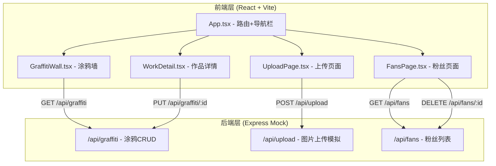
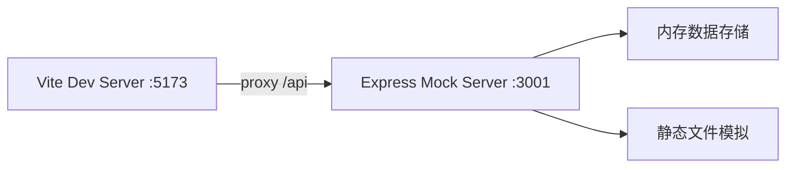
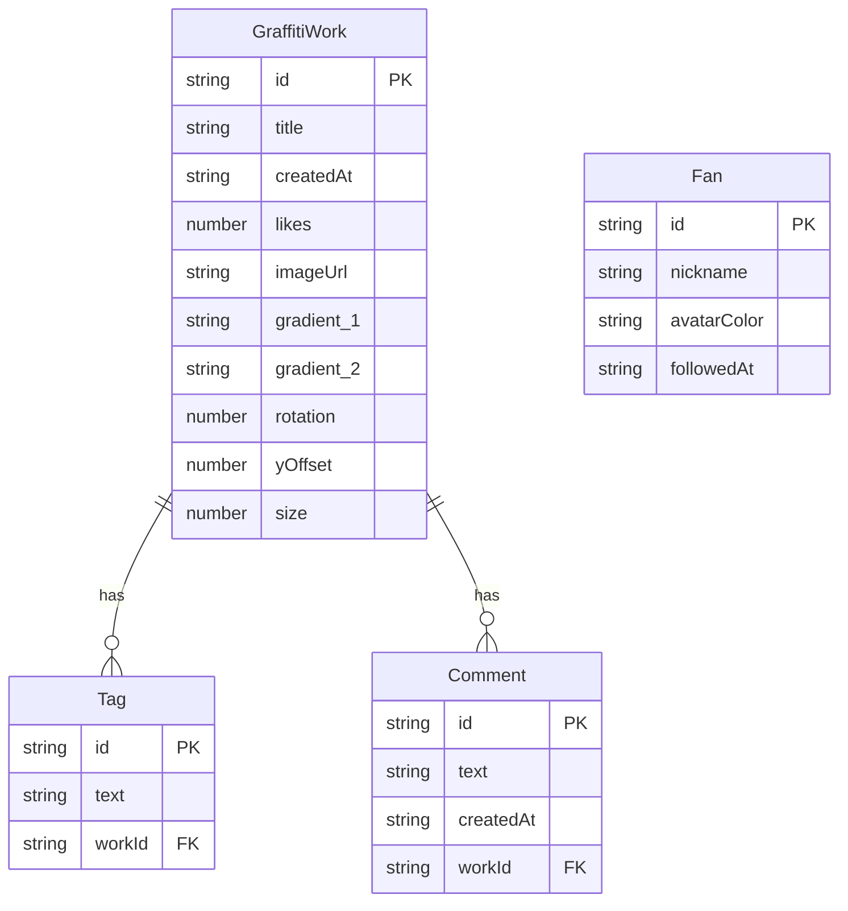

## 1. 架构设计



## 2. 技术说明

- **前端**：React@18 + TypeScript + Vite
- **样式方案**：CSS Modules + CSS变量（主题色管理）
- **路由**：react-router-dom@6
- **HTTP客户端**：axios
- **后端**：Express@4（Mock服务器，模拟数据，无数据库）
- **ID生成**：uuid
- **启动工具**：Vite dev server（端口5173）+ Express mock server（端口3001）
- **代理**：Vite proxy将/api请求转发到localhost:3001

## 3. 路由定义

| 路由 | 用途 |
|------|------|
| / | 涂鸦墙主视图 |
| /detail/:id | 作品详情视图 |
| /upload | 上传新作页面 |
| /fans | 我的粉丝页面 |

## 4. API定义

### 4.1 TypeScript类型定义

```typescript
interface GraffitiWork {
  id: string;
  title: string;
  createdAt: string;
  tags: string[];
  likes: number;
  comments: Comment[];
  imageUrl?: string;
  gradient: [string, string];
  rotation: number;
  yOffset: number;
  size: number;
}

interface Comment {
  id: string;
  text: string;
  createdAt: string;
}

interface Fan {
  id: string;
  nickname: string;
  avatarColor: string;
  followedAt: string;
}
```

### 4.2 API端点

| 方法 | 路径 | 请求体 | 响应 |
|------|------|--------|------|
| GET | /api/graffiti | - | GraffitiWork[] |
| GET | /api/graffiti/:id | - | GraffitiWork |
| POST | /api/graffiti | Partial<GraffitiWork> | GraffitiWork |
| PUT | /api/graffiti/:id | Partial<GraffitiWork> | GraffitiWork |
| DELETE | /api/graffiti/:id | - | { success: boolean } |
| POST | /api/upload | FormData (image) | { imageUrl: string } |
| GET | /api/fans | - | Fan[] |
| DELETE | /api/fans/:id | - | { success: boolean } |

## 5. 服务器架构



### Mock服务器实现要点

- 使用Express中间件处理CORS
- 内存中维护graffitiWorks数组和fans数组
- /api/upload使用multer模拟文件上传，返回模拟URL
- 初始化时生成20条模拟涂鸦数据

## 6. 数据模型

### 6.1 数据模型定义



### 6.2 初始数据

- 20条GraffitiWork模拟数据（随机渐变色、旋转角度、偏移量）
- 10条Fan模拟数据（随机昵称、色板头像色、关注时间）
