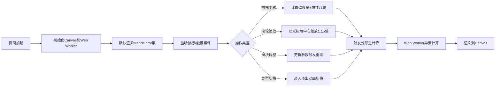

## 1. 产品概述

分形艺术编辑器是一款基于Web的交互式分形图案生成与探索工具，让用户通过直观的拖拽和滑块操作，实时调整分形参数，观察Mandelbrot集和Julia集的动态生成、缩放和色彩变换过程。

- 面向数学爱好者、数字艺术家和学生群体，提供沉浸式的分形几何探索体验
- 解决传统分形软件学习门槛高、交互不流畅的痛点，让复杂数学变得可视化、可触摸

## 2. 核心特性

### 2.1 用户角色

| 角色 | 注册方式 | 核心权限 |
|------|----------|----------|
| 普通用户 | 无需注册 | 浏览、操作分形视图，调整参数，切换分形类型 |

### 2.2 功能模块

1. **分形渲染画布**：全屏Canvas渲染容器，支持分形图案的实时绘制
2. **交互控制系统**：鼠标拖拽平移、滚轮缩放、惯性滑动效果
3. **参数控制面板**：迭代次数、缩放因子、颜色偏移滑块，分形类型切换按钮
4. **Julia集参数控制**：复数参数可视化控制点，支持拖拽调整
5. **响应式适配层**：桌面端侧边面板、移动端底部抽屉自动切换

### 2.3 页面详情

| 页面名称 | 模块名称 | 功能描述 |
|-----------|----------|----------|
| 主界面 | 分形画布 | 全屏Canvas渲染，支持拖拽平移、滚轮缩放、惯性滑动 |
| 主界面 | 控制面板 | 右侧280px毛玻璃面板，包含三个自定义滑块和类型切换按钮 |
| 主界面 | Julia控制点 | 预览区蓝色坐标点，拖拽实时调整复数参数并显示坐标标签 |
| 主界面 | 移动端抽屉 | 屏幕<768px时，控制面板转为底部抽屉，从底部滑入 |

## 3. 核心流程

用户打开应用 → 默认渲染Mandelbrot集 → 鼠标拖拽平移视图（带惯性）→ 滚轮缩放（以光标为中心）→ 调整控制面板参数 → 切换到Julia集（淡入淡出动画）→ 拖拽Julia控制点调整复数参数 → 实时观察分形变化

## 4. 用户界面设计

### 4.1 设计风格

- **主色调**：深空背景 #0D1117，紫色渐变 #4A00E0 → #8E2DE2
- **分形配色**：中心暖色渐变（暗红 #4A0000 → 亮金 #FFD700），外部冷色过渡（蓝紫 #2D1B69 → 深蓝 #0A0A2E）
- **文本颜色**：浅灰 #E0E0E0，提示信息亮紫 #BB86FC
- **按钮风格**：渐变填充，圆角8px，悬停时上浮2px，0.2秒过渡
- **滑块风格**：渐变轨道，圆形手柄，拖动时放大1.2倍并显示阴影
- **字体**：使用现代无衬线字体，标题16px加粗，正文14px，提示文字12px
- **布局风格**：画布全屏+右侧固定面板，毛玻璃半透明效果（backdrop-filter: blur(16px)）

### 4.2 页面设计概览

| 页面名称 | 模块名称 | UI元素 |
|-----------|----------|--------|
| 主界面 | 分形画布 | 全屏深色渐变背景，Canvas覆盖，鼠标悬停显示十字准星 |
| 主界面 | 控制面板 | 280px宽，rgba(255,255,255,0.06)背景，1px边框rgba(255,255,255,0.1)，毛玻璃模糊 |
| 主界面 | 自定义滑块 | 渐变轨道，圆形手柄，实时数值显示，拖动动画 |
| 主界面 | 切换按钮 | 渐变背景，悬停上浮，点击涟漪效果 |
| 主界面 | Julia控制点 | 蓝色圆点，白色坐标标签（12px），拖动时高亮 |
| 主界面 | 底部抽屉 | 移动端从底部滑入，0.3秒缓动，半屏高度 |

### 4.3 响应式设计

- **桌面端**（≥768px）：控制面板固定右侧，宽280px，画布自适应剩余空间
- **移动端**（<768px）：控制面板转为底部抽屉，默认收起，点击展开按钮滑入，画布占满全屏
- **触摸优化**：支持触摸拖拽平移，双指缩放，增大交互热区

### 4.4 动画与交互

- **视图切换**：Mandelbrot/Julia切换时0.6秒淡入淡出
- **缩放动画**：0.3秒平滑过渡，缓动函数ease-out
- **惯性滑动**：阻尼系数0.85，0.5秒内平滑停止
- **悬停效果**：按钮上浮2px，滑块手柄放大1.2倍，0.2秒过渡
- **抽屉动画**：移动端0.3秒缓动滑入/滑出
