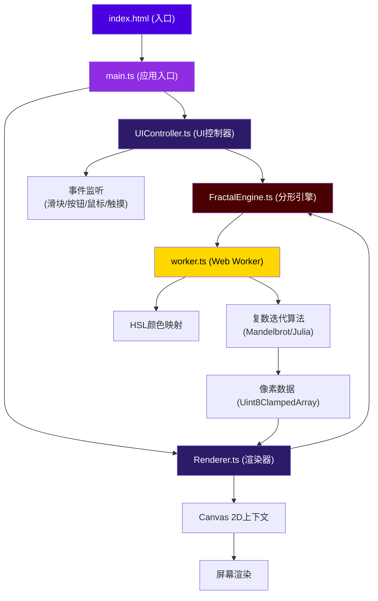

## 1. 架构设计



## 2. 技术栈描述

- **前端框架**: 原生 TypeScript + Canvas 2D API（无UI框架，追求极致性能）
- **构建工具**: Vite 5.x，使用 esbuild 目标 ES2020
- **类型系统**: TypeScript 5.x 严格模式，ESModule 模块系统
- **异步计算**: Web Workers 独立线程处理像素计算，避免UI阻塞
- **样式方案**: 原生 CSS + CSS 变量，毛玻璃效果使用 backdrop-filter
- **动画方案**: CSS transitions + requestAnimationFrame 平滑动画
- **性能优化**: 离屏Canvas、像素数据复用、节流/防抖事件处理

## 3. 目录结构与文件定义

```
auto98/
├── package.json              # 项目依赖与脚本
├── vite.config.js            # Vite配置 (esbuild target es2020)
├── tsconfig.json             # TypeScript配置 (严格模式, ES2020)
├── index.html                # 入口HTML (全屏深色渐变, Canvas容器, UI叠加层)
└── src/
    ├── main.ts               # 应用入口，初始化各模块
    ├── FractalEngine.ts      # 核心分形计算引擎 (复数迭代, 颜色映射)
    ├── Renderer.ts           # Canvas渲染管理 (缩放平移, 鼠标交互, 惯性)
    ├── UIController.ts       # UI控制 (滑块, 按钮, Julia参数控制点)
    └── worker.ts             # Web Worker (异步计算像素数据)
```

## 4. 核心模块与接口定义

### 4.1 类型定义

```typescript
// 分形参数
interface FractalParams {
  type: 'mandelbrot' | 'julia';
  iterations: number;
  zoom: number;
  offsetX: number;
  offsetY: number;
  colorOffset: number;
  juliaReal: number;
  juliaImag: number;
}

// 计算任务
interface WorkerTask {
  id: number;
  width: number;
  height: number;
  params: FractalParams;
}

// 计算结果
interface WorkerResult {
  id: number;
  pixelData: Uint8ClampedArray;
  renderTime: number;
}

// 视口状态
interface Viewport {
  centerX: number;
  centerY: number;
  zoom: number;
  targetZoom: number;
  velocityX: number;
  velocityY: number;
}
```

### 4.2 FractalEngine.ts 核心算法

```typescript
// Mandelbrot集迭代: z = z² + c, c为像素坐标
// Julia集迭代: z = z² + c, c为固定复数参数
// 逃逸时间算法: |z| > 2 时停止迭代
// 平滑迭代计数: log(log(|z|)/log(2))/log(2) 实现连续渐变

function mandelbrot(cx: number, cy: number, maxIter: number): number;
function julia(zx: number, zy: number, cx: number, cy: number, maxIter: number): number;
function hslColorMapping(iteration: number, maxIter: number, colorOffset: number): [number, number, number, number];
```

### 4.3 Renderer.ts 渲染与交互

```typescript
class Renderer {
  constructor(canvas: HTMLCanvasElement, engine: FractalEngine);
  setViewport(centerX: number, centerY: number, zoom: number): void;
  pan(dx: number, dy: number): void;
  zoomAt(screenX: number, screenY: number, factor: number): void;
  startDrag(screenX: number, screenY: number): void;
  updateDrag(screenX: number, screenY: number): void;
  endDrag(): void;
  render(): void;
  private applyInertia(): void; // 阻尼系数0.85
  private animateZoom(): void; // 0.3秒平滑过渡
}
```

### 4.4 UIController.ts UI控制

```typescript
class UIController {
  constructor(params: FractalParams, onParamsChange: (p: FractalParams) => void);
  bindSliders(): void; // 迭代次数/缩放因子/颜色偏移
  bindToggleButton(): void; // Mandelbrot/Julia切换
  bindJuliaControl(): void; // 复数参数拖拽控制点
  updateJuliaPreview(real: number, imag: number): void;
  private createCustomSlider(config: SliderConfig): HTMLElement;
  private fadeTransition(duration: number): Promise<void>; // 0.6秒淡入淡出
}
```

### 4.5 worker.ts Web Worker

```typescript
// 独立线程接收计算任务，返回像素数据
self.onmessage = (e: MessageEvent<WorkerTask>) => {
  const { id, width, height, params } = e.data;
  const pixelData = calculateFractal(width, height, params);
  self.postMessage({ id, pixelData, renderTime: performance.now() - startTime }, [pixelData.buffer]);
};
```

## 5. 性能指标与优化策略

### 5.1 性能指标

- 100次迭代，640x480分辨率：像素计算 ≤ 15ms
- 渲染帧率：≥ 30fps
- 交互响应延迟：≤ 16ms（单帧内响应）
- Web Worker消息往返：≤ 5ms

### 5.2 优化策略

1. **Web Worker 异步计算**：复杂迭代在独立线程执行，Transferable Objects传输ArrayBuffer避免拷贝
2. **像素数据复用**：重复使用ImageData对象，避免频繁内存分配
3. **节流事件处理**：鼠标移动、滚轮事件使用requestAnimationFrame节流
4. **增量渲染**：缩放动画时使用低分辨率预览，动画结束后渲染高清
5. **计算提前终止**：视图变换时取消未完成的Worker任务
6. **类型化数组**：使用Uint8ClampedArray、Float64Array等高效数据结构

## 6. 响应式布局断点

| 断点 | 布局模式 | 面板行为 |
|------|----------|----------|
| ≥ 768px | 桌面端 | 右侧固定面板，宽280px |
| < 768px | 移动端 | 底部抽屉，从底部滑入，0.3秒缓动 |

## 7. 构建与运行

- **开发**: `npm run dev` - 启动Vite开发服务器
- **构建**: `npm run build` - TypeScript编译 + Vite打包
- **类型检查**: `npx tsc --noEmit` - 严格模式类型检查
