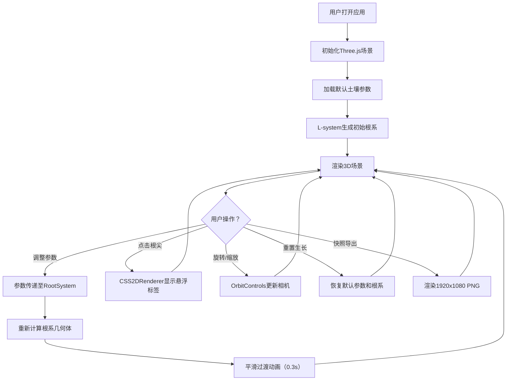

## 1. 产品概述

植物根系生长模拟器是一款面向生物学家和教育工作者的交互式3D可视化工具，通过模拟不同土壤条件下植物根系的生长形态，帮助用户直观理解土壤参数对根部分支模式的影响。

- 核心价值：将抽象的生物学过程转化为可交互、可调整的3D视觉体验
- 目标用户：生物学家、农业研究员、学生及教育工作者

## 2. 核心功能

### 2.1 功能模块

1. **主3D场景**：土壤立方体、种子、根系可视化、地面网格
2. **参数控制面板**：湿度、密度、养分三个核心土壤参数实时调节
3. **根系生长系统**：基于L-system算法的动态根系生成
4. **交互操作**：视角旋转、缩放、根尖信息查看
5. **辅助功能**：重置生长、快照导出

### 2.2 页面详情

| 页面名称 | 模块名称 | 功能描述 |
|---------|---------|---------|
| 主页面 | 3D场景渲染 | 展示土壤区域、种子、根系生长，支持鼠标交互 |
| 主页面 | 控制面板 | lil-gui实现的参数调节区，含湿度、密度、养分滑块 |
| 主页面 | 悬浮标签 | 点击根尖显示该分支的深度和局部养分值 |
| 主页面 | 功能按钮区 | 重置生长按钮、快照导出按钮 |

## 3. 核心流程

## 4. 用户界面设计

### 4.1 设计风格

- **主色调**：深蓝棕色系
  - 顶部渐变：#1B2A3B（深蓝）
  - 底部渐变：#3D2B1F（深棕）
  - 土壤线框：#8B5E3C
  - 根段近地表：#9C6B3E，深层：#5D4037
  - 滑块轨道：#5D4037，滑块手柄：#D4A373（亮橙色）
- **控制面板**：毛玻璃半透明背景 rgba(30,20,10,0.7)，边框1px solid #8B5E3C，圆角8px
- **动画**：UI元素0.2秒淡入，根系更新0.3秒渐变过渡

### 4.2 页面设计概述

| 页面名称 | 模块名称 | UI元素 |
|---------|---------|--------|
| 主页面 | 3D场景 | 全屏渲染、渐变背景、土壤立方体线框、半透明地面圆盘 |
| 主页面 | 控制面板 | 右侧280px宽毛玻璃面板、三个参数滑块、两个功能按钮 |
| 主页面 | 悬浮标签 | CSS2D实现的信息卡片，跟随根尖位置 |

### 4.3 响应性

- 桌面端优先设计，全屏自适应
- 控制面板固定右侧，不随缩放变化
- 鼠标拖拽旋转、滚轮缩放交互流畅

### 4.4 3D场景指导

- **环境氛围**：深蓝棕渐变背景，营造地下观察视角
- **灯光设置**：主方向光 + 环境光，确保根系各角度可见
- **相机设置**：初始位置(10,8,10)看向原点，OrbitControls阻尼0.1
- **构图焦点**：种子位于土壤底部中央，根系向下和侧向扩展为视觉主体
- **交互与动画**：参数变化时根系0.3秒平滑过渡，UI元素0.2秒淡入
- **性能约束**：根段总数≤1000，重计算<200ms，初始加载<3秒
