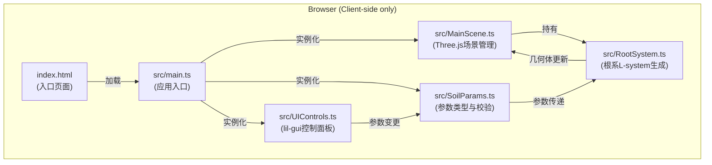

## 1. 架构设计



**模块调用关系与数据流：**
1. `main.ts` → 初始化 `MainScene`、`SoilParams`、`UIControls`
2. `UIControls` → 绑定 `SoilParams`，用户操作实时更新参数值
3. `SoilParams` → 参数变更时触发回调，通知 `RootSystem` 重新计算
4. `RootSystem` → 根据 `SoilParams` 生成根系几何体，返回给 `MainScene`
5. `MainScene` → 将几何体渲染到Three.js场景，处理相机交互

## 2. 技术描述

- **前端框架**：无框架，原生TypeScript
- **3D引擎**：Three.js (latest)
- **构建工具**：Vite (latest)
- **开发语言**：TypeScript (strict模式，target ES2020)
- **UI组件库**：lil-gui (latest)
- **后端**：无，纯浏览器端运行

## 3. 文件结构

```
├── package.json
├── vite.config.js
├── tsconfig.json
├── index.html
└── src/
    ├── main.ts              # 应用入口，整合所有模块
    ├── MainScene.ts         # Three.js场景、相机、灯光、地面、交互
    ├── RootSystem.ts        # L-system根系生成算法
    ├── SoilParams.ts        # 土壤参数接口、默认值、校验
    └── UIControls.ts        # lil-gui控制面板、按钮事件
```

## 4. 核心类型定义

### 4.1 SoilParams 土壤参数

```typescript
interface SoilParamsData {
  moisture: number;  // 湿度 0-100，默认50
  density: number;   // 密度 0-100，默认30
  nutrients: number; // 养分 0-100，默认40
}
```

### 4.2 RootSegment 根段数据

```typescript
interface RootSegmentData {
  start: THREE.Vector3;
  end: THREE.Vector3;
  radius: number;
  depth: number;       // 分支深度等级
  colorStart: string;  // 起点颜色
  colorEnd: string;    // 终点颜色
  isTip: boolean;      // 是否为根尖
  tipColor: string;    // 根尖颜色（随养分变化）
}
```

## 5. 性能优化策略

1. **几何体合并**：使用 `BufferGeometryUtils.mergeGeometries` 将所有根段 `TubeGeometry` 合并为单一几何体，减少Draw Call
2. **限制根段数量**：L-system递归深度控制在3级，确保根段总数≤1000
3. **防抖重计算**：参数变化后延迟50ms再触发重计算，避免连续调整时频繁计算
4. **材质复用**：所有根段共享同一 `MeshStandardMaterial`，通过顶点颜色实现渐变色
5. **CSS2DRenderer**：悬浮标签使用DOM渲染，不占用WebGL资源

## 6. L-system 算法规则

- **公理 (Axiom)**：`F`（初始主根）
- **产生式规则**：
  - `F → F[+F][-F]F`（高湿度条件，分支密集）
  - `F → FF[-F]`（低湿度条件，分支稀疏）
- **参数影响**：
  - 湿度↑ → 分支密度↑，水平偏转角度↑
  - 密度↑ → 单段长度↓，弯曲度↑
  - 养分↑ → 递归深度↑，根尖颜色由黄转绿

## 7. 技术约束

- TypeScript严格模式（`strict: true`）
- 目标ES2020，使用ESModule
- 根段数量≤1000
- 参数重计算耗时<200ms
- 初始加载<3秒
- 60fps流畅运行
