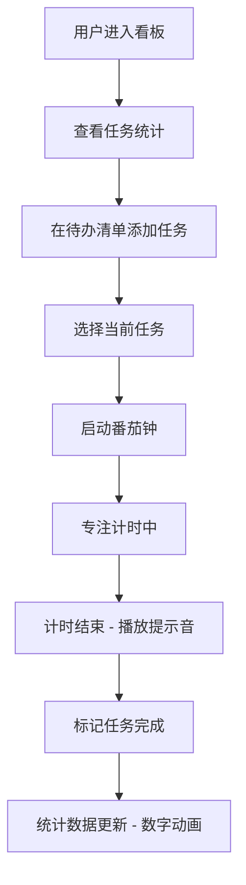

## 1. 产品概述

个人效率看板是一款集待办事项管理与番茄钟计时于一体的效率工具，帮助用户集中管理日常任务，通过专注计时提升工作效率。

- 核心价值：将任务管理与时间管理深度整合，提供一站式效率提升体验
- 目标用户：需要管理日常任务并追求专注工作效率的个人用户

## 2. 核心功能

### 2.1 功能模块

1. **待办清单面板**：任务添加、完成勾选、删除、渐变划除动画
2. **番茄钟计时器**：开始/暂停/重置、倒计时显示、进度环动画、结束提示音
3. **任务统计栏**：今日完成数、进行中数量、总任务数、数字动画

### 2.2 页面详情

| 页面名称 | 模块名称 | 功能描述 |
|-----------|-------------|---------------------|
| 主面板 | 统计栏 | 顶部展示三个统计卡片，数字变化时淡入上升动画 |
| 主面板 | 待办清单 | 左侧面板，支持添加、勾选、删除任务，完成项渐变划除 |
| 主面板 | 番茄钟 | 右侧面板，SVG进度环，开始/暂停/重置按钮，结束提示音 |

## 3. 核心流程

## 4. 用户界面设计

### 4.1 设计风格
- **主题**：深色主题，营造专注氛围
- **配色**：深蓝到紫色渐变作为点缀色，搭配毛玻璃卡片效果
- **卡片**：backdrop-filter 毛玻璃效果，半透明背景
- **字体**：现代无衬线字体，清晰易读
- **动画**：平滑过渡，微交互增强体验

### 4.2 页面设计概览

| 页面名称 | 模块名称 | UI元素 |
|-----------|-------------|-------------|
| 主面板 | 统计栏 | 三个毛玻璃卡片，数字淡入上升动画，蓝紫渐变点缀 |
| 主面板 | 待办清单 | 列表布局，输入框，删除按钮，完成项渐变划除效果 |
| 主面板 | 番茄钟 | SVG圆形进度环，大数字倒计时，三个操作按钮 |

### 4.3 响应式
- 桌面端：flex 行布局，左右分栏
- 断点：768px 以下自动切换为单列堆叠布局
- 平板适配：保持两栏布局，适当调整间距和尺寸

### 4.4 性能要求
- 计时器更新频率：稳定 60fps
- 界面操作响应：50ms 以内
- 动画流畅度：所有过渡动画平滑无卡顿
