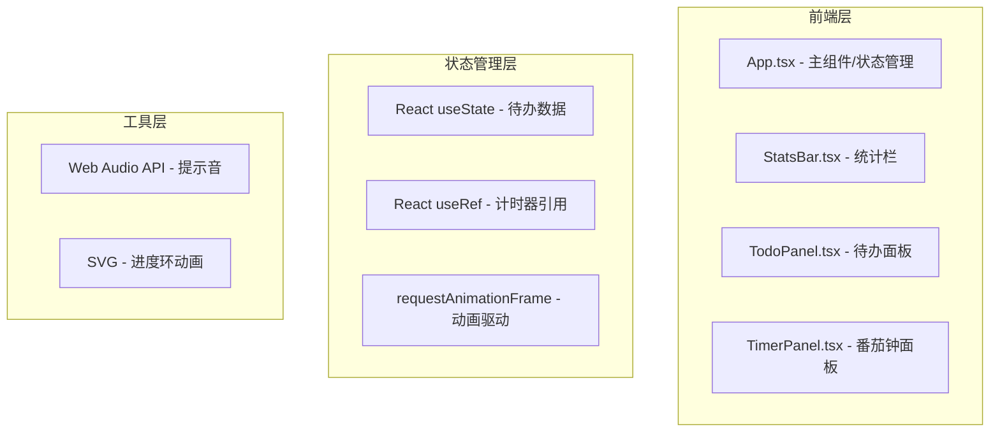

## 1. 架构设计



## 2. 技术描述

- **前端框架**：React 18 + TypeScript
- **构建工具**：Vite
- **状态管理**：React useState（组件级）
- **动画方案**：CSS transitions + requestAnimationFrame
- **音效方案**：Web Audio API 合成音效
- **样式方案**：CSS Modules / 内联样式（按需）

## 3. 文件结构

```
├── package.json
├── vite.config.js
├── tsconfig.json
├── index.html
└── src/
    ├── App.tsx          # 主组件，布局与状态管理
    └── components/
        ├── TodoPanel.tsx   # 待办面板组件
        ├── TimerPanel.tsx  # 番茄钟面板组件
        └── StatsBar.tsx    # 统计栏组件
```

## 4. 核心数据模型

### 4.1 待办项 (TodoItem)

```typescript
interface TodoItem {
  id: string;
  text: string;
  completed: boolean;
  createdAt: number;
  completedAt?: number;
}
```

### 4.2 计时器状态

```typescript
type TimerStatus = 'idle' | 'running' | 'paused';

interface TimerState {
  remainingTime: number;  // 剩余时间（秒）
  totalTime: number;      // 总时长（秒）
  status: TimerStatus;
}
```

## 5. 性能优化策略

- **计时器**：使用 requestAnimationFrame 实现 60fps 平滑更新
- **状态更新**：批量更新减少重渲染
- **动画**：优先使用 CSS transform 和 opacity 动画
- **内存管理**：组件卸载时清除计时器和动画帧
- **响应式**：CSS media query 实现布局切换
