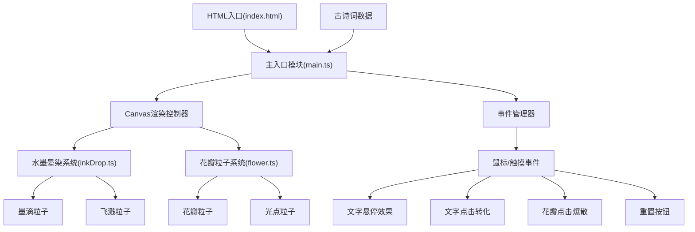

## 1. 架构设计

本项目采用纯前端架构，使用TypeScript + Vite构建，不依赖任何UI框架。核心逻辑分为三层：渲染层、动画粒子系统层、交互控制层。



## 2. 技术描述

### 2.1 核心技术栈

- **前端**：TypeScript 5.x + Vite 5.x，不依赖任何UI框架
- **渲染**：HTML5 Canvas 2D API
- **动画**：requestAnimationFrame 驱动的动画循环
- **样式**：原生CSS3 + CSS变量

### 2.2 项目结构

```
auto109/
├── package.json          # 项目依赖和脚本
├── index.html            # 入口HTML
├── tsconfig.json         # TypeScript配置
├── vite.config.js        # Vite构建配置
└── src/
    ├── main.ts           # 入口模块，主控制器
    ├── inkDrop.ts        # 水墨晕染粒子系统
    └── flower.ts         # 花瓣飘落粒子系统
```

### 2.3 模块职责

| 模块 | 职责 | 关键类/接口 |
|------|------|-------------|
| main.ts | 初始化Canvas、加载古诗词、绑定事件、协调各模块、主循环 | `AppController`, `CharacterEntity` |
| inkDrop.ts | 墨滴扩散模拟、飞溅粒子渲染 | `InkDropSystem`, `InkParticle`, `SplashParticle` |
| flower.ts | 花瓣生成、飘落动画、点击爆散 | `FlowerSystem`, `PetalParticle`, `SparkleParticle` |

### 2.4 初始化命令

由于用户要求不依赖框架，使用vanilla-ts模板初始化：

```bash
# Windows环境
npm init vite-init@latest -y . "--" --template vanilla-ts --force
```

### 2.5 依赖清单

```json
{
  "dependencies": {},
  "devDependencies": {
    "typescript": "^5.0.0",
    "vite": "^5.0.0"
  }
}
```

## 3. 数据模型

### 3.1 古诗词数据结构

```typescript
interface PoemData {
  id: string;
  title: string;
  author: string;
  dynasty: string;
  content: string[];  // 每行诗句
}

interface CharacterPoemMap {
  [char: string]: string;  // 字 → 关联短诗
}
```

### 3.2 粒子基类

```typescript
interface BaseParticle {
  x: number;
  y: number;
  vx: number;
  vy: number;
  life: number;
  maxLife: number;
  active: boolean;
  update(deltaTime: number): void;
  render(ctx: CanvasRenderingContext2D): void;
}
```

### 3.3 文字实体

```typescript
interface CharacterEntity {
  char: string;
  index: number;
  x: number;
  y: number;
  width: number;
  height: number;
  isHovered: boolean;
  isSelected: boolean;
  isFloating: boolean;
  floatProgress: number;  // 0-1 飘移动画进度
  originalX: number;
  originalY: number;
}
```

## 4. 核心算法与渲染

### 4.1 水墨晕染算法

- **径向渐变**：多层径向渐变叠加，模拟墨色从浓到淡
- **粒子扩散**：墨滴粒子按时间增大半径，透明度衰减
- **不规则边缘**：使用正弦波扰动半径，形成自然晕染边界
- **飞溅粒子**：在墨滴扩大到50%时生成30个随机方向飞溅粒子

### 4.2 花瓣渲染

- **形状生成**：3-5个随机大小椭圆叠加，旋转不同角度
- **渐变填充**：粉红→米白径向渐变，叠加半透明脉络
- **飘落轨迹**：正弦波浪曲线 + 垂直下落，参数随机化
- **碰撞检测**：鼠标点击位置与花瓣包围盒的命中检测

### 4.3 性能优化策略

1. **粒子池化**：对象池复用粒子，避免频繁GC
2. **视口剔除**：超出Canvas边界的粒子立即标记为非活跃
3. **分层渲染**：静态文字与动态粒子分层Canvas
4. **帧率控制**：requestAnimationFrame配合deltaTime计算
5. **粒子上限**：花瓣≤50，飞溅≤40，超过时拒绝生成新粒子

## 5. 交互事件处理

### 5.1 鼠标事件流程

```
mousemove → 检测文字碰撞 → 更新hover状态 → 渲染高亮
click → 检测碰撞目标
  ├─ 命中文字 → 触发文字转化流程
  ├─ 命中花瓣 → 触发花瓣爆散
  └─ 命中重置按钮 → 触发重置流程
```

### 5.2 动画状态机

```typescript
type AnimationState = 
  | 'idle'           // 空闲
  | 'loading'        // 加载动画
  | 'char_floating'  // 文字飘向中央
  | 'ink_spreading'  // 水墨晕染
  | 'petals_falling' // 花瓣飘落
  | 'poem_typing'    // 诗句打字
  | 'clearing';      // 清除效果中
```

## 6. 响应式适配

### 6.1 断点定义

| 断点 | 宽度范围 | 适配策略 |
|------|----------|----------|
| 宽屏 | ≥1280px | 字号28px，字间距30px，花瓣每侧8-12 |
| 中屏 | 768-1279px | 字号24px，字间距24px，花瓣每侧6-10 |
| 窄屏 | <768px | 字号22px，字间距20px，花瓣每侧5-8 |

### 6.2 Canvas自适应

- 监听window.resize事件
- 重新计算所有文字位置
- 更新Canvas尺寸（考虑devicePixelRatio）
- 保持内容居中显示

## 7. 构建与部署

- **开发命令**：`npm run dev` → 启动Vite开发服务器
- **构建命令**：`npm run build` → 输出到dist目录
- **预览命令**：`npm run preview` → 预览构建产物

---

**文档版本**：v1.0  
**创建日期**：2026-06-13
