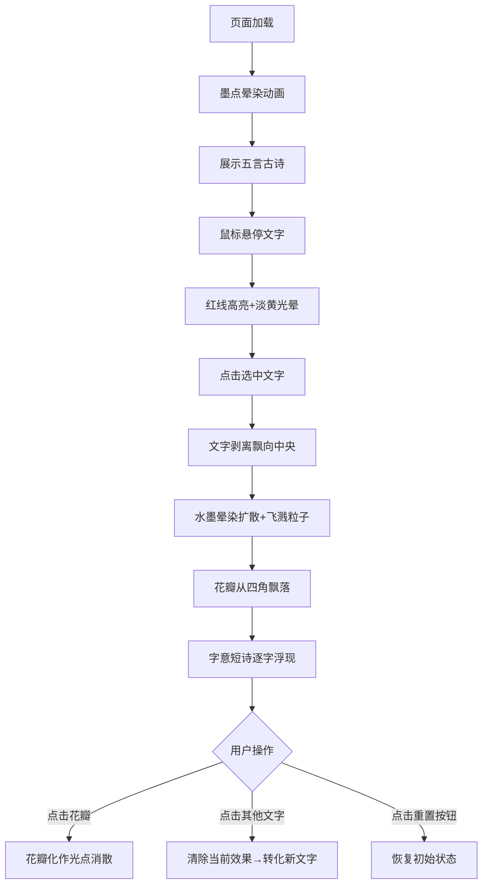

## 1. 产品概述

'墨染·飞花令'是一款融合中国传统水墨艺术与现代交互体验的汉字动画应用。用户通过与古诗词文字互动，体验水墨晕染与花瓣飘落的诗意动画，感受汉字之美与中华文化的独特魅力。

- 核心价值：将传统文化以创新的交互形式呈现，让用户在互动中感受水墨艺术的韵味
- 目标用户：对中华文化、书法、水墨艺术感兴趣的用户，以及追求高品质视觉体验的用户
- 市场定位：文化艺术类Web应用，兼具教育性与审美价值

## 2. 核心特征

### 2.1 用户角色

| 角色 | 注册方式 | 核心权限 |
|------|----------|----------|
| 访客用户 | 无需注册 | 完整体验所有交互功能 |

### 2.2 功能模块

1. **主交互页面**：古诗展示、文字选择、水墨动画、花瓣飘落
2. **水墨晕染系统**：粒子系统模拟墨滴扩散、飞溅粒子效果
3. **花瓣粒子系统**：多形态花瓣飘落、点击爆散效果
4. **诗句浮现系统**：字意关联短诗的打字机动画展示
5. **重置功能**：一键恢复初始状态

### 2.3 页面详情

| 页面名称 | 模块名称 | 功能描述 |
|----------|----------|----------|
| 主页面 | 加载动画 | 页面加载时墨点晕开效果 |
| 主页面 | 古诗展示 | 五言古诗毛笔楷体展示，悬停红线高亮 |
| 主页面 | 文字转化 | 点击文字飘向中央，水墨晕染动画 |
| 主页面 | 花瓣飘落 | 四角飘入花瓣，点击化作光点 |
| 主页面 | 诗句浮现 | 字意关联短诗逐字打字效果 |
| 主页面 | 重置按钮 | 复古印章样式，恢复初始状态 |

## 3. 核心流程

用户打开页面 → 观看加载墨点晕染动画 → 五言古诗展示 → 鼠标悬停文字出现红线高亮 → 点击选中文字 → 文字剥离飘向画面中央 → 水墨晕染扩散动画 → 花瓣从四角飘落 → 字意短诗逐字浮现 → 可点击花瓣触发光点爆散 → 点击重置按钮恢复初始状态

## 4. 用户界面设计

### 4.1 设计风格

- **主色调**：浅米色(#f5e6ca)宣纸背景、深褐(#3e2723)标题色、焦墨浓黑(#0a0a0a)文字色、朱砂红(#c0392b)强调色、粉红(#ffb6c1)→米白(#fffaf0)花瓣渐变色
- **字体**：毛笔楷体(诗句)、行书(短诗)、篆体(印章)
- **布局风格**：中式留白美学，居中对称构图，半透明悬浮元素
- **质感**：宣纸纤维纹理、水墨晕染过渡、飞白笔触效果
- **动效**：缓动函数ease-out，过渡动画0.3-0.8秒，平滑流畅

### 4.2 页面设计概述

| 页面名称 | 模块名称 | UI元素 |
|----------|----------|--------|
| 主页面 | 标题区域 | 左上角"墨染·飞花令"标题，半透明悬浮条，毛笔楷体20px，字间距4px |
| 主页面 | 诗句区域 | 画面中央五言古诗，毛笔楷体28px，字间距30px，焦墨浓黑带飞白纹理 |
| 主页面 | 悬停效果 | 文字下方朱砂红线1.5px，0.3秒渐变，淡黄光晕背景 |
| 主页面 | 文字转化动画 | 0.8秒ease-out飘向中央，原位置0.2透明度残影 |
| 主页面 | 水墨晕染 | 20px→120px直径扩散，浓黑→淡灰渐变，30个飞溅粒子2-5px |
| 主页面 | 花瓣系统 | 3-5椭圆重叠花瓣，粉红→米白渐变，波浪曲线飘落 |
| 主页面 | 诗句浮现 | 行书朱红20px，0.15秒/字打字效果，停留3秒后0.5秒渐隐 |
| 主页面 | 重置按钮 | 右下角40px圆形朱砂红印章，白文篆体"重写"，悬停放大1.1倍+红光 |
| 主页面 | 背景 | 浅米色宣纸，radial-gradient噪点纹理透明度0.05 |

### 4.3 响应式设计

- **桌面优先**：1280x720以上屏幕，文字和墨迹居中显示
- **窄屏适配**：自动调整字号(28px→22px)、字间距(30px→20px)、花瓣数量(每侧8-12→5-8)
- **Canvas自适应**：Canvas尺寸随窗口大小调整，保持画面比例
- **触控支持**：移动端触摸事件替代鼠标悬停和点击

### 4.4 性能要求

- 帧率不低于55FPS
- 花瓣粒子：活跃不超过50个
- 墨点飞溅粒子：不超过40个
- 粒子离开视口或完成动画后立即销毁
- 使用requestAnimationFrame进行动画循环
- Canvas分层渲染优化

---

**文档版本**：v1.0  
**创建日期**：2026-06-13
