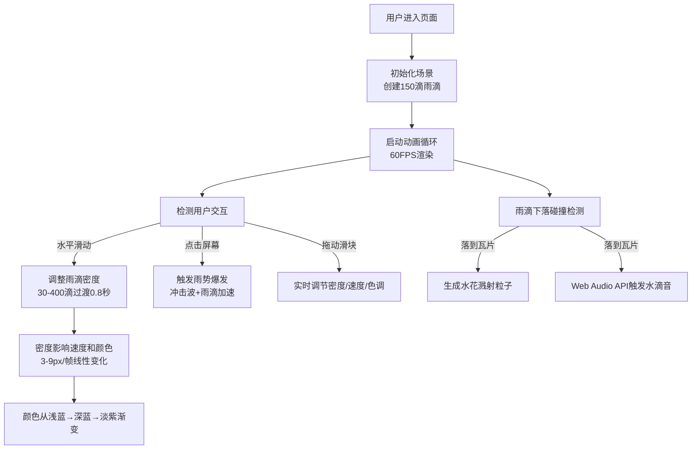

## 1. 产品概述

"檐雨·律动"是一款交互式雨滴韵律可视化应用，用户通过点击或滑动屏幕指挥一场视听雨景。雨滴落在虚拟瓦片屋顶上溅起水花并触发不同音调，形成独特的雨声韵律。

- **核心目标**：通过沉浸式视觉与听觉结合，创造放松、治愈的交互体验
- **目标用户**：喜欢数字艺术、音乐可视化、放松减压应用的用户
- **产品价值**：将自然降雨场景转化为可交互的艺术体验，让用户成为雨景的指挥者

## 2. 核心功能

### 2.1 功能模块

1. **主场景页面**：倾斜瓦片屋顶视角、雨滴粒子系统、实时渲染动画
2. **交互控制系统**：滑动控制密度、点击触发雨势爆发、滑块精细调节
3. **音频引擎系统**：雨滴碰撞触发音调、密度变化形成雨声层次
4. **视觉效果系统**：瓦片纹理渲染、水花溅射、冲击波效果、运动模糊

### 2.2 页面详情

| 页面名称 | 模块名称 | 功能描述 |
|-----------|-------------|---------------------|
| 主场景 | 瓦片屋顶渲染 | Canvas动态生成不规则瓦片，带随机纹理和反光，30度倾斜角 |
| 主场景 | 雨滴粒子系统 | 150滴初始量，细长半透明椭圆，浅蓝到白色渐变，碰撞检测 |
| 主场景 | 滑动交互 | 左滑密度降至30滴，右滑增至400滴，0.8秒平滑过渡 |
| 主场景 | 点击交互 | 触发环形冲击波，环内雨滴变白加速，水花增多 |
| 主场景 | 水花溅射 | 每滴碰撞生成3-5个溅射粒子，随机飞散后消失 |
| 主场景 | 音频反馈 | 雨滴大小决定音调（300-800Hz），速度决定音量 |
| 控制面板 | 密度滑块 | 30-400范围，步长10，默认150 |
| 控制面板 | 速度滑块 | 3-9范围，步长1，默认5 |
| 控制面板 | 色调滑块 | 0-360范围，步长1，默认210（蓝色系） |

## 3. 核心流程

## 4. 用户界面设计

### 4.1 设计风格

- **整体氛围**：清冷湿润的雨景，写实水彩质感与数字化光效结合
- **主色调**：
  - 瓦片青灰：`#5B6E6E`
  - 深灰背景渐变至墨绿：`#2F4F4F` → `#1B3A2D`
  - 雨滴渐变：浅蓝 `#ADD8E6` → 深紫 `#4B0082`
- **UI控件**：半透明磨砂玻璃风格，圆角矩形，高斯模糊白色透明层，深灰色文字
- **动画过渡**：所有交互反馈0.3-0.8秒平滑过渡

### 4.2 页面设计概述

| 页面名称 | 模块名称 | UI元素 |
|-----------|-------------|-------------|
| 主场景 | 瓦片屋顶 | 30度倾斜视角，不规则瓦片，随机纹理噪点，微弱反光，深灰色缝隙 |
| 主场景 | 雨滴效果 | 细长椭圆（6×2px），运动模糊尾迹（8px，透明度0.5），半透明渐变 |
| 主场景 | 冲击波 | 环形扩散，0→150px，持续0.6秒，环宽3px，白色半透明 |
| 主场景 | 水花溅射 | 1-2px白色半透明粒子，2-4px随机飞散 |
| 控制面板 | 滑块组 | 左上角三个垂直排列滑块，磨砂玻璃背景，悬停高亮，实时数值显示 |

### 4.3 响应式设计

- **>1024px**：屋顶占满整个视口
- **768-1024px**：屋顶占视口80%并居中
- **<768px**：屋顶占满，瓦片和雨滴等比缩小至70%
- **触摸优化**：滑动和点击事件支持移动端触控

### 4.4 视觉细节指引

- **瓦片渲染**：每片瓦带有随机的深浅纹理噪点（±10%明度变化），随机位置的微弱高光，模拟湿润反光
- **雨滴尾迹**：每滴雨跟随8px长的运动模糊，透明度0.5，增强速度感
- **景深效果**：远处瓦片略微模糊，近处清晰，营造俯瞰沉浸感
- **色彩过渡**：密度变化时雨滴颜色HSL渐变，密度30为浅蓝（HSL210°），密度400为深紫（HSL270°）

## 5. 性能指标

- **帧率要求**：稳定55FPS以上
- **峰值处理**：400滴雨滴同时渲染无卡顿
- **粒子上限**：溅射粒子不超过500个，超出时销毁最老粒子
- **内存管理**：及时回收销毁的雨滴和粒子对象
