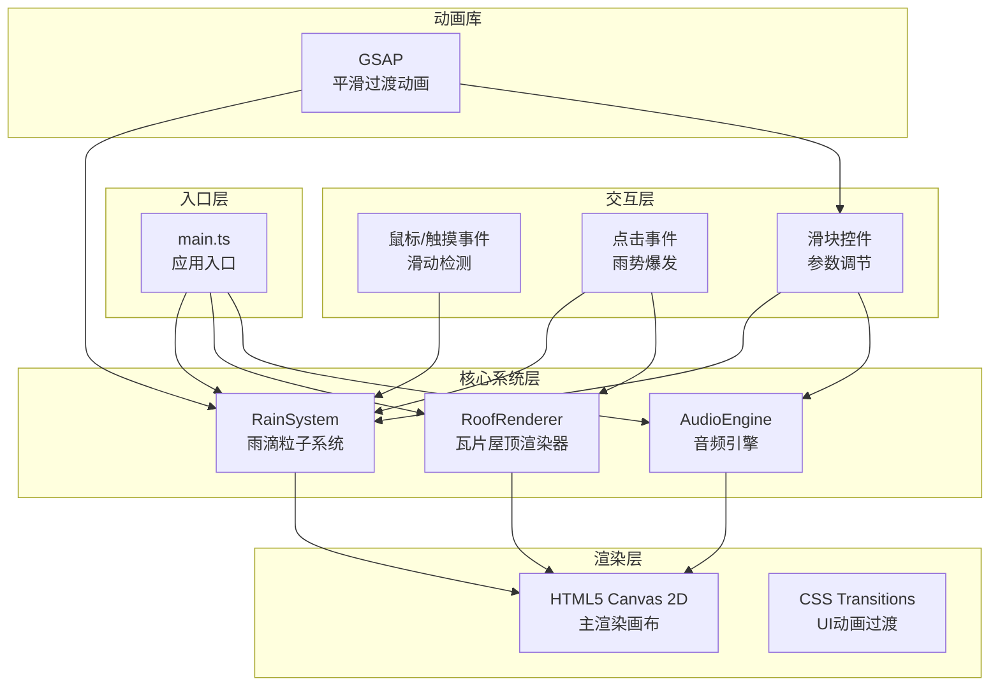

## 1. 架构设计



## 2. 技术描述

- **前端技术**：TypeScript + Vite + HTML5 Canvas 2D + Web Audio API
- **动画库**：gsap@3.x（用于平滑数值过渡和时间线控制）
- **构建工具**：Vite@5.x
- **语言标准**：ES2020 模块，严格模式 TypeScript

## 3. 文件结构

```
project/
├── package.json          # 项目依赖和脚本
├── index.html            # 入口HTML
├── tsconfig.json         # TypeScript配置
├── vite.config.js        # Vite构建配置
└── src/
    ├── main.ts           # 应用入口，场景初始化，动画循环
    ├── rainSystem.ts     # 雨滴粒子系统：生成/更新/销毁/碰撞
    ├── roofRenderer.ts   # 瓦片渲染：Canvas绘制/碰撞检测/溅射
    └── audioEngine.ts    # 音调生成：Web Audio API水滴音效
```

## 4. 核心类与接口定义

### 4.1 RainSystem 雨滴系统

```typescript
interface Raindrop {
  id: number;
  x: number;
  y: number;
  speed: number;
  baseSpeed: number;
  size: { width: number; height: number };
  baseSize: { width: number; height: number };
  color: string;
  opacity: number;
  trail: Array<{ x: number; y: number }>;
  boosted: boolean;
  boostTimer: number;
}

interface SplashParticle {
  id: number;
  x: number;
  y: number;
  vx: number;
  vy: number;
  life: number;
  maxLife: number;
  size: number;
  opacity: number;
}

interface ShockWave {
  x: number;
  y: number;
  radius: number;
  maxRadius: number;
  opacity: number;
  width: number;
  progress: number;
}

class RainSystem {
  constructor(canvas: HTMLCanvasElement, audioEngine: AudioEngine);
  setDensity(target: number, duration?: number): void;
  setSpeed(target: number): void;
  setHue(hue: number): void;
  triggerBurst(x: number, y: number): void;
  update(deltaTime: number): void;
  render(ctx: CanvasRenderingContext2D): void;
  onRoofCollision(callback: (raindrop: Raindrop, x: number, y: number) => void): void;
}
```

### 4.2 RoofRenderer 屋顶渲染器

```typescript
interface Tile {
  x: number;
  y: number;
  width: number;
  height: number;
  baseColor: string;
  noisePattern: number[];
  highlight: { x: number; y: number; size: number; opacity: number };
  row: number;
  col: number;
}

class RoofRenderer {
  constructor(canvas: HTMLCanvasElement);
  generateTiles(): void;
  checkCollision(x: number, y: number): { hit: boolean; tileY: number };
  createSplash(x: number, y: number, count: number): void;
  update(deltaTime: number): void;
  render(ctx: CanvasRenderingContext2D): void;
  resize(): void;
  getRoofTopY(): number;
  getRoofBottomY(): number;
}
```

### 4.3 AudioEngine 音频引擎

```typescript
class AudioEngine {
  constructor();
  init(): Promise<void>;
  playDropSound(size: number, speed: number): void;
  setMasterVolume(volume: number): void;
}
```

## 5. 核心算法

### 5.1 雨滴碰撞检测

```
对于每滴雨滴：
1. 计算下一帧位置 y + speed
2. 调用 RoofRenderer.checkCollision(x, nextY)
3. 若命中：
   - 生成溅射粒子（3-5个，爆发时15个）
   - 触发水滴音效（频率：300 + size*500/6 Hz）
   - 重置雨滴到顶部随机x位置
```

### 5.2 密度平滑过渡

使用GSAP的gsap.to()实现0.8秒平滑过渡：
```typescript
gsap.to(this.state, { 
  density: target, 
  duration: 0.8, 
  ease: "power2.out",
  onUpdate: () => this.syncRaindrops() 
});
```

### 5.3 瓦片生成算法

```
1. 按30度倾斜角计算行偏移
2. 每行瓦片交错排列
3. 每片瓦片：
   - 基础色 #5B6E6E 叠加 ±10% 随机明度噪点
   - 随机位置生成1-2个高亮点（模拟湿润反光）
   - 瓦片缝隙 2px 深灰色线条
```

## 6. 性能优化策略

1. **对象池**：雨滴和溅射粒子使用对象池复用，避免频繁GC
2. **离屏Canvas**：瓦片纹理预渲染到离屏Canvas，每帧直接贴图
3. **粒子上限**：溅射粒子最多500个，FIFO队列销毁最老粒子
4. **帧率控制**：requestAnimationFrame循环，deltaTime时间归一化
5. **分层渲染**：背景→瓦片→雨滴→水花→UI，分层绘制减少重绘
6. **增量更新**：瓦片只在resize时重新生成，不每帧重建

## 7. 响应式适配逻辑

```typescript
function getScaleFactor(width: number): number {
  if (width > 1024) return 1.0;
  if (width >= 768) return 1.0; // 瓦片缩小由布局控制
  return 0.7; // <768px 整体70%
}

function getRoofWidth(width: number): number {
  if (width > 1024) return width;
  if (width >= 768) return width * 0.8;
  return width;
}
```

## 8. 音频合成方案

使用 Web Audio API 合成水滴声：
1. **振荡器**：sine波，频率300-800Hz基于雨滴大小
2. **噪声源**：短噪声burst模拟水花溅起
3. **包络**：快速attack(0.005s)，指数decay(0.1-0.3s基于速度)
4. **滤波器**：低通滤波器，截止频率2000Hz，使音色圆润
5. **音量**：速度 / 9 * 0.3，最大不超过0.3避免爆音
