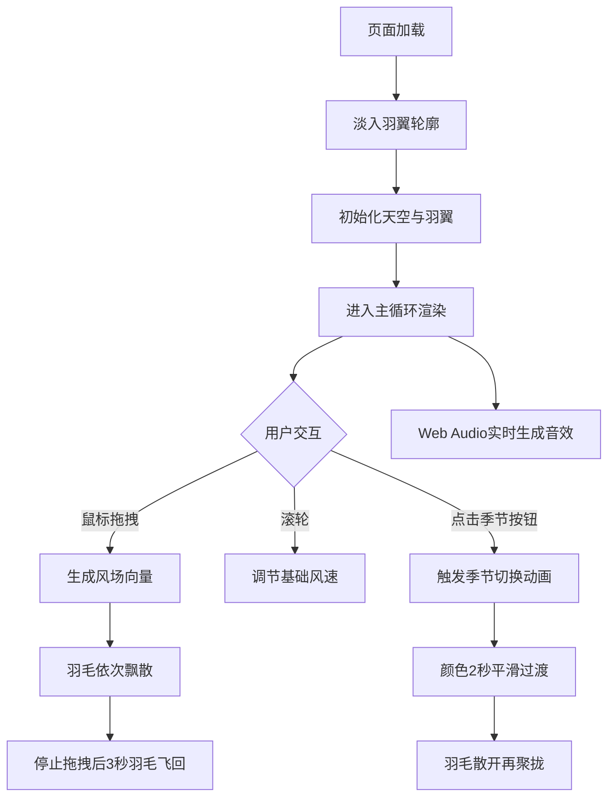

## 1. 产品概述

"织梦·季风羽翼"是一款基于HTML5 Canvas的交互式视觉艺术应用，在浏览器中呈现一只由风流动线构成的半透明羽翼，悬浮于四季轮转的虚拟天空下。用户通过鼠标交互操控风向与风速，体验羽毛随风飘舞的诗意画面。

- 核心价值：通过细腻的物理模拟和唯美的视觉设计，为用户提供沉浸式的自然美学体验
- 目标用户：艺术爱好者、创意工作者、寻求放松体验的普通用户

## 2. 核心特性

### 2.1 功能模块

1. **动态天空背景**：渐变色彩、漂移云絮、氛围光点
2. **羽翼系统**：50根主羽毛 + 80根绒毛，贝塞尔曲线勾勒，自然摆动
3. **风场交互**：鼠标拖拽生成风力，滚轮调节风速
4. **四季切换**：春夏秋冬四季配色，平滑过渡动画
5. **音频反馈**：Web Audio模拟羽毛摩挲声

### 2.2 页面详情

| 页面名称 | 模块名称 | 功能描述 |
|---------|----------|----------|
| 主画布 | 动态天空 | 随鼠标位置变化的渐变色背景，200颗云絮粒子漂移 |
| 主画布 | 羽翼渲染 | 中央偏上位置的半透明羽翼，发光效果，羽毛自然摆动 |
| 主画布 | 风场交互 | 鼠标拖拽生成风向量，羽毛随风飘散、聚拢 |
| 主画布 | 氛围光点 | 80个悬浮光点，随机脉动 |
| 四季按钮 | 季节切换 | 圆形四象限按钮，点击切换季节，羽毛散开再聚拢动画 |

## 3. 核心流程

## 4. 用户界面设计

### 4.1 设计风格
- 整体风格：极简柔和、诗意自然、空灵梦幻
- 主色调：随季节变化（春：粉樱/嫩绿；夏：深蓝/墨绿；秋：金黄/深红；冬：冰蓝/雪白）
- 羽翼发光：shadowBlur + shadowColor，发光色随季节变化
- 按钮样式：圆形直径60px，四扇形分色（粉、绿、金、蓝）

### 4.2 页面设计概述

| 页面名称 | 模块名称 | UI元素 |
|---------|----------|--------|
| 主画布 | 动态天空 | 地平线暖色→顶部冷色渐变，鼠标位置缓慢影响色调 |
| 主画布 | 云絮粒子 | 半透明椭圆形，20-50px，透明度0.1-0.3，随风向漂移 |
| 主画布 | 羽翼主体 | 宽度70%屏宽，高度50%屏高，中央偏上位置 |
| 主画布 | 羽毛细节 | 三段贝塞尔曲线轮廓，羽根到羽尖渐变变浅 |
| 主画布 | 拖尾光晕 | 风吹过时羽毛后40px彩色拖尾，0.8秒渐消 |
| 主画布 | 氛围光点 | 80个1-3px光点，随机亮度脉动 |
| 四季按钮 | 切换控件 | 圆形四象限，季节代表色，悬停微动效 |

### 4.3 响应式设计
- 桌面端优先，Canvas自适应窗口大小
- 羽翼尺寸基于屏幕百分比，保持视觉比例
- 按钮固定于羽翼下方中央位置

## 5. 性能要求

- 动画帧率：稳定60fps
- 交互延迟：≤50ms
- 粒子数量：200云絮 + 130羽毛 + 80光点 = 410个动态元素
- 渲染优化：Canvas分层渲染，离屏缓存静态元素
