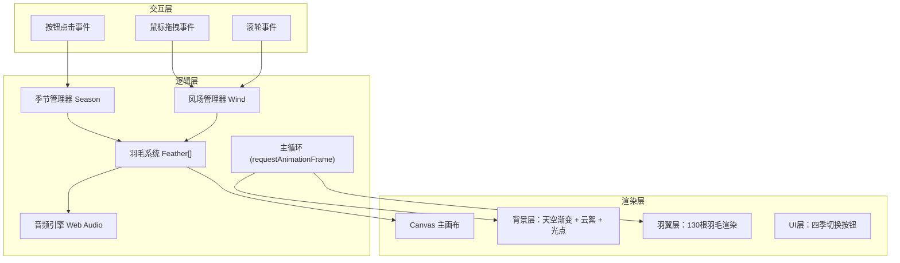

## 1. 架构设计



## 2. 技术栈描述

- **前端框架**：原生 TypeScript + HTML5 Canvas 2D
- **构建工具**：Vite 5.x
- **动画库**：GSAP 3.x（用于平滑过渡和时间线动画）
- **音频**：Web Audio API（原生，模拟羽毛摩挲声）
- **项目初始化**：vite-init vanilla-ts 模板

## 3. 文件结构定义

```
/
├── package.json          # 依赖配置：typescript、vite、gsap
├── index.html            # 入口页面，柔白背景，加载淡入动画
├── tsconfig.json         # TypeScript严格模式配置
├── vite.config.js        # Vite构建配置
└── src/
    ├── main.ts           # 应用入口：Canvas初始化、事件绑定、主循环
    ├── feather.ts        # 羽毛类：位置、角度、颜色、飘动、飘落、物理
    ├── wind.ts           # 风场管理：鼠标拖拽生成风向量、风速风向
    └── season.ts         # 四季管理：当前季节、配色方案、切换动画
```

## 4. 核心数据结构

### 4.1 季节配色方案

```typescript
interface SeasonPalette {
  name: string;
  skyTop: string;      // 天空顶部颜色
  skyBottom: string;   // 天空底部（地平线）颜色
  cloudColor: string;  // 云絮颜色
  featherRoot: string; // 羽根色
  featherTip: string;  // 羽尖色
  glowColor: string;   // 发光色
  trailColor: string;  // 拖尾色
}

type Season = 'spring' | 'summer' | 'autumn' | 'winter';
```

### 4.2 风场向量

```typescript
interface WindVector {
  x: number;           // 水平分量
  y: number;           // 垂直分量
  strength: number;    // 风速 0-15 px/s
  originX: number;     // 风源X坐标
  originY: number;     // 风源Y坐标
  lifetime: number;    // 剩余生命周期
}
```

### 4.3 羽毛状态

```typescript
type FeatherState = 'idle' | 'fluttering' | 'floating' | 'returning';

interface Feather {
  id: number;
  type: 'main' | 'down';  // 主羽/绒毛
  baseX: number;          // 原位X
  baseY: number;          // 原位Y
  baseAngle: number;      // 原位角度
  currentX: number;
  currentY: number;
  currentAngle: number;
  length: number;
  width: number;
  opacity: number;
  state: FeatherState;
  floatProgress: number;  // 飘落进度 0-1
  returnProgress: number; // 返回进度 0-1
  trail: { x: number; y: number; alpha: number }[];
}
```

## 5. 关键算法

### 5.1 贝塞尔曲线羽毛轮廓
每根羽毛由三段贝塞尔曲线勾勒：
- 羽根控制点：(baseX, baseY)
- 羽轴曲线：二次贝塞尔，控制点随摆动动态偏移
- 羽片轮廓：左右两条三次贝塞尔，宽度从羽根到羽尖渐变

### 5.2 风场影响计算
```typescript
// 计算风对羽毛的作用力
function calculateWindInfluence(feather: Feather, wind: WindVector): {
  angleDelta: number;    // 角度变化
  positionDelta: { x: number; y: number };  // 位置变化
} {
  const distance = Math.hypot(feather.currentX - wind.originX, 
                              feather.currentY - wind.originY);
  const falloff = Math.max(0, 1 - distance / 500);  // 500px影响半径
  const force = wind.strength * falloff;
  // 羽毛依次掀起：根据id添加延迟
  return { angleDelta: force * 0.1, positionDelta: { x: wind.x * force, y: wind.y * force } };
}
```

### 5.3 自然摆动模拟
```typescript
// 无风时的自然摆动（简谐运动）
function idleSwing(time: number, baseAngle: number, featherId: number): number {
  const phase = featherId * 0.3;  // 相位偏移，避免同频
  const period = 1.5 + (featherId % 10) * 0.15;  // 1.5-3s周期
  const amplitude = (2 + (featherId % 4)) * Math.PI / 180;  // 2-5度
  return baseAngle + Math.sin(time / period * Math.PI * 2 + phase) * amplitude;
}
```

### 5.4 四季颜色过渡
使用GSAP的interpolate实现2秒平滑颜色过渡，过渡期间触发"散开-聚拢"动画序列。

## 6. 性能优化策略

1. **分层渲染**：背景层静态元素（渐变底色）使用离屏Canvas缓存，每帧只重绘动态元素
2. **对象池**：云絮和光点粒子复用对象，避免频繁GC
3. **requestAnimationFrame**：统一主循环，使用deltaTime确保动画速度一致
4. **阴影优化**：发光效果仅应用于羽翼层，通过shadowBlur + shadowColor实现
5. **音频节流**：Web Audio声音生成按需触发，避免持续CPU占用

## 7. 音频实现方案

使用Web Audio API模拟羽毛摩挲声：
- 噪声源：BufferSourceNode生成粉红噪声
- 滤波：BiquadFilterNode带通滤波（中心频率2-5kHz）
- 包络：GainNode根据风速动态调整音量（0.02-0.15）
- 触发：羽毛飘散/聚拢时触发短噪声包络
