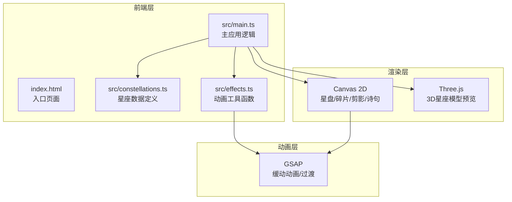

## 1. 架构设计



## 2. 技术说明

- 前端：TypeScript + Vite + GSAP + Three.js@0.160
- 初始化工具：Vite
- 后端：无
- 数据库：无（前端静态数据）

### 依赖清单

| 依赖 | 版本 | 用途 |
|------|------|------|
| typescript | latest | 类型系统 |
| vite | latest | 构建工具 |
| gsap | latest | 动画缓动 |
| three | 0.160 | 3D星座模型 |
| @types/three | 0.160 | Three.js类型声明 |

## 3. 文件结构

```
├── package.json          # 依赖与启动脚本
├── index.html            # 入口页面（深空蓝紫渐变背景+加载动画）
├── tsconfig.json         # TypeScript严格模式配置
├── vite.config.js        # Vite构建配置（base: './'）
└── src/
    ├── main.ts           # 应用入口，初始化Canvas/Three.js，管理拼合逻辑/动画循环/事件
    ├── constellations.ts # 星座数据（坐标/剪影/诗句/3D顶点）
    └── effects.ts        # 动画工具（星点点亮/诗句浮现/剪影扩散/对话框）
```

## 4. 数据模型

### 4.1 星座数据结构

```typescript
interface StarPoint {
  id: number;
  correctX: number;
  correctY: number;
  initialX: number;
  initialY: number;
  size: number;
  mythFigure: number[][];   // Canvas剪影轮廓路径
  poem: string;             // 传说诗句
  vertex3D: [number, number, number]; // Three.js 3D顶点
}

interface Constellation {
  name: string;
  nameEn: string;
  stars: StarPoint[];
  connections: [number, number][]; // 星点连线
}
```

### 4.2 预置星座

1. **猎户座 (Orion)**：20颗星，猎户剪影
2. **仙后座 (Cassiopeia)**：20颗星，仙女剪影
3. **天鹅座 (Cygnus)**：20颗星，天鹅剪影

## 5. 核心模块职责

### 5.1 main.ts
- 初始化Canvas和Three.js场景
- 管理碎片状态数组（位置、是否已拼合）
- 处理鼠标/触摸事件（拖拽、点击、悬停）
- 动画循环（requestAnimationFrame）：重绘Canvas、更新Three.js
- 数据流：鼠标事件 → 更新碎片状态 → 触发Canvas重绘和Three.js更新

### 5.2 constellations.ts
- 导出三个星座的完整数据
- 每颗星包含：正确坐标、初始散落坐标、大小、剪影路径、诗句、3D顶点
- 星座连线数据

### 5.3 effects.ts
- 封装GSAP动画函数
- starLightUp()：星点点亮动画（银白→金黄+涟漪）
- poemFloat()：诗句浮现与浮动动画
- silhouetteSpread()：剪影扩散与淡出动画
- dialogPopup()：确认对话框弹出动画
- resetAnimation()：重置倒放动画
- 所有函数返回可取消的GSAP动画句柄
