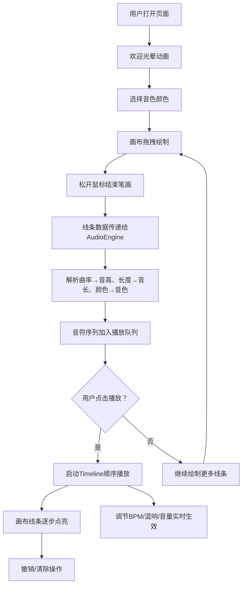

## 1. 产品概述

"律动·声痕"是一款基于浏览器的交互式音乐可视化创作工具，让听众通过在抽象声波画布上绘制线条，与AI共同完成一场视听表演。用户绘制的每条线条代表一种乐器音色，系统根据线条特征自动合成旋律片段。

- 目标用户：数字音乐人、音乐爱好者、创意工作者
- 核心价值：将视觉创作与音乐合成深度融合，提供零门槛的即兴创作体验

## 2. 核心功能

### 2.1 用户角色
无角色区分，所有用户拥有完整功能权限

### 2.2 功能模块
1. **声波画布**：全屏绘制区域，支持鼠标拖拽绘制，带网格背景和发光尾迹
2. **音色选择**：左上角三种色块按钮（红=钢琴，蓝=弦乐，绿=打击乐）
3. **音频合成引擎**：基于Tone.js，将线条映射为音高、音长、音色
4. **播放控制栏**：底部播放/暂停、进度条、音量滑块
5. **参数调节**：右上角BPM滑块（60-180）、混响旋钮（0-100%）
6. **画布管理**：清除画布（带动画）、撤销上一笔（Ctrl+Z）

### 2.3 页面详情
| 页面名称 | 模块名称 | 功能描述 |
|-----------|-------------|---------------------|
| 主画布页 | 欢迎动画 | 加载时中央白色光晕从内向外扩散 |
| 主画布页 | 声波画布 | 85%屏幕尺寸正方形画布，深灰网格参考线，支持鼠标绘制发光曲线 |
| 主画布页 | 音色选择器 | 左上角25x25三色块，选中带外发光动画 |
| 主画布页 | 参数调节区 | 右上角BPM滑块、混响旋钮，极简白色细线样式 |
| 主画布页 | 播放控制栏 | 底部播放/暂停按钮（带旋转光晕）、进度条、音量滑块 |
| 主画布页 | 清除按钮 | 右上角清除画布，触发确认收缩动画 |

## 3. 核心流程

用户打开页面 → 欢迎光晕动画 → 选择音色颜色 → 在画布上拖拽绘制曲线 → 松开鼠标自动解析并合成音符 → 点击播放按钮 → 线条随播放进度从起点到终点逐步点亮 → 多轨叠加播放 → 可调节BPM/混响/音量 → 可撤销或清除重新创作

## 4. 用户界面设计

### 4.1 设计风格
- **主色调**：纯黑背景 #0a0a0a，白色主文字 #ffffff
- **强调色**：红色 #ff4444（钢琴）、蓝色 #4488ff（弦乐）、绿色 #44ff88（打击乐）
- **视觉风格**：赛博朋克极简风，强调发光元素与暗色背景的高对比
- **交互反馈**：hover时scale(1.05)+光晕（0.2s ease-out），点击时scale(0.95)
- **字体**：现代无衬线等宽字体，数字部分使用等宽字体以保证BPM显示稳定

### 4.2 页面设计概述
| 页面名称 | 模块名称 | UI元素 |
|-----------|-------------|-------------|
| 主画布页 | 画布区域 | 85%视口正方形居中，四周10px阴影，0.5px深灰网格线50px间距透明度0.05 |
| 主画布页 | 画笔色块 | 左上角绝对定位，25x25px方块，20px间距，选中色块外发光脉冲动画 |
| 主画布页 | BPM滑块 | 右上角，白色细线轨道，滑块发光，当前值显示 |
| 主画布页 | 混响旋钮 | 右上角BPM下方，圆形旋钮，周围渐变色环指示当前值 |
| 主画布页 | 清除按钮 | 右上角混响下方，极简细线边框按钮，hover发光 |
| 主画布页 | 播放控制栏 | 底部水平flex布局，播放按钮（圆形带旋转光晕）、6px高度进度条、音量滑块 |
| 主画布页 | 绘制线条 | 4px宽度，alpha 0.8，径向渐变+模糊发光尾迹效果 |

### 4.3 响应式
- 桌面优先设计，适配 1366x768 和 1920x1080 分辨率
- 画布始终保持 1:1 正方形比例，居中显示，最大尺寸为视口宽高的85%
- 控件使用固定定位 + flex 布局，视口变化时自动调整位置
- 最小支持触控操作的元素尺寸不小于 40x40px

### 4.4 动效设计
- 欢迎动画：中央白色光晕从0半径向外扩散至消失，持续1.5秒
- 选中色块：外发光呼吸动画，2秒周期
- 播放按钮：播放时环绕光晕旋转，3秒/圈
- 清除动画：画面边缘向内收缩淡出所有线条，0.5秒
- 线条点亮：从起点到终点线性渐变高亮，与音符播放同步
- 控件交互：hover scale(1.05) 0.2s ease-out，active scale(0.95)
