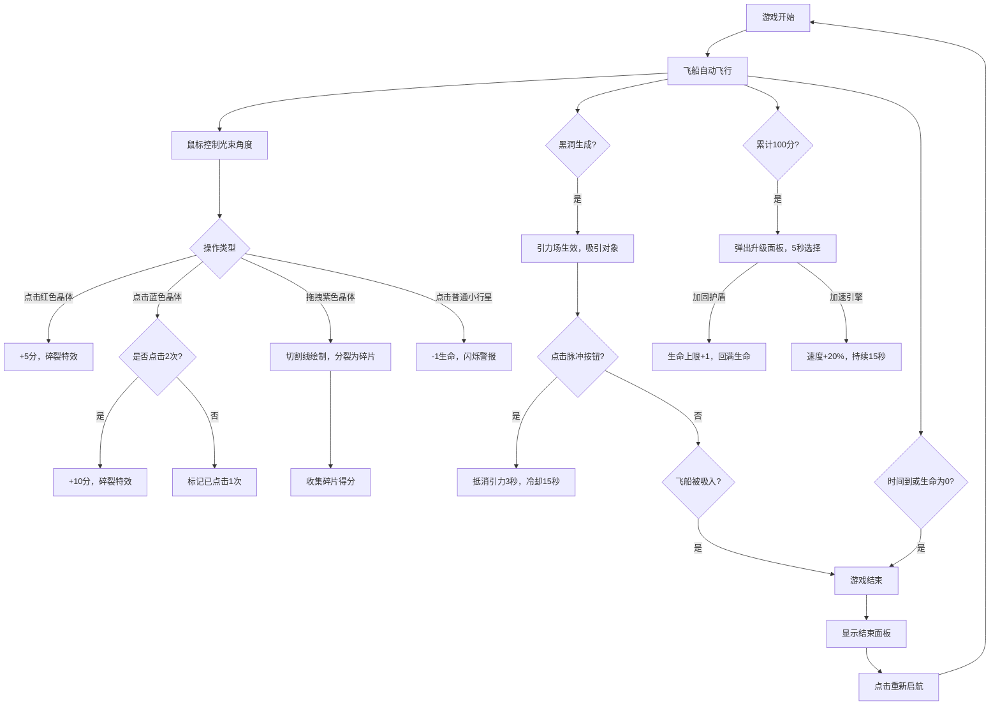

## 1. 产品概述

深空矿工是一款基于浏览器的交互式太空采矿游戏，玩家驾驶钻探飞船在小行星带穿梭，通过精准的鼠标操作切割收集能量晶体，躲避陨石与黑洞引力，在限定时间内获取高分并升级飞船装备。

- **核心问题**：解决休闲游戏中缺少将精准操作、资源管理和视觉节奏感相结合的沉浸式小行星采矿体验
- **目标用户**：休闲游戏玩家，太空科幻题材爱好者
- **市场价值**：提供独特的鼠标精准操作玩法，结合炫酷的科幻视觉效果和丰富的升级系统，创造高留存的休闲游戏体验

## 2. 核心功能

### 2.1 游戏角色与场景

| 角色/对象 | 描述 | 交互方式 |
|-----------|------|----------|
| 钻探飞船 | 银色流线型子弹状，尺寸60x40px，船头带黄色探照灯光束 | 固定速度向前飞行，鼠标控制光束角度 |
| 普通小行星 | 灰色不规则多边形，30-80px | 点击受损-1生命 |
| 红色晶体 | 红色小行星，+5分 | 点击即碎，收集成功 |
| 蓝色晶体 | 蓝色小行星，+10分 | 连续点击2次收集 |
| 紫色巨型晶体 | 紫色大型小行星，+20分 | 拖拽画线切割，分裂为3-5块碎片 |
| 黑洞 | 暗紫色，直径80px，带扭曲光晕，引力场半径150px | 吸引飞船和碎片，被吸入则游戏结束 |
| 反引力脉冲按钮 | 红色圆形，50x50px，右下角固定位置 | 点击释放脉冲，抵消引力3秒，冷却15秒 |

### 2.2 功能模块

1. **游戏主界面**：Canvas游戏区域、UI覆盖层、分数显示、生命条、计时器、速度等级
2. **飞船控制系统**：自动向前飞行、鼠标控制探照灯角度、粒子尾焰特效
3. **晶体收集系统**：点击收集、拖拽切割、分数统计、音效反馈
4. **黑洞与引力系统**：随机生成、引力场计算、反引力脉冲、视觉特效
5. **升级系统**：每100分弹出升级选择（加固护盾/加速引擎）
6. **游戏状态管理**：生命值、计时器、游戏结束面板、重新开始

### 2.3 页面详情

| 页面名称 | 模块名称 | 功能描述 |
|---------|---------|----------|
| 游戏主界面 | 背景渲染 | 繁星密布深空背景，500颗星星随机闪烁 |
| 游戏主界面 | 飞船渲染 | 银色船体、黄色探照灯光束、粒子尾焰 |
| 游戏主界面 | 小行星带 | 随机滚动生成不同类型小行星 |
| 游戏主界面 | 晶体切割 | 红色发光切割线、粒子爆散特效 |
| 游戏主界面 | 黑洞特效 | 扭曲光晕旋转、引力场可视化 |
| 游戏主界面 | UI层 | 分数、生命条、计时器、升级面板、脉冲按钮 |
| 游戏结束面板 | 统计展示 | 最终得分、晶体分类统计、太空格言 |
| 升级选择面板 | 选项展示 | 加固护盾/加速引擎二选一，5秒倒计时 |

## 3. 核心流程

玩家从画面左下角出发，飞船自动向前飞行，通过鼠标点击和拖拽操作收集不同类型的能量晶体获取分数。每隔20秒生成黑洞，玩家需躲避或使用反引力脉冲。每收集100分可选择升级，在120秒倒计时和3条生命值限制内尽可能获取高分。

## 4. 用户界面设计

### 4.1 设计风格

- **设计主题**：科幻霓虹风格，深空太空主题
- **主色调**：深空蓝 (#0a0e27)、银色 (#c0c8d4)、能量紫 (#7b2d8e)
- **按钮风格**：圆形发光按钮，带轻微漂浮动画，按下时有缩放反馈
- **字体**：Press Start 2P 像素风格字体，所有文字带发光效果
- **布局风格**：Canvas占满视口，半透明UI层覆盖，元素分布在四角
- **视觉特效**：粒子爆散、光束切割、引力扭曲、光晕旋转、文字闪烁

### 4.2 页面设计概述

| 页面名称 | 模块名称 | UI元素 |
|---------|---------|--------|
| 游戏主界面 | 背景 | 深空蓝底色，500颗星星1-3px随机大小，冷白到淡蓝渐变，1-3秒闪烁周期 |
| 游戏主界面 | 飞船 | 银色流线型船体，黄色探照灯30度角，100px光束长度，半透明光晕 |
| 游戏主界面 | 小行星 | 不规则多边形，岩石纹理，灰色/红色/蓝色/紫色区分等级 |
| 游戏主界面 | 黑洞 | 暗紫色圆形，半透明渐变条纹光晕，10秒顺时针旋转 |
| 游戏主界面 | 左上角UI | 白色大字分数（银色外发光），黄色能量条（120x8px，绿到红渐变） |
| 游戏主界面 | 右上角UI | MM:SS格式计时器，圆形进度环包围（绿到红渐变） |
| 游戏主界面 | 右下角UI | 红色圆形脉冲按钮（50x50px，闪电图标，发光效果） |
| 游戏主界面 | 底部中央 | 速度等级I/II/III，闪烁动画 |
| 升级面板 | 半透明面板 | 两种升级选项，5秒倒计时，点击选择 |
| 结束面板 | 半透明深色面板 | 最终得分、晶体统计（按颜色分类）、太空格言、重新启航按钮 |

### 4.3 响应性

- **桌面优先**：以16:9为标准比例设计
- **自适应缩放**：其他屏幕比例自动缩放Canvas，保持游戏区域完整
- **坐标转换**：鼠标事件自动转换为游戏内坐标
- **Canvas适配**：监听窗口大小变化，动态调整Canvas尺寸

### 4.4 性能优化

- **帧率控制**：requestAnimationFrame驱动，稳定50-60fps
- **粒子系统**：最多150个粒子，超出自动淘汰旧粒子
- **引力计算**：每帧最多计算60个对象的引力影响
- **渲染优化**：分层渲染，静态背景预渲染
- **内存管理**：及时清理过期实体和粒子
