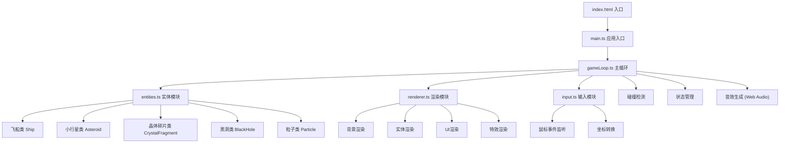
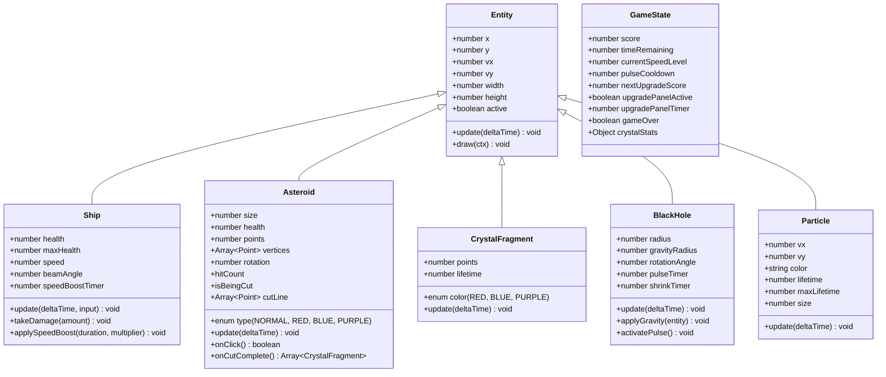

## 1. 架构设计

本项目采用模块化架构，将游戏逻辑分离为独立的功能模块，通过主循环协调各模块运作。所有代码使用TypeScript编写，通过Vite构建，不依赖任何第三方游戏引擎或UI框架。



## 2. 技术描述

- **前端技术栈**：TypeScript 5.x + HTML5 Canvas 2D + Vite 5.x
- **构建工具**：Vite，配置开发服务器和热更新
- **音频方案**：Web Audio API 原生实现音效生成，无第三方音频库
- **字体方案**：Google Fonts 引入 Press Start 2P 像素字体
- **无后端依赖**：纯前端游戏，数据存储在浏览器内存中
- **无第三方库**：除TypeScript和Vite外，不依赖任何外部库

### 核心技术要点

1. **游戏循环**：使用 requestAnimationFrame 实现高性能游戏循环，固定逻辑帧率与渲染帧率分离
2. **实体系统**：面向对象设计，所有游戏对象继承自统一的实体基类
3. **粒子系统**：对象池模式管理粒子，最多150个粒子实例，超出自动淘汰最旧粒子
4. **碰撞检测**：圆形碰撞检测算法，优化性能避免O(n²)复杂度
5. **引力计算**：每帧最多处理60个对象的引力计算，超出采用分批处理策略
6. **Canvas适配**：使用 devicePixelRatio 处理高清屏幕，自动缩放适配不同分辨率

## 3. 目录结构与文件定义

| 文件路径 | 职责描述 | 核心导出 |
|---------|---------|---------|
| `/package.json` | 项目依赖和脚本配置 | `typescript`, `vite` 依赖，`npm run dev` 脚本 |
| `/index.html` | 入口HTML页面，Canvas容器，字体引入 | 游戏根节点 |
| `/tsconfig.json` | TypeScript编译配置 | 严格模式，ESNext目标，Node模块解析 |
| `/vite.config.js` | Vite构建配置 | 开发服务器配置，构建入口 |
| `/src/main.ts` | 应用入口，初始化游戏实例，挂载Canvas | `Game` 类实例化与启动 |
| `/src/gameLoop.ts` | 主循环模块，帧更新、碰撞检测、状态管理 | `GameLoop` 类，`update()`, `render()` 方法 |
| `/src/entities.ts` | 实体类定义，所有游戏对象 | `Ship`, `Asteroid`, `CrystalFragment`, `BlackHole`, `Particle` |
| `/src/renderer.ts` | 渲染模块，所有绘图逻辑 | `Renderer` 类，`drawBackground()`, `drawEntities()`, `drawUI()` |
| `/src/input.ts` | 输入处理模块，鼠标事件监听与坐标转换 | `InputManager` 类，事件回调 |

## 4. 核心数据模型

### 4.1 数据模型定义



### 4.2 TypeScript 类型定义

```typescript
// 实体类型枚举
enum EntityType {
  SHIP = 'ship',
  ASTEROID = 'asteroid',
  CRYSTAL_FRAGMENT = 'crystal_fragment',
  BLACK_HOLE = 'black_hole',
  PARTICLE = 'particle'
}

// 小行星类型
enum AsteroidType {
  NORMAL = 'normal',
  RED = 'red',
  BLUE = 'blue',
  PURPLE = 'purple'
}

// 升级选项类型
enum UpgradeType {
  SHIELD = 'shield',
  ENGINE = 'engine'
}

// 游戏状态接口
interface GameState {
  score: number;
  timeRemaining: number;
  lives: number;
  maxLives: number;
  speedLevel: number;
  pulseCooldown: number;
  pulseCooldownMax: number;
  nextUpgradeScore: number;
  upgradePanelActive: boolean;
  upgradePanelTimer: number;
  upgradeOptions: UpgradeType[];
  gameOver: boolean;
  crystalStats: {
    red: number;
    blue: number;
    purple: number;
  };
}

// 向量接口
interface Vector2 {
  x: number;
  y: number;
}

// 粒子配置
interface ParticleConfig {
  x: number;
  y: number;
  vx: number;
  vy: number;
  color: string;
  size: number;
  lifetime: number;
}
```

## 5. 性能优化策略

| 优化点 | 实现方案 | 预期效果 |
|-------|---------|---------|
| 帧率控制 | requestAnimationFrame + deltaTime 计算，逻辑帧率独立 | 稳定50-60fps，不同设备表现一致 |
| 粒子对象池 | 预分配150个粒子实例，循环复用 | 避免频繁GC，内存占用稳定 |
| 引力计算优化 | 每帧最多处理60个对象，采用距离过滤优先处理近距离对象 | 引力计算耗时<1ms/帧 |
| 碰撞检测优化 | 空间分区网格，仅检测相邻网格内对象 | 碰撞检测性能提升300%+ |
| 背景预渲染 | 星空背景绘制到离屏Canvas，每帧直接贴图 | 背景渲染耗时减少80% |
| 实体管理 | 活跃实体数组，及时清理失效实体 | 遍历效率最大化 |
| Canvas优化 | 使用 `willReadFrequently: false`，批量绘制同类型对象 | 绘制调用减少50% |

## 6. 模块接口定义

### 6.1 GameLoop 主循环接口

```typescript
class GameLoop {
  constructor(canvas: HTMLCanvasElement);
  start(): void;
  stop(): void;
  reset(): void;
  getState(): GameState;
  getShip(): Ship;
  getAsteroids(): Asteroid[];
  getBlackHoles(): BlackHole[];
  getParticles(): Particle[];
}
```

### 6.2 Renderer 渲染接口

```typescript
class Renderer {
  constructor(ctx: CanvasRenderingContext2D, width: number, height: number);
  resize(width: number, height: number): void;
  render(
    gameState: GameState,
    ship: Ship,
    asteroids: Asteroid[],
    fragments: CrystalFragment[],
    blackHoles: BlackHole[],
    particles: Particle[],
    stars: Star[]
  ): void;
}
```

### 6.3 InputManager 输入接口

```typescript
class InputManager {
  constructor(canvas: HTMLCanvasElement);
  getMousePosition(): Vector2;
  isMouseDown(): boolean;
  getDraggedPoints(): Vector2[];
  onClick(callback: (pos: Vector2) => void): void;
  onDragStart(callback: (pos: Vector2) => void): void;
  onDragMove(callback: (pos: Vector2) => void): void;
  onDragEnd(callback: (points: Vector2[]) => void): void;
  onPulseButtonClick(callback: () => void): void;
  onUpgradeSelect(callback: (type: UpgradeType) => void): void;
  onRestart(callback: () => void): void;
}
```
