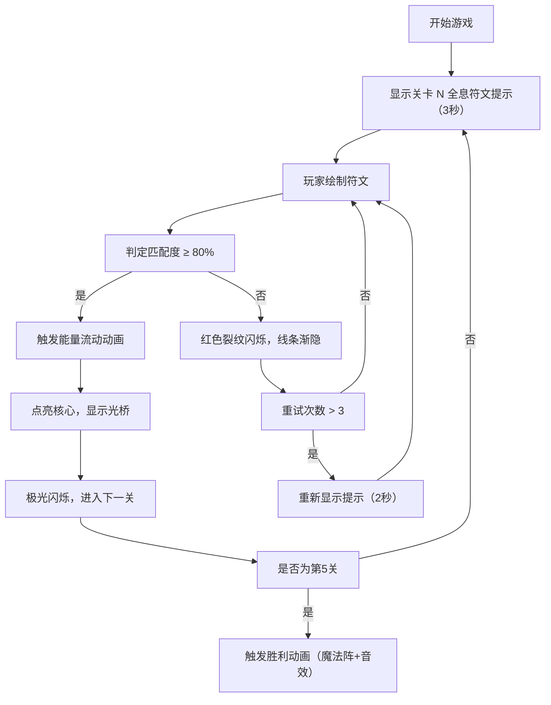

## 1. 产品概述

符文铭刻师（Rune Inscriber）是一款基于 HTML5 Canvas 的浏览器交互式解谜游戏，玩家通过鼠标在古老石碑上绘制符文图案，激活并引导光之能量，最终点亮能量核心，解锁更复杂的符文谜题。

- **核心问题解决**：填补神话主题休闲解谜游戏中手绘图案识别、能量流动动画与渐进式谜题设计缺乏整合的空白，提供沉浸式的即时视觉与音效反馈体验。
- **目标用户**：休闲游戏玩家、神话文化爱好者。
- **产品价值**：结合艺术创作与解谜思考，提供富有仪式感的魔法体验。

## 2. 核心功能

### 2.2 功能模块
1. **主游戏界面**：中央石碑、符文绘制区域、UI 提示面板
2. **符文绘制系统**：鼠标绘制、粒子拖尾、线条燃烧固化效果
3. **谜题匹配系统**：5 个渐进难度符文、全息投影提示、像素覆盖率 + 方向余弦相似度匹配算法
4. **能量流动动画系统**：光之能量流、八边形能量核心、光桥解锁
5. **胜利动画系统**：极光闪烁、魔法阵旋转、胜利音效
6. **失败反馈系统**：红色裂纹闪烁、线条渐隐、重试提示

### 2.3 页面详情
| 页面名称 | 模块名称 | 功能描述 |
|---------|---------|---------|
| 主游戏界面 | 石碑绘制区 | 深灰石纹噪点纹理、3-5 条随机裂缝、鼠标绘制交互 |
| 主游戏界面 | 全息投影提示 | 关卡开始前 3 秒显示冰蓝色目标符文轮廓，3 次重试后重新显示 2 秒 |
| 主游戏界面 | 能量核心 | 八边形灰色核心，成功后点亮并扩散波纹 |
| 主游戏界面 | UI 信息面板 | 显示当前关卡编号、剩余尝试次数、铭文提示（5 秒后隐藏） |
| 主游戏界面 | 光桥 | 成功后显示 5 块菱形光砖通往下一关 |
| 胜利界面 | 魔法阵动画 | 150 个金色粒子圆形轨迹旋转、光球脉冲效果 |

## 3. 核心流程

玩家进入游戏后，看到古老石碑和全息符文提示。提示消失后，玩家按住鼠标左键绘制符文。绘制完成后系统判断匹配度，若达到 80% 以上则成功，触发能量流动动画并点亮核心，解锁下一关；若失败则触发红色裂纹反馈，玩家重试。超过 3 次失败重新显示提示。通关 5 关后触发胜利动画。

## 4. 用户界面设计

### 4.1 设计风格
- **主色调**：深紫罗兰到黑曜石径向渐变背景，金色（#d4af37）作为核心强调色，冰蓝色作为提示色，铜色作为固化色
- **字体**：Times New Roman（细长 Serif 字体），统一字号 14px
- **光效风格**：荧光金色线条带白色光晕，粒子拖尾，能量流带金色边缘光晕
- **布局风格**：中央略微偏左的石碑（宽 40%，高 50%），右侧浮动 UI 面板，底部浅淡金色弧形祭坛边缘

### 4.2 页面设计概述
| 页面名称 | 模块名称 | UI 元素 |
|---------|---------|---------|
| 主游戏界面 | 石碑绘制区 | 深灰噪点石纹、3-5 条随机裂缝、金色流动线条、铜色固化线条 |
| 主游戏界面 | 全息投影 | 冰蓝色半透明轮廓、线宽 3px、透明度 0.6 |
| 主游戏界面 | 能量核心 | 八边形（40px）、灰色→金色→白色发光、波纹扩散动画 |
| 主游戏界面 | UI 面板 | 半透明石板、关卡编号、剩余次数、铭文提示 |
| 主游戏界面 | 光桥 | 5 块半透明菱形光砖、间距 20px |
| 胜利界面 | 魔法阵 | 150 个金色粒子、圆形轨迹（100-150px）、10秒/圈 |

### 4.3 响应式
- **桌面端（≥768px）**：石碑占宽度 40%，高度 50%
- **移动端（<768px）**：石碑占宽度 70%，高度自适应，所有粒子/光效尺寸按比例缩放
- **触摸优化**：支持触摸设备的 touchstart/touchmove/touchend 事件

## 4.4 性能要求
- **帧率**：1920x1080 分辨率下不低于 30 FPS
- **动画驱动**：requestAnimationFrame
- **粒子控制**：峰值 ≤ 200 个
- **渲染限制**：避免大量实时阴影渲染
