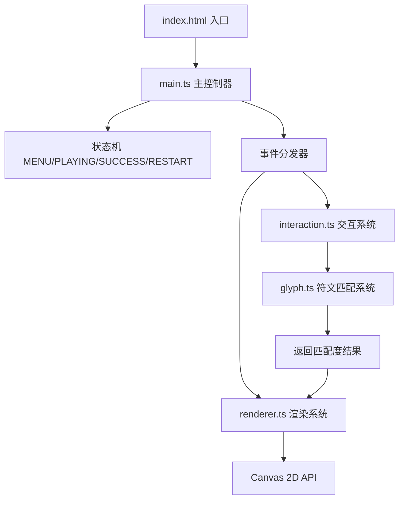

## 1. 架构设计



## 2. 技术描述

- **前端框架**：无框架，纯 TypeScript + HTML5 Canvas 2D API
- **构建工具**：Vite 5.x
- **语言**：TypeScript 5.x（严格模式，ES2020 目标）
- **渲染技术**：HTML5 Canvas 2D，requestAnimationFrame 驱动
- **动画系统**：自研粒子系统，基于时间差的帧动画
- **音效**：Web Audio API 合成（低频嗡鸣 + 高频铃音）
- **数据**：内置 5 个符文路径数据（归一化坐标点序列）

## 3. 文件结构

```
/
├── index.html                    # 入口页面，含加载动画
├── package.json                  # 依赖配置（typescript, vite）
├── tsconfig.json                 # TypeScript 配置（严格模式）
├── vite.config.js                # Vite 构建配置
└── src/
    ├── main.ts                   # 应用入口，状态机，主循环
    ├── glyph.ts                  # 符文数据与匹配算法
    ├── renderer.ts               # 渲染系统与粒子管理
    └── interaction.ts            # 鼠标/触摸交互处理
```

## 4. 核心模块说明

### 4.1 glyph.ts - 符文系统
```typescript
interface Point { x: number; y: number; }
interface GlyphStroke { points: Point[]; }
interface Glyph { id: number; name: string; strokes: GlyphStroke[]; }
interface MatchResult { score: number; success: boolean; }

// 核心方法
function generateGlyphs(): Glyph[];  // 生成5个关卡的符文数据
function matchGlyph(
  playerStrokes: Point[][],
  targetGlyph: Glyph,
  canvasWidth: number,
  canvasHeight: number
): MatchResult;
```

**匹配算法**：
1. **像素覆盖率**：将玩家路径与目标路径栅格化，计算重叠像素比例
2. **方向余弦相似度**：对每条笔画的分段方向向量计算余弦相似度
3. **加权综合**：覆盖率权重 0.6，方向相似度权重 0.4

### 4.2 renderer.ts - 渲染系统
```typescript
interface Particle {
  x: number; y: number; vx: number; vy: number;
  life: number; maxLife: number; size: number;
  color: string; alpha: number;
}

interface RendererState {
  stoneTexture: ImageData;
  cracks: Point[][];
  activeParticles: Particle[];
  drawingStroke: Point[];
  completedStrokes: { points: Point[]; solidified: boolean; burnProgress: number }[];
  energyFlow: { active: boolean; progress: number; strokeIndex: number };
  coreGlow: number;
  auraWave: { active: boolean; radius: number; alpha: number };
  aurora: { active: boolean; progress: number };
  magicCircle: { active: boolean; rotation: number; particles: Particle[] };
  hintGlyph: { visible: boolean; alpha: number; glyph: Glyph | null };
  lightBridge: { active: boolean; alpha: number };
}

class Renderer {
  constructor(ctx: CanvasRenderingContext2D, width: number, height: number);
  generateStoneTexture(): void;
  drawBackground(dt: number): void;
  drawStone(dt: number): void;
  drawHintGlyph(dt: number): void;
  drawPlayerStrokes(dt: number): void;
  drawEnergyFlow(dt: number): void;
  drawEnergyCore(dt: number): void;
  drawLightBridge(dt: number): void;
  drawUI(dt: number, level: number, attempts: number, message: string): void;
  drawAurora(dt: number): void;
  drawMagicCircle(dt: number): void;
  updateParticles(dt: number): void;
  addParticle(...): void;
  resize(width: number, height: number): void;
}
```

### 4.3 interaction.ts - 交互系统
```typescript
class InteractionHandler {
  constructor(canvas: HTMLCanvasElement, callbacks: {
    onStrokeStart: (p: Point) => void;
    onStrokeMove: (p: Point) => void;
    onStrokeEnd: (p: Point) => void;
  });
  
  getCanvasPoint(e: MouseEvent | TouchEvent): Point;
}
```

### 4.4 main.ts - 主控制器
```typescript
type GameState = 'MENU' | 'PLAYING' | 'SUCCESS' | 'RESTART';

interface GameStateData {
  currentLevel: number;
  attempts: number;
  currentGlyph: Glyph;
  playerStrokes: Point[][];
  currentStroke: Point[];
  matchResult: MatchResult | null;
  uiMessage: string;
  uiMessageTimer: number;
}

class Game {
  private state: GameState;
  private stateData: GameStateData;
  private renderer: Renderer;
  private interaction: InteractionHandler;
  
  constructor();
  init(): void;
  startLevel(level: number): void;
  showHint(duration: number): void;
  handleStrokeStart(p: Point): void;
  handleStrokeMove(p: Point): void;
  handleStrokeEnd(p: Point): void;
  checkMatch(): void;
  triggerSuccessAnimation(): void;
  triggerFailAnimation(): void;
  triggerVictory(): void;
  update(dt: number): void;
  render(): void;
  gameLoop(): void;
}
```

## 5. 数据模型

### 5.1 符文数据结构
5 个关卡符文设计（归一化坐标 0-1）：

1. **Level 1 - 初始符文**：竖直线 + 底部圆圈（2 笔）
2. **Level 2 - 双月符文**：左弧线 + 右弧线 + 横连接线（3 笔）
3. **Level 3 - 三叉符文**：中心竖线 + 左斜线 + 右斜线（3 笔）
4. **Level 4 - 螺旋符文**：顺时针螺旋 + 外框菱形（2 笔）
5. **Level 5 - 复合符文**：锯齿波浪 + 中心十字 + 外圈圆环（3 笔）

### 5.2 符文生成算法
- 每笔由 20-50 个归一化坐标点组成
- 使用贝塞尔曲线或参数方程生成平滑路径
- 坐标基于石碑尺寸动态转换

## 6. 渲染与动画关键技术

1. **石碑纹理**：Canvas 生成 Perlin 噪点 + 随机裂缝（使用离屏 Canvas 缓存）
2. **绘制光效**：
   - 金色线条：lineWidth=6, shadowColor=gold, shadowBlur=15
   - 起点光晕：径向渐变白色透明
   - 粒子拖尾：每帧在鼠标位置添加 1-2 个粒子，速度 20-30px/s
3. **燃烧固化**：使用 stroke-dashoffset 动画实现向前推进效果
4. **能量流动**：沿路径的线性渐变 + 时间偏移实现流动感
5. **核心波纹**：半径从 40px 扩大到 120px，透明度 0.6→0，持续 0.8s
6. **魔法阵粒子**：极坐标系统，角度随时间递增，半径 100-150px 随机

## 7. 性能优化策略

1. **离屏缓存**：石碑纹理、符文轮廓预渲染到离屏 Canvas
2. **粒子池**：对象池管理粒子，避免频繁 GC
3. **脏矩形渲染**：仅重绘变化区域（必要时）
4. **时间差动画**：使用 dt 确保不同帧率下动画速度一致
5. **粒子数量控制**：峰值 200，超出时优先移除寿命最短的粒子
