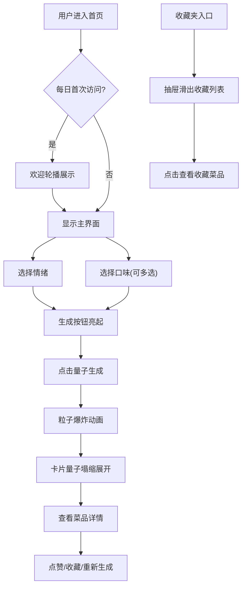

## 1. 产品概述

"味觉·量子菜单"是一款结合分子料理概念的创意菜品生成应用，用户通过选择情绪与口味偏好，系统生成融合科学与艺术的虚拟菜品体验。

- **核心价值**：将情绪与味觉关联，通过AI生成算法创造独特的分子料理体验，为用户提供沉浸式的美食想象空间
- **目标用户**：美食爱好者、创意从业者、追求新奇体验的年轻人群
- **市场定位**：未来科技感与美食艺术结合的创新交互应用

## 2. 核心功能

### 2.1 用户角色
| 角色 | 注册方式 | 核心权限 |
|------|----------|----------|
| 普通用户 | 无需注册 | 生成菜品、点赞、收藏、查看收藏夹 |

### 2.2 功能模块
1. **首页**：欢迎轮播、情绪选择器、口味选择器、菜品生成与展示区、操作栏、收藏夹
2. **收藏夹抽屉**：收藏菜品列表、快速查看功能
3. **菜品卡片**：量子塌缩展示动画、动态渐变背景、三栏内容布局、交互按钮

### 2.3 页面详情
| 页面名称 | 模块名称 | 功能描述 |
|---------|----------|----------|
| 首页 | 欢迎轮播 | 每日首次访问展示3张历史推荐，自动轮播+手动切换，视差效果 |
| 首页 | 情绪选择器 | 4个彩色圆形按钮（快乐黄/忧郁蓝/兴奋橙/平静绿），悬停/选中动画 |
| 首页 | 口味选择器 | 4个标签按钮（甜/辣/酸/鲜），可多选，水滴飞入动画 |
| 首页 | 量子生成按钮 | 磨砂玻璃效果，点击粒子爆炸动画，选中后亮起 |
| 首页 | 菜品卡片 | 量子塌缩展开动画，三栏布局（食材/步骤/体验），动态渐变背景 |
| 首页 | 操作栏 | 点赞（心形）、收藏（星形）、重新生成（旋转箭头）按钮动画 |
| 首页 | 收藏夹入口 | 书签图标，抽屉式滑出收藏列表 |

## 3. 核心流程

用户进入首页 → 每日首次访问显示欢迎轮播 → 选择情绪 → 选择口味（可多选）→ 点击量子生成按钮 → 粒子爆炸动画 → 菜品卡片量子塌缩展开 → 查看菜品详情 → 点赞/收藏/重新生成 → 点击收藏夹查看历史收藏

## 4. 用户界面设计

### 4.1 设计风格
- **主色调**：深色主题，背景 `#0a0a1a` 到 `#1a1a2e` 径向渐变，强调色从情绪主题色中选取
- **配色方案**：
  - 快乐：`#ffe66d`（黄）
  - 忧郁：`#4ecdc4`（蓝）
  - 兴奋：`#ff6b6b`（橙红）
  - 平静：`#95e1a3`（绿）
  - 甜：`#ff9ff3`（粉）
  - 辣：`#ee5253`（红）
  - 酸：`#1dd1a1`（绿）
  - 鲜：`#54a0ff`（蓝）
- **按钮风格**：软阴影、光晕效果、磨砂玻璃质感、圆角设计
- **字体**：展示字体使用 Orbitron（未来科技感），正文字体使用 Noto Sans SC，数字使用 JetBrains Mono
- **布局风格**：卡片式布局，玻璃态面板，分层阴影效果
- **图标风格**：线性+填充结合，带微弱发光效果，与主题色呼应
- **视觉元素**：粒子流动背景、分子结构加载动画、散景阴影效果

### 4.2 页面设计概述
| 页面名称 | 模块名称 | UI元素 |
|---------|----------|--------|
| 首页 | 加载动画 | 中央旋转分子结构粒子，2秒后淡出，transition: opacity 0.5s ease |
| 首页 | 欢迎轮播 | 3张卡片3秒自动切换，左右箭头，视差背景，transform: translate3d |
| 首页 | 选择器面板 | 磨砂玻璃（backdrop-filter: blur(20px)），半透明边框，内外阴影 |
| 首页 | 情绪按钮 | 圆形渐变按钮，悬停 hue-rotate(10deg) scale(1.1)，选中脉冲波纹金色边框 |
| 首页 | 口味标签 | 胶囊形按钮，选中填充主题色，水滴飞入碗动画（keyframes drop） |
| 首页 | 生成按钮 | 悬浮固定，磨砂玻璃，从灰到主题色过渡，点击粒子爆炸（keyframes explode） |
| 首页 | 菜品卡片 | 量子塌缩展开（keyframes collapse），动态渐变背景，三栏flex布局，内外发光边框 |
| 首页 | 操作按钮 | 心形点赞（scale 1.2回弹），星形收藏（rotate 360度变金色），旋转箭头重新生成 |
| 首页 | 收藏夹 | 书签图标，抽屉滑入（keyframes slideIn），半透明列表，滑出渐变消失 |

### 4.3 响应式设计
- **桌面端**（≥768px）：情绪与口味选择器并排布局，菜品卡片三栏展示
- **平板端**（480px-767px）：选择器上下排列，菜品卡片保持三栏
- **移动端**（<480px）：选择器变为纵向滚动列表，菜品卡片全宽单栏堆叠，按钮尺寸适配触控

### 4.4 动画规范
- **过渡效果**：所有交互使用 `transition: all 0.3s cubic-bezier(0.4, 0, 0.2, 1)`
- **动画时长**：0.3-0.5秒，缓动函数使用 ease-out
- **性能要求**：使用 `transform` 和 `opacity` 属性实现动画，避免重排重绘
- **帧率目标**：粒子动画保持50fps以上，使用 `will-change` 和 `requestAnimationFrame` 优化
