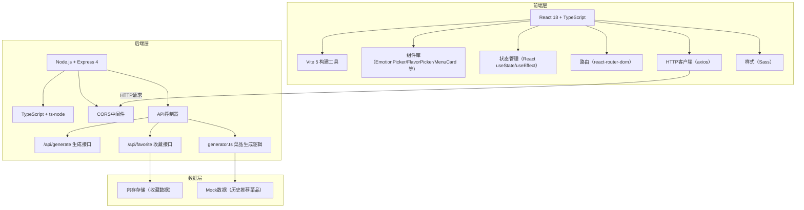
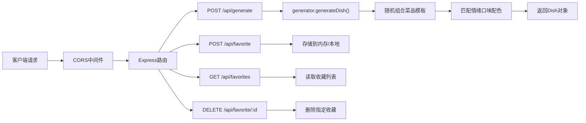
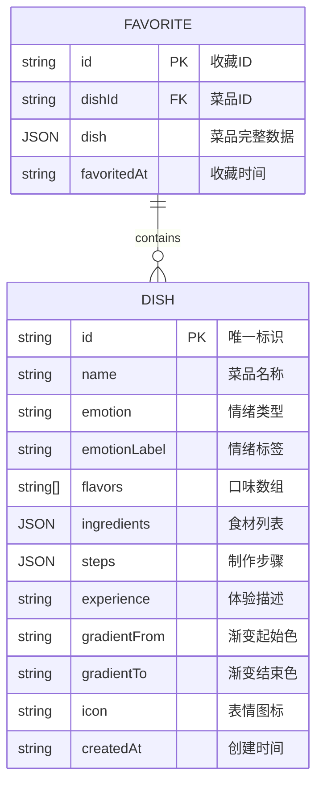

## 1. 架构设计



## 2. 技术说明

- **前端**：React@18 + TypeScript + Vite@5 + Sass + react-router-dom + axios
- **后端**：Node.js + Express@4 + TypeScript + ts-node + CORS
- **构建工具**：Vite 5（热更新、快速构建）
- **数据存储**：内存存储（开发阶段），收藏数据持久化到 localStorage
- **动画实现**：纯CSS动画（keyframes/transition）+ React状态驱动

### 依赖说明
| 依赖包 | 版本 | 用途 |
|--------|------|------|
| react | ^18.2.0 | 前端框架 |
| react-dom | ^18.2.0 | DOM渲染 |
| typescript | ^5.0.0 | 类型系统 |
| vite | ^5.0.0 | 构建工具 |
| @types/react | ^18.2.0 | React类型定义 |
| @types/react-dom | ^18.2.0 | React DOM类型定义 |
| axios | ^1.6.0 | HTTP请求 |
| react-router-dom | ^6.20.0 | 路由管理 |
| sass | ^1.69.0 | CSS预处理器 |
| express | ^4.18.0 | 后端框架 |
| ts-node | ^10.9.0 | TypeScript运行时 |
| @types/express | ^4.17.0 | Express类型定义 |
| cors | ^2.8.5 | 跨域中间件 |
| @types/cors | ^2.8.17 | CORS类型定义 |
| concurrently | ^8.2.0 | 同时启动前后端 |

## 3. 目录结构

```
auto127/
├── package.json              # 项目配置与依赖
├── vite.config.js            # Vite构建配置
├── tsconfig.json             # 前端TypeScript配置
├── index.html                # 入口HTML
├── src/
│   ├── main.tsx              # React入口
│   ├── App.tsx               # 主应用组件
│   ├── api.ts                # API请求封装
│   ├── types/                # 类型定义
│   │   └── index.ts
│   ├── components/           # 组件目录
│   │   ├── MenuCard.tsx      # 菜品卡片
│   │   ├── EmotionPicker.tsx # 情绪选择器
│   │   ├── FlavorPicker.tsx  # 口味选择器
│   │   ├── GenerateButton.tsx# 生成按钮
│   │   ├── LoadingScreen.tsx # 加载动画
│   │   ├── WelcomeCarousel.tsx# 欢迎轮播
│   │   └── FavoritesDrawer.tsx# 收藏夹抽屉
│   ├── hooks/                # 自定义Hooks
│   │   └── useParticles.ts   # 粒子动画Hook
│   └── styles/               # 样式文件
│       ├── main.scss         # 全局样式
│       ├── _variables.scss   # Sass变量
│       ├── _animations.scss  # 动画关键帧
│       └── _responsive.scss  # 响应式断点
└── server/
    ├── tsconfig.json         # 后端TypeScript配置
    ├── index.ts              # Express服务入口
    ├── generator.ts          # 菜品生成逻辑
    └── types.ts              # 后端类型定义
```

## 4. API 定义

### 类型定义

```typescript
// src/types/index.ts
export type Emotion = 'happy' | 'sad' | 'excited' | 'calm';
export type Flavor = 'sweet' | 'spicy' | 'sour' | 'umami';

export interface Ingredient {
  name: string;
  icon: string;
  amount: string;
}

export interface Step {
  number: number;
  description: string;
}

export interface Dish {
  id: string;
  name: string;
  emotion: Emotion;
  emotionLabel: string;
  flavors: Flavor[];
  ingredients: Ingredient[];
  steps: Step[];
  experience: string;
  gradientFrom: string;
  gradientTo: string;
  icon: string;
  createdAt: string;
}

export interface GenerateRequest {
  emotion: Emotion;
  flavors: Flavor[];
}

export interface FavoriteRequest {
  dish: Dish;
}

export interface FavoriteItem {
  dish: Dish;
  favoritedAt: string;
}
```

### 接口定义

| 方法 | 路径 | 请求体 | 响应 | 说明 |
|------|------|--------|------|------|
| POST | `/api/generate` | `{ emotion: Emotion, flavors: Flavor[] }` | `Dish` | 根据情绪和口味生成菜品 |
| POST | `/api/favorite` | `{ dish: Dish }` | `{ success: boolean, message: string }` | 收藏菜品 |
| GET | `/api/favorites` | - | `FavoriteItem[]` | 获取收藏列表 |
| DELETE | `/api/favorite/:id` | - | `{ success: boolean }` | 删除收藏 |

## 5. 服务器架构



## 6. 数据模型

### 6.1 数据模型定义



### 6.2 前端数据持久化

使用 `localStorage` 存储用户收藏数据，key 为 `quantum_menu_favorites`，存储格式：

```json
{
  "favorites": [
    {
      "dish": { /* Dish对象 */ },
      "favoritedAt": "2026-06-13T03:20:00.000Z"
    }
  ],
  "lastVisitDate": "2026-06-13",
  "likedDishes": ["dish-id-1", "dish-id-2"]
}
```

## 7. 启动脚本

| 脚本命令 | 说明 |
|----------|------|
| `npm run dev:front` | 启动前端开发服务器（端口3000） |
| `npm run dev:back` | 启动后端开发服务器（端口3001） |
| `npm run dev` | 使用concurrently同时启动前后端 |
| `npm run build` | 构建前端生产版本 |
| `npm run build:back` | 编译后端TypeScript |
