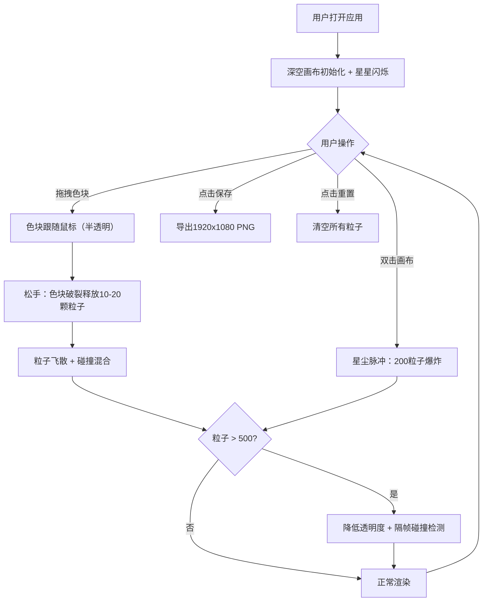

## 1. 产品概述

星尘·调色盘是一款基于Canvas的浏览器端交互式星云绘画应用，让用户通过拖拽星云色块到深空画布上，利用粒子碰撞混合机制创造独一无二的数字星云画作。目标用户为科幻插画师和数字艺术爱好者，提供沉浸式宇宙创作体验。

## 2. 核心功能

### 2.2 功能模块

1. **主画布页面**：深空背景、闪烁星星、粒子绘画区域、底部调色板栏、操作按钮

### 2.3 页面详情

| 页面名称 | 模块名称 | 功能描述 |
|---------|---------|---------|
| 主画布 | 深空背景 | 径向渐变漆黑到深蓝背景，50颗随机闪烁星星（1-2px，随机频率） |
| 主画布 | 调色板栏 | 底部固定70px高度栏，12个星云色块（40x40px），径向渐变+发光边缘，悬停1.1倍放大+增亮 |
| 主画布 | 色块拖拽 | 鼠标拖拽色块到画布，松开后色块破裂释放10-20颗粒子（数量随拖拽速度调整），粒子放射飞散、减速、变色、缩小至消失 |
| 主画布 | 粒子碰撞混合 | 粒子碰撞时RGB加权混合产生新颜色，碰撞后产生扩散光晕（半径30px，透明度0.2），新粒子短暂增大5-8px再恢复 |
| 主画布 | 星尘脉冲 | 双击画布触发，清空所有粒子保留星星，从点击位置释放12色200粒子绚烂爆炸，3秒后逐渐消失 |
| 主画布 | 保存/重置按钮 | 右上角按钮，保存为1920x1080 PNG，重置清空所有粒子 |
| 主画布 | 性能自适应 | 粒子超500颗时降低新粒子透明度（1.0→0.5）和碰撞检测精度（每帧→隔帧），保持45FPS+ |

## 3. 核心流程

用户打开应用 → 看到深空画布和底部12个星云色块 → 拖拽色块到画布 → 色块破裂释放粒子 → 粒子飞散并碰撞混合 → 创作出星云画作 → 可双击触发星尘脉冲 → 保存或重置

## 4. 用户界面设计

### 4.1 设计风格

- **主色调**：深空黑（#000000）→深蓝（#0a0a2e）径向渐变背景
- **辅助色**：12种宇宙色系（星云紫#9b59b6、星云粉#e91e9c、星云蓝#3498db、星云青#1abc9c、星云金#f39c12、星云橙#e67e22、星云红#e74c3c、星云绿#2ecc71、星云靛#4a54e1、星云玫#ff6b9d、星云铜#cd8032、星云银#c0c0c0）
- **按钮风格**：圆角矩形，1px边框（匹配当前色块主色调），悬停0.3s渐进式背景填充动画
- **字体**：系统无衬线字体，标题加粗
- **布局**：全屏显示，零页边距，画布自适应（最小800x600），底部70px调色板栏

### 4.2 页面设计概览

| 页面名称 | 模块名称 | UI元素 |
|---------|---------|--------|
| 主画布 | 深空背景 | 径向渐变黑→深蓝，50颗1-2px白色半透明闪烁星点 |
| 主画布 | 调色板栏 | rgba(0,0,0,0.7)背景，70px高，12个40x40色块均匀分布，径向渐变+发光边缘 |
| 主画布 | 色块悬停 | 1.1倍放大，发光亮度增强 |
| 主画布 | 操作按钮 | 右上角，圆角矩形，1px边框，悬停0.3s背景填充 |
| 主画布 | 加载LOGO | 中央缓缓旋转的星云漩涡LOGO |

### 4.3 响应式

- 桌面优先设计，全屏自适应
- 最小支持800x600分辨率
- 画布尺寸随窗口动态调整
