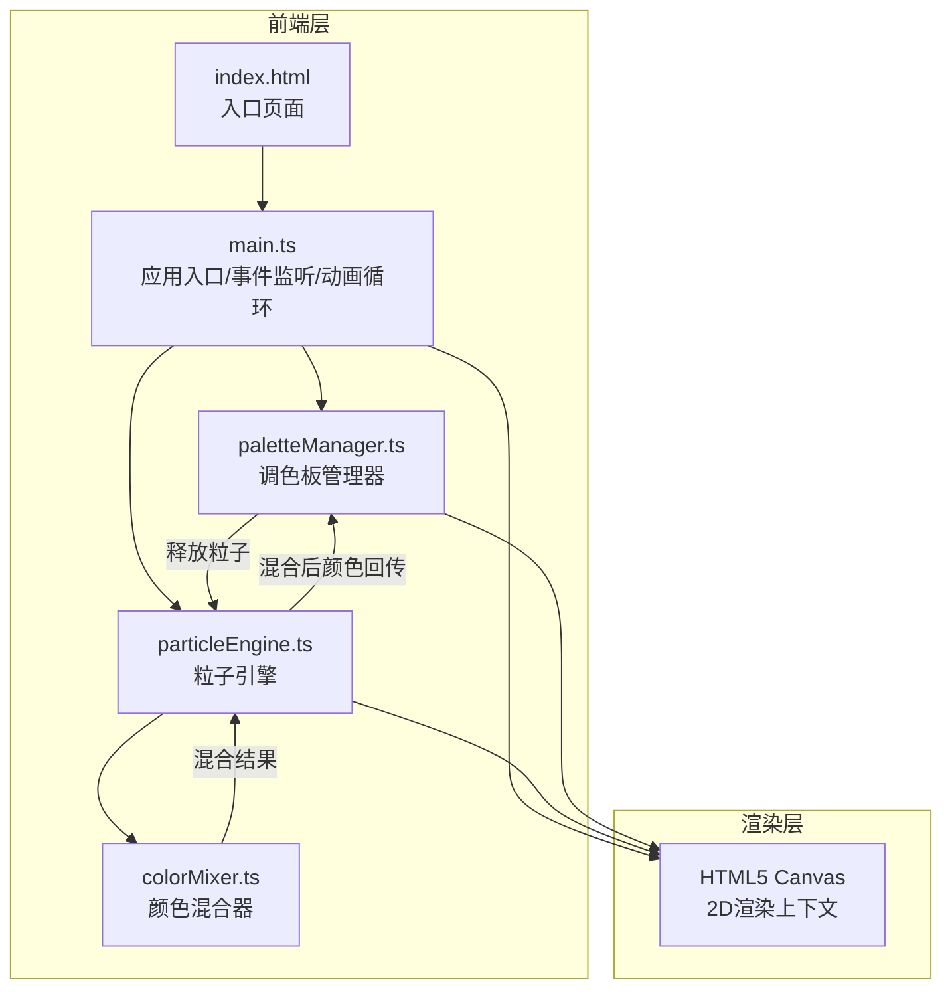

## 1. 架构设计



## 2. 技术说明

- **前端**：TypeScript + Vite（无框架，纯Canvas渲染）
- **动画库**：GSAP（用于加载LOGO旋转动画和UI过渡效果）
- **构建工具**：Vite
- **后端**：无
- **数据库**：无

## 3. 文件结构与数据流

```
├── package.json          # 依赖：typescript, vite, gsap; 脚本：npm run dev
├── vite.config.js        # 构建配置，指向index.html
├── tsconfig.json         # 严格模式，ES模块目标
├── index.html            # 入口页面，纯黑背景，加载LOGO
└── src/
    ├── main.ts           # 应用入口 → 初始化Canvas → 挂载事件 → 启动动画循环
    ├── paletteManager.ts # 调色板管理器 → 12色块 → 拖拽 → 释放粒子给particleEngine
    ├── particleEngine.ts # 粒子引擎 → 粒子运动/碰撞/渲染 → 调用colorMixer → 回传颜色
    └── colorMixer.ts     # 颜色混合器 → RGB加权融合 → 返回混合结果
```

**数据流向**：
1. 用户鼠标事件 → `main.ts` 接收坐标
2. `main.ts` → `paletteManager.ts`（拖拽色块位置更新）
3. `paletteManager.ts` 松手 → `particleEngine.ts`（注入新粒子）
4. `particleEngine.ts` 碰撞检测 → `colorMixer.ts`（RGB混合计算）
5. `colorMixer.ts` → `particleEngine.ts`（返回混合后颜色/大小/光晕）
6. `particleEngine.ts` → `paletteManager.ts`（回传混合色用于色块更新）
7. `particleEngine.ts` → Canvas（渲染粒子）
8. `main.ts` → Canvas（动画循环驱动）

## 4. 核心数据结构

### 4.1 Particle（粒子）

```typescript
interface Particle {
  x: number;
  y: number;
  vx: number;
  vy: number;
  r: number;
  g: number;
  b: number;
  size: number;        // 6-12px
  lifespan: number;    // 3-6秒
  age: number;         // 已存在时间
  alpha: number;       // 透明度 0-1
  haloRadius: number;  // 光晕半径
  haloAlpha: number;   // 光晕透明度
}
```

### 4.2 ColorBlock（色块）

```typescript
interface ColorBlock {
  x: number;
  y: number;
  r: number;
  g: number;
  b: number;
  size: number;        // 40px
  isDragging: boolean;
  glowIntensity: number;
}
```

### 4.3 MixResult（混合结果）

```typescript
interface MixResult {
  r: number;
  g: number;
  b: number;
  sizeDelta: number;   // 5-8px 增量
  haloIntensity: number;
}
```

## 5. 性能策略

| 粒子数量 | 透明度 | 碰撞检测 | 目标帧率 |
|---------|--------|---------|---------|
| ≤500 | 1.0 | 每帧检测 | ≥60FPS |
| >500 | 0.5 | 隔帧检测 | ≥45FPS |

- 粒子引擎更新计算每帧耗时 ≤ 16ms
- 颜色混合算法每次调用耗时 ≤ 0.5ms
- 碰撞检测采用空间网格优化（网格大小30px）
