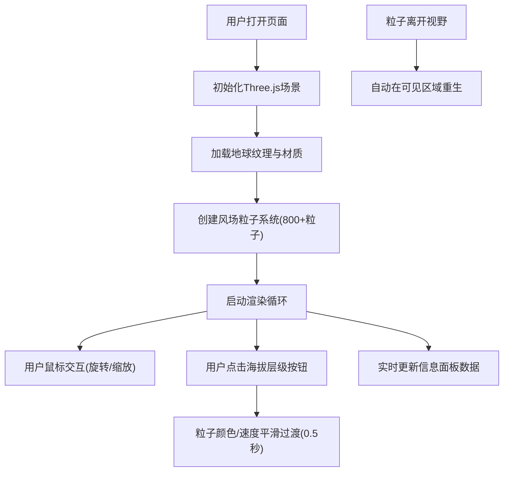

## 1. 产品概述
本产品是一款面向气象研究人员的交互式3D全球风场可视化应用，通过Three.js构建真实感地球模型与动态风场粒子系统，直观展示不同海拔高度的全球风向数据与气流运动趋势。

- 核心价值：将抽象的气象数据转化为沉浸式3D视觉体验，帮助研究人员直观理解全球大气环流模式
- 目标用户：气象研究员、气候分析师、环境科学研究者

## 2. 核心功能

### 2.1 功能模块
1. **3D地球渲染模块**：高分辨率卫星云图纹理、缓慢自转、鼠标交互控制
2. **风场粒子系统模块**：800+动态粒子、流线轨迹、颜色渐变、发光效果
3. **海拔层级控制模块**：低空/中空/高空三级切换、平滑过渡动画
4. **实时信息面板模块**：经纬度海拔显示、毛玻璃效果、数字动画更新
5. **性能优化模块**：粒子智能再生、帧率稳定、HDR后处理

### 2.2 页面详情
| 页面名称 | 模块名称 | 功能描述 |
|---------|---------|---------|
| 主页面 | 3D场景渲染 | 全屏深空背景、自转地球、动态风场粒子系统 |
| 主页面 | 海拔层级控制 | 左下角三级切换按钮，颜色/速度平滑过渡 |
| 主页面 | 实时信息面板 | 右下角悬浮面板，显示视角中心经纬度和海拔 |
| 主页面 | 加载提示 | 初始加载时显示进度提示 |

## 3. 核心流程

## 4. 用户界面设计

### 4.1 设计风格
- **主色调**：深空渐变背景（深蓝#0a0e27 → 纯黑#000000）
- **粒子渐变**：低纬度蓝色(#0066ff) → 中纬度青色(#00ffcc) → 高纬度紫色(#9933ff)
- **层级配色**：低空黄色(#ffcc00)、中空橙色(#ff6600)、高空红色(#ff3333)
- **按钮风格**：圆角胶囊形状，悬停放大1.1倍，亮度提升30%
- **字体**：采用Orbitron科技感字体 + Roboto Mono等宽字体组合
- **毛玻璃效果**：backdrop-filter: blur(10px)，1px细亮边框

### 4.2 页面设计概述
| 页面名称 | 模块名称 | UI元素 |
|---------|---------|---------|
| 主页面 | 3D地球 | 高分辨率卫星纹理、大气光晕效果、缓慢自转 |
| 主页面 | 粒子系统 | 流线轨迹、半透明渐变、大小波动、HDR辉光 |
| 主页面 | 层级控制 | 圆角胶囊按钮组、选中高亮、悬停动画 |
| 主页面 | 信息面板 | 毛玻璃背景、数字淡入上升动画、细亮边框 |

### 4.3 响应式设计
- **桌面端**：按钮尺寸48px高度，面板宽度280px
- **平板横屏**：整体缩放0.85倍
- **手机横屏**：整体缩放0.7倍，按钮最小高度36px，面板宽度自适应
- **触摸优化**：支持触摸拖拽旋转、双指缩放

### 4.4 3D场景指引
- **环境光**：深蓝色环境光 + 方向光源模拟太阳光
- **辉光效果**：UnrealBloomPass后处理，阈值0.8，强度1.5，半径0.5
- **相机设置**：PerspectiveCamera(60, aspect, 0.1, 1000)，初始距离3.5
- **控制器**：OrbitControls，启用阻尼效果(dampingFactor=0.05)
- **后处理**：EffectComposer + RenderPass + UnrealBloomPass
- **性能预算**：粒子数800-1200，Draw Call控制在15以内，目标帧率60FPS
