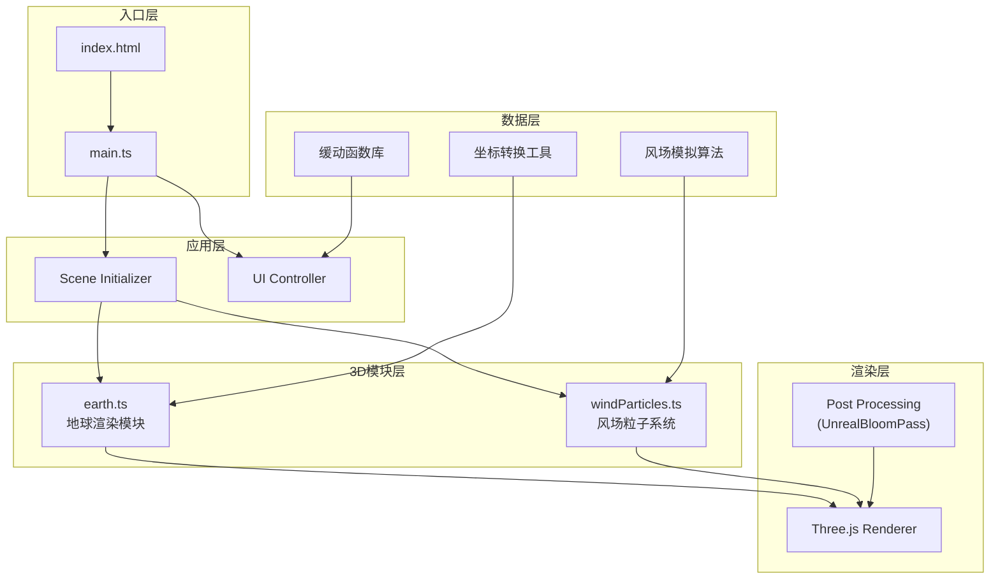

## 1. 架构设计



## 2. 技术描述

| 层级 | 技术选型 | 版本 | 用途 |
|-----|---------|------|------|
| 构建工具 | Vite | latest | 快速开发构建，ES模块原生支持 |
| 开发语言 | TypeScript | latest | 类型安全，严格模式 |
| 3D引擎 | Three.js | 0.160.0 | WebGL渲染核心 |
| 类型定义 | @types/three | 0.160.0 | Three.js类型支持 |
| 后处理 | three/examples/jsm | 0.160.0 | EffectComposer, UnrealBloomPass |
| 控制器 | three/examples/jsm/controls | 0.160.0 | OrbitControls轨道控制 |

### 核心设计原则
- **模块化**：按职责分离，地球渲染与粒子系统完全解耦
- **性能优先**：BufferGeometry批量渲染，对象池复用粒子
- **流畅体验**：所有状态切换使用缓动函数，避免突兀变化
- **内存安全**：纹理资源、几何体、材质在销毁时正确释放

## 3. 文件结构与调用关系

```
project/
├── index.html                    # 入口HTML，全屏容器 + 加载提示
├── package.json                  # 依赖配置，启动脚本
├── vite.config.js                # Vite构建配置
├── tsconfig.json                 # TypeScript严格模式配置
└── src/
    ├── main.ts                   # [入口] 场景初始化→加载地球→启动粒子系统
    │   ├── 调用: earth.ts → createEarth()
    │   ├── 调用: windParticles.ts → createWindParticles()
    │   └── 调用: UI控制器 → initControls()
    ├── earth.ts                  # [地球模块] 接收scene参数，添加到场景
    │   ├── createEarth(scene)    # 生成带纹理的地球球体
    │   ├── setupEarthAnimation() # 控制自转动画
    │   └── latLonToVector3()     # 经纬度转3D坐标
    └── windParticles.ts          # [粒子系统模块] 粒子生成与动画控制
        ├── createWindParticles(scene, params)  # 初始化粒子系统
        ├── updateParticles(delta)              # 每帧更新粒子位置
        ├── generateWindPath()                  # 生成贝塞尔/螺旋线路径
        ├── updateAltitudeLevel(level)          # 切换海拔层级（平滑过渡）
        └── respawnParticle(index)              # 粒子重生逻辑
```

### 数据流向
1. `main.ts` → 创建Scene、Camera、Renderer → 传递给`earth.ts`和`windParticles.ts`
2. `earth.ts` → 加载纹理 → 创建Mesh → 添加到Scene → 每帧更新rotation
3. `windParticles.ts` → 生成粒子数据(BufferGeometry) → 创建Points → 添加到Scene
4. `windParticles.ts` → 每帧读取粒子状态 → 更新位置/颜色/透明度 → 写入BufferAttribute
5. UI事件 → `main.ts` → 调用`windParticles.ts`的层级切换方法 → 缓动更新粒子参数

## 4. 核心数据结构

```typescript
// 海拔层级配置
interface AltitudeLevel {
  name: string;
  colorStart: THREE.Color;
  colorMid: THREE.Color;
  colorEnd: THREE.Color;
  speedMultiplier: number;
  particleCount: number;
  altitudeKm: number;
}

// 粒子状态
interface ParticleState {
  position: THREE.Vector3;      // 当前位置
  velocity: THREE.Vector3;      // 速度向量
  pathProgress: number;         // 路径进度 0-1
  size: number;                 // 粒子大小
  opacity: number;              // 透明度
  latitude: number;             // 纬度(用于颜色插值)
  longitude: number;            // 经度
  pathPoints: THREE.Vector3[];  // 贝塞尔路径点
}

// 风场参数
interface WindParams {
  particleCount: number;
  baseSpeed: number;
  trailLength: number;
  colorGradient: THREE.Color[];
}
```

## 5. 性能优化策略

### 5.1 渲染性能
- 使用`BufferGeometry`而非`Geometry`，批量提交GPU
- 单`Points`对象渲染所有粒子，减少Draw Call
- 粒子大小通过`sizeAttenuation`实现近大远小
- `PointsMaterial`开启`transparent`和`depthWrite: false`

### 5.2 动画性能
- 粒子位置更新直接修改`Float32Array`，避免对象创建
- 使用`THREE.Clock`的`delta`时间进行帧率无关动画
- 缓动函数使用轻量级实现，避免复杂计算

### 5.3 内存管理
- 纹理贴图使用`.dispose()`释放
- `BufferGeometry`和`Material`在组件销毁时释放
- 粒子对象池复用，避免频繁GC

### 5.4 层级切换优化
- 预分配最大粒子数Buffer，切换时仅更新可见性
- 颜色/速度过渡使用requestAnimationFrame分帧插值
- 0.3秒内完成状态稳定，避免帧率骤降
