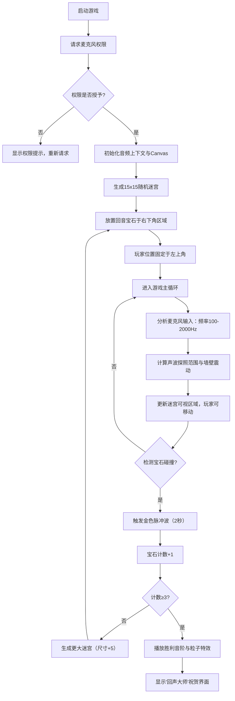

## 1. 产品概述

"回声·地宫"是一款基于Web Audio API的声音迷宫探索游戏，玩家通过麦克风发出不同频率的声音，利用声波在迷宫墙壁上的反射进行回声定位，探索古代地宫并收集隐藏的回音宝石。

- 核心玩法：声音作为唯一的"光源"，声波强度决定探照范围，频率影响回声反馈
- 目标用户：独立游戏爱好者、声音交互体验探索者
- 产品价值：创新的声控游戏体验，结合迷宫探索与音频可视化

## 2. 核心 Features

### 2.1 功能模块

1. **游戏主界面**：Canvas迷宫渲染、实时音频数值面板、宝石收集计数
2. **音频分析模块**：麦克风输入捕获、频率与响度实时分析、声波探照范围计算
3. **迷宫系统**：随机迷宫生成（递归回溯算法）、墙壁震动反馈、探索区域记忆
4. **宝石系统**：宝石生成与碰撞检测、收集动画与音效、关卡递进
5. **胜利界面**：粒子特效、祝贺动画、音阶播放

### 2.2 页面详情

| 页面名称 | 模块名称 | 功能描述 |
|---------|---------|---------|
| 启动页面 | 麦克风权限请求 | 引导用户授权麦克风访问，提供权限请求UI |
| 游戏主界面 | 迷宫渲染 | Canvas绘制石质地宫，已探索区域暖黄色光晕，未探索区域纯黑 |
| 游戏主界面 | 实时数据面板 | 左上角显示声波频率(Hz)、响度(dB)、宝石收集数量 |
| 游戏主界面 | 声波探照 | 半透明白色圆形光晕随声音强度变化，边缘模糊动画 |
| 游戏主界面 | 墙壁震动 | 声波击中墙壁时产生白色波纹，强度与响度成正比 |
| 胜利界面 | 祝贺展示 | 粒子飘散效果、"回声大师"文字、上扬合成音阶 |

## 3. 核心流程

## 4. 用户界面设计

### 4.1 设计风格

- **主色调**：深灰到黑色径向渐变背景（#1a1a1a → #0a0a0a）
- **强调色**：
  - 暖黄色光晕（#ffd700, #daa520）- 已探索区域
  - 金色边框（#d4af37）- 面板边框
  - 白色光点（#ffffff）- 玩家位置
  - 金色光柱（#ffd700）- 宝石收集
- **字体**：像素风格字体，数值显示使用等宽像素字体
- **布局**：迷宫Canvas居中，左上角固定数据面板
- **视觉效果**：石砖纹理噪点、声波边缘模糊、GSAP平滑过渡动画

### 4.2 页面设计概述

| 页面名称 | 模块名称 | UI元素 |
|---------|---------|---------|
| 启动页面 | 权限请求 | 深灰背景、中央麦克风图标、"点击授权麦克风"按钮、金色描边 |
| 游戏主界面 | 迷宫Canvas | 居中渲染，自适应1920x1080和1440x900，12x12px石砖块 |
| 游戏主界面 | 数据面板 | 左上角，半透明深色背景，1px金色边框，淡金色像素字体 |
| 游戏主界面 | 玩家标记 | 白色发光圆点，位于当前格子中心 |
| 游戏主界面 | 声波探照 | 半透明白色圆形，半径随响度动态变化，GSAP缓动 |
| 游戏主界面 | 墙壁震动 | 白色波纹从墙壁向外扩散，透明度渐变消失 |
| 宝石收集 | 脉冲动画 | 以宝石为中心的金色扩散波，持续2秒 |
| 胜利界面 | 祝贺展示 | 全屏金色粒子飘散，"回声大师"像素文字居中 |

### 4.3 响应性

- **桌面优先**：适配1920x1080和1440x900两种标准分辨率
- **自动缩放**：迷宫Canvas根据窗口尺寸等比例缩放，保持居中
- **字体自适应**：数据面板字体大小随Canvas缩放比例调整

## 5. 性能要求

- **渲染帧率**：Canvas刷新率不低于55fps
- **音频延迟**：音频分析延迟不超过100ms
- **动画帧率**：GSAP动画稳定在60fps
- **内存管理**：已探索区域数据结构优化，避免内存泄漏
