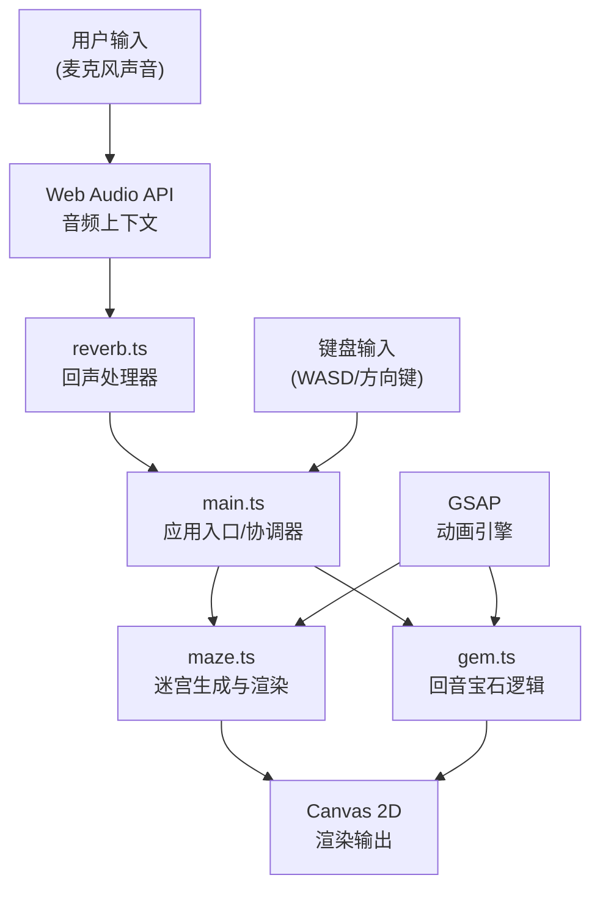

## 1. 架构设计



### 模块调用关系与数据流向

| 模块 | 输入 | 输出 | 调用方 | 被调用方 |
|------|------|------|--------|----------|
| main.ts | 音频分析数据、玩家输入 | 协调指令 | 浏览器 | maze.ts, reverb.ts, gem.ts |
| maze.ts | 玩家坐标、探照半径、震动数据 | Canvas渲染 | main.ts | GSAP |
| reverb.ts | 麦克风音频流 | 频率、响度、探照半径、震动幅度 | main.ts | Web Audio API |
| gem.ts | 玩家位置 | 碰撞检测结果、收集动画 | main.ts | GSAP, Web Audio API |

**数据流向：**
1. 麦克风 → Web Audio API → reverb.ts（分析频率/响度）
2. reverb.ts → main.ts（传递探照半径、震动幅度）
3. main.ts → maze.ts（更新可视区域、触发墙壁震动）
4. 键盘输入 → main.ts（更新玩家坐标）
5. main.ts → maze.ts（更新玩家位置、渲染）
6. main.ts → gem.ts（检测碰撞）
7. gem.ts → main.ts（收集事件）→ maze.ts（触发脉冲动画）

## 2. 技术描述

- **前端框架**：TypeScript 5.x + Vite 5.x
- **动画库**：GSAP 3.x（用于所有平滑过渡动画）
- **音频处理**：Web Audio API（AnalyserNode、OscillatorNode、GainNode）
- **渲染技术**：HTML5 Canvas 2D
- **用户输入**：Web MIDI API（可选）、KeyboardEvent、getUserMedia

### 核心技术选型理由

1. **TypeScript**：强类型保证，适合复杂的游戏状态管理和音频数据处理
2. **Vite**：极速开发体验，ES模块原生支持，热更新快
3. **GSAP**：专业动画库，确保60fps稳定帧率，支持复杂的缓动效果
4. **Web Audio API**：低延迟音频分析，支持实时频率和响度计算
5. **Canvas 2D**：像素级控制，适合迷宫的石砖纹理和动态光影效果

## 3. 目录结构

```
echo-dungeon/
├── package.json          # 项目依赖与脚本
├── vite.config.js        # Vite构建配置
├── tsconfig.json         # TypeScript配置（严格模式）
├── index.html            # 入口HTML
└── src/
    ├── main.ts           # 应用入口，协调各模块
    ├── maze.ts           # 迷宫生成与渲染
    ├── reverb.ts         # 回声处理器/音频分析
    └── gem.ts            # 回音宝石逻辑
```

## 4. 数据结构定义

### 4.1 类型定义

```typescript
// 位置坐标
interface Position {
  x: number;
  y: number;
}

// 迷宫单元格
interface Cell {
  x: number;
  y: number;
  walls: { top: boolean; right: boolean; bottom: boolean; left: boolean };
  explored: boolean;
  visible: boolean;
}

// 墙壁震动效果
interface WallVibration {
  x: number;
  y: number;
  intensity: number;
  startTime: number;
  duration: number;
}

// 音频分析结果
interface AudioAnalysis {
  frequency: number;      // Hz (100-2000)
  loudness: number;       // dB
  normalizedLoudness: number; // 0-1
  sonarRadius: number;    // 探照半径（单元格数）
}

// 宝石状态
interface Gem {
  position: Position;
  collected: boolean;
  collectAnimation: number; // 0-1 动画进度
}

// 游戏状态
interface GameState {
  mazeSize: number;       // 当前迷宫尺寸
  playerPos: Position;
  cells: Cell[][];
  gems: Gem[];
  collectedGems: number;  // 已收集宝石总数（用于胜利判定）
  audioData: AudioAnalysis;
  vibrations: WallVibration[];
  pulseAnimation: { active: boolean; progress: number; center: Position };
  victory: boolean;
}
```

### 4.2 常量定义

```typescript
// 游戏常量
const CELL_SIZE = 12;              // 单元格像素大小
const INITIAL_MAZE_SIZE = 15;      // 初始迷宫尺寸
const MAX_MAZE_SIZE = 25;          // 最大迷宫尺寸
const MAZE_SIZE_INCREMENT = 5;     // 每次递增
const VICTORY_GEM_COUNT = 3;       // 胜利所需宝石数

// 音频常量
const MIN_FREQUENCY = 100;         // Hz
const MAX_FREQUENCY = 2000;        // Hz
const FFT_SIZE = 2048;             // FFT窗口大小
const ANALYSIS_INTERVAL = 16;      // 分析间隔ms（约60fps）

// 视觉常量
const MIN_SONAR_RADIUS = 2;        // 最小探照半径（单元格）
const MAX_SONAR_RADIUS = 8;        // 最大探照半径（单元格）
const WALL_VIBRATION_DURATION = 300; // ms
const PULSE_DURATION = 2000;       // 收集脉冲持续ms

// 颜色常量
const COLORS = {
  background: '#0a0a0a',
  wallDark: '#2a2a2a',
  wallLight: '#4a4a4a',
  floorStart: '#8b7355',
  floorEnd: '#654321',
  exploredGlow: 'rgba(255, 215, 0, 0.15)',
  sonarGlow: 'rgba(255, 255, 255, 0.2)',
  player: '#ffffff',
  gem: '#ffd700',
  panelBg: 'rgba(20, 20, 20, 0.8)',
  panelBorder: '#d4af37',
  panelText: '#e6d691',
};
```

## 5. 核心算法

### 5.1 迷宫生成（递归回溯算法）

```
算法：递归回溯生成完美迷宫
输入：迷宫尺寸 size
输出：Cell[][] 迷宫网格

1. 初始化 size × size 网格，所有单元格四周都有墙，未访问
2. 选择起始单元格 (0,0)，标记为已访问
3. 创建栈，将起始单元格入栈
4. 当栈不为空时：
   a. 取出栈顶单元格 current
   b. 获取 current 未访问的邻居列表
   c. 如果有未访问邻居：
      i. 随机选择一个邻居 next
      ii. 移除 current 和 next 之间的墙
      iii. 标记 next 为已访问
      iv. 将 next 入栈
   d. 否则：
      i. 弹出栈顶
5. 返回网格
```

### 5.2 频率检测算法

```
算法：检测主频率
输入：AnalyserNode 频率数据数组
输出：主导频率 Hz

1. 获取频域数据 Uint8Array
2. 找到能量最高的频率桶索引 maxIndex
3. 计算频率分辨率 = 采样率 / FFT_SIZE
4. 主导频率 = maxIndex × 频率分辨率
5. 限制在 [MIN_FREQUENCY, MAX_FREQUENCY] 范围内
```

### 5.3 响度计算

```
算法：计算响度 dB
输入：AnalyserNode 时域数据数组
输出：响度 dB

1. 获取时域数据
2. 计算均方根 RMS = sqrt(平均(x²))
3. 转换为 dB = 20 * log10(RMS / 参考值)
4. 归一化到 [0, 1] 范围用于探照半径计算
```

### 5.4 可见区域计算

```
算法：计算声波探照可见区域
输入：玩家位置、探照半径、迷宫网格
输出：更新单元格 visible 属性

1. 对每个单元格 (x, y)：
   a. 计算与玩家的曼哈顿距离
   b. 如果距离 ≤ 探照半径：
      i. 检查直线上是否有墙壁阻挡（射线检测）
      ii. 如无阻挡，标记为可见
      iii. 标记为已探索（持久化）
```

## 6. 性能优化

### 6.1 Canvas渲染优化

1. **离屏Canvas预渲染**：石砖纹理预先绘制到离屏Canvas，运行时直接拷贝
2. **脏矩形渲染**：只重绘可见区域变化的部分
3. **requestAnimationFrame**：使用浏览器原生动画循环，与刷新率同步
4. **对象池**：震动效果和粒子对象复用，避免频繁GC

### 6.2 音频分析优化

1. **FFT_SIZE选择**：2048平衡频率分辨率和计算速度
2. **滑动窗口平均**：对频率和响度进行平滑，减少抖动
3. **节流分析**：每16ms分析一次，与渲染帧率同步

### 6.3 内存优化

1. **TypedArray**：使用Uint8Array、Float32Array存储音频数据
2. **迷宫数据复用**：生成新迷宫时复用数组，避免重新分配
3. **GSAP动画清理**：动画完成后及时kill，防止内存泄漏

## 7. 关键API使用

### Web Audio API
- `getUserMedia({ audio: true })` - 获取麦克风权限
- `AudioContext` - 音频上下文
- `AnalyserNode` - 频率/时域分析
- `OscillatorNode` - 生成回声音效
- `GainNode` - 音量控制

### GSAP API
- `gsap.to()` - 属性过渡动画（探照半径、震动幅度）
- `gsap.fromTo()` - 脉冲波扩散动画
- `gsap.timeline()` - 宝石收集序列动画
- `gsap.ticker` - 与渲染循环同步
