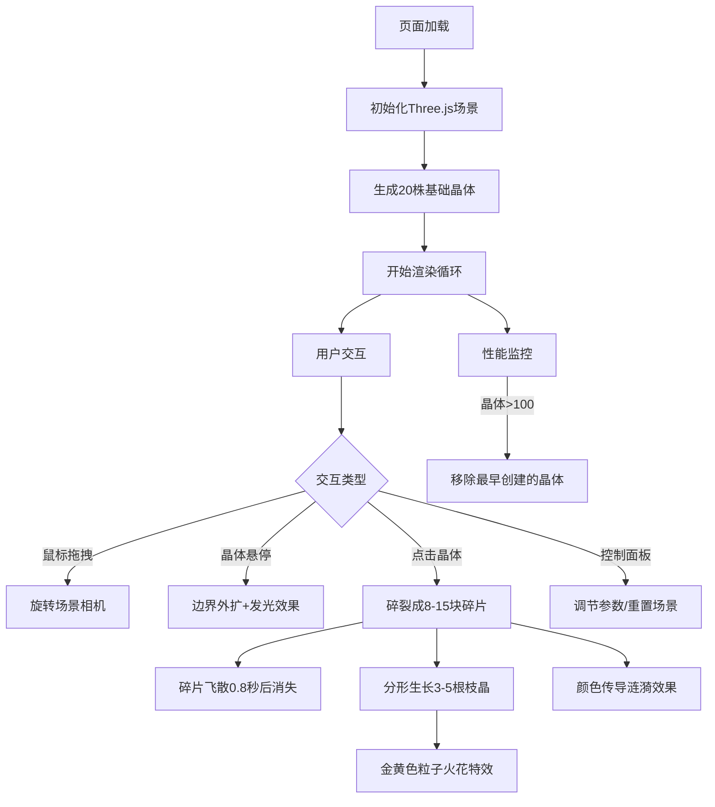

## 1. 产品概述

'晶格·生长纪元'是一款基于WebGL的交互式3D晶体森林可视化应用，用户可以观察程序化生成的晶体动态生长、碎裂和分形演化的过程，体验矿物与生命形态交织的奇幻生长秀。

- 核心价值：通过程序化生成的晶体几何形态和动态生长动画，创造沉浸式的科幻矿物学美学体验
- 目标用户：艺术爱好者、设计师、科技美学追求者
- 市场定位：高端WebGL艺术展示作品，可作为创意网站首页、数字艺术展览或交互装置

## 2. 核心特性

### 2.2 功能模块
1. **3D场景渲染**：动态晶体森林、渐变背景、网格地面、光照系统
2. **晶体生成系统**：程序化几何生成、随机扭曲六面体/八面体、表面扫描线纹理
3. **交互系统**：鼠标拖拽旋转场景、点击触发生长、悬停发光效果
4. **动画系统**：晶体自旋、生长动画、碎裂效果、粒子火花、颜色传导涟漪
5. **控制面板**：生长速度、碎片力度、颜色循环、重置场景
6. **性能管理**：晶体数量上限、自动清理老旧对象

### 2.3 页面详情
| 页面名称 | 模块名称 | 功能描述 |
|-----------|-------------|---------------------|
| 主场景 | 3D晶体森林 | 20株基础晶体散布在半径15的圆形区域，每株由6-12个多面体堆叠，高度2-8单位 |
| 主场景 | 背景系统 | 深紫到墨黑的垂直渐变，半透明网格地面（线宽1px，透明度0.15，间距20px） |
| 主场景 | 交互层 | 鼠标拖拽旋转场景、点击晶体触发碎裂和分形生长、悬停发光 |
| 主场景 | 动画层 | 晶体自旋（0.005-0.05弧度/秒）、生长动画（1.5秒）、碎片飞散（0.8秒） |
| 控制面板 | 参数调节 | 生长速度（0.1-2.0）、碎片飞散力度（0.5-2.0）、颜色循环速度（0-1.0） |
| 控制面板 | 重置功能 | 重置场景按钮，1秒过渡动画回到初始状态 |

## 3. 核心流程

用户进入页面后，首先看到一片静态的晶体森林，晶体缓慢自旋。用户可以拖拽鼠标旋转观察场景，悬停在晶体上时会触发边界外扩和发光效果。点击任意晶体时，该晶体碎裂成8-15块碎片向外飞散，同时从中心生长出3-5根分形枝晶，伴随金黄色粒子火花。周围未被点击的晶体会在3秒内逐渐向被点击晶体的颜色靠拢，形成颜色涟漪。右上角控制面板可调节各项参数，移动端自动收缩为浮动图标。

## 4. 用户界面设计

### 4.1 设计风格
- **主色调**：深紫(#1a0a2e) → 墨黑(#0a0510) 渐变背景
- **点缀色**：荧光绿(#00ff88)、冰蓝(#00ccff)、金黄色(#ffcc00)粒子
- **晶体色**：色相环从紫(#8855ff)到蓝(#4488ff)随机选取
- **控制面板**：半透明磨砂玻璃效果（模糊半径8px），极窄圆角，深色半透明背景
- **字体**：无衬线等宽字体，科幻冷峻风格
- **动效**：所有交互使用ease-out缓动函数，平滑过渡

### 4.2 页面设计概述
| 页面名称 | 模块名称 | UI元素 |
|-----------|-------------|-------------|
| 主场景 | 3D渲染区 | 全屏Canvas，渐变背景，网格地面，晶体森林，动态光照 |
| 控制面板 | 右上角面板 | 200px宽度，半透明背景，三个滑块，一个重置按钮 |
| 移动端 | 浮动图标 | <768px时收缩为右上角图标，点击展开面板 |

### 4.3 响应式设计
- **桌面端**（≥768px）：完整控制面板悬浮在右上角
- **移动端**（<768px）：控制面板收缩为圆形浮动图标，点击展开全屏半透明面板
- **触摸优化**：支持触摸拖拽旋转，触摸点击触发晶体交互

### 4.4 3D场景设计
- **环境**：深紫到墨黑的垂直渐变背景，无HDRI，营造神秘深邃氛围
- **光照**：环境光(强度0.3) + 两盏方向光(冷色调主光+暖色调补光) + 点光源跟随选中晶体
- **相机**：PerspectiveCamera，fov=60，初始位置(0, 10, 25)，看向原点
- **构图**：晶体散布在半径15的圆形区域，形成自然的森林形态，留有充足负空间
- **交互动画**：
  - 点击晶体：碎裂(0.8秒) → 枝晶生长(1.5秒) → 颜色涟漪(3秒)
  - 悬停效果：边界外扩1px + 发光强度提升
  - 场景重置：所有晶体1秒内平滑过渡到初始状态
- **后期处理**：轻微Bloom发光效果，增强晶体荧光感；FXAA抗锯齿
- **性能预算**：晶体总数上限100，每株6-12个多面体，总面数控制在10000以内
