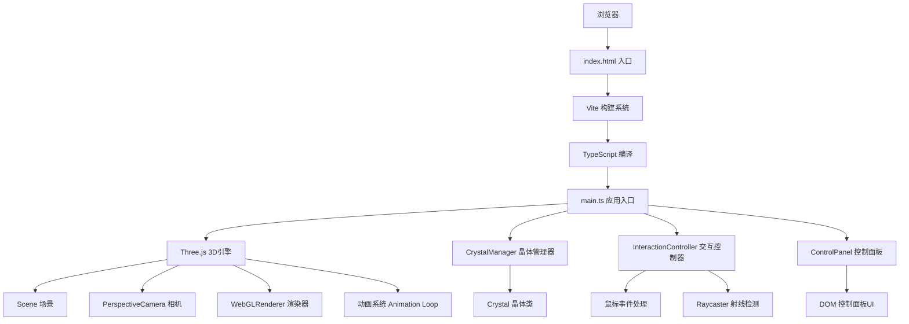

## 1. 架构设计



## 2. 技术选型

- **前端框架**：原生 TypeScript + Three.js (无React/Vue等上层框架，追求极致性能)
- **构建工具**：Vite 5.x (原生ES模块，热更新，快速构建)
- **3D引擎**：Three.js @0.160 (成熟稳定的WebGL封装)
- **类型系统**：TypeScript 5.x (严格模式，类型安全)
- **样式方案**：内联CSS + CSS变量 (控制面板UI)
- **动画系统**：自定义ease-out缓动函数 + requestAnimationFrame

**选择理由**：
1. 原生TS + Three.js避免额外框架开销，适合60fps高性能3D场景
2. Vite提供极快的开发体验和优化的生产构建
3. 严格TypeScript模式确保大型项目的可维护性
4. 不引入额外的状态管理库，使用类封装内部状态

## 3. 文件结构

| 文件路径 | 职责 |
|---------|------|
| `package.json` | 项目依赖和脚本配置 |
| `vite.config.js` | Vite构建配置 |
| `tsconfig.json` | TypeScript编译配置 |
| `index.html` | 入口HTML页面 |
| `src/main.ts` | 应用入口，初始化场景、相机、渲染器 |
| `src/Crystal.ts` | 单个晶体类，几何生成、材质、动画 |
| `src/CrystalManager.ts` | 晶体管理器，创建/生长/碎裂/颜色传导 |
| `src/InteractionController.ts` | 鼠标交互，射线检测，场景旋转 |
| `src/ControlPanel.ts` | 控制面板UI，滑块和按钮事件 |

## 4. 核心类与接口定义

### 4.1 Crystal 类

```typescript
interface CrystalConfig {
  position: THREE.Vector3;
  height: number;
  polyhedronCount: number;
  hue: number;
  rotationSpeed: number;
}

interface CrystalFragment {
  mesh: THREE.Mesh;
  velocity: THREE.Vector3;
  lifetime: number;
  maxLifetime: number;
}

class Crystal {
  public group: THREE.Group;
  public id: number;
  public createdAt: number;
  public isFragment: boolean;
  public isDendrite: boolean;
  
  constructor(config: CrystalConfig);
  public update(delta: number, time: number): void;
  public shatter(): CrystalFragment[];
  public growDendrite(): Crystal[];
  public setColor(hue: number): void;
  public getColor(): number;
  public setHover(active: boolean): void;
  public dispose(): void;
}
```

### 4.2 CrystalManager 类

```typescript
interface ManagerConfig {
  scene: THREE.Scene;
  maxCrystals: number;
  growthSpeed: number;
  fragmentForce: number;
  colorCycleSpeed: number;
}

class CrystalManager {
  public crystals: Crystal[];
  
  constructor(config: ManagerConfig);
  public generateInitialCrystals(count: number): void;
  public update(delta: number, time: number): void;
  public onCrystalClick(crystal: Crystal): void;
  public propagateColor(sourceHue: number, center: THREE.Vector3): void;
  public reset(): void;
  public setGrowthSpeed(speed: number): void;
  public setFragmentForce(force: number): void;
  public setColorCycleSpeed(speed: number): void;
  private cleanupOldCrystals(): void;
}
```

### 4.3 InteractionController 类

```typescript
interface InteractionConfig {
  camera: THREE.PerspectiveCamera;
  renderer: THREE.WebGLRenderer;
  crystalManager: CrystalManager;
  onCrystalHover: (crystal: Crystal | null) => void;
  onCrystalClick: (crystal: Crystal) => void;
}

class InteractionController {
  private isDragging: boolean;
  private previousMouse: { x: number; y: number };
  private cameraAngle: { theta: number; phi: number };
  private cameraDistance: number;
  
  constructor(config: InteractionConfig);
  public update(): void;
  public dispose(): void;
}
```

### 4.4 ControlPanel 类

```typescript
interface PanelConfig {
  onGrowthSpeedChange: (value: number) => void;
  onFragmentForceChange: (value: number) => void;
  onColorCycleChange: (value: number) => void;
  onReset: () => void;
  initialValues: {
    growthSpeed: number;
    fragmentForce: number;
    colorCycleSpeed: number;
  };
}

class ControlPanel {
  private container: HTMLElement;
  private isMobile: boolean;
  private isExpanded: boolean;
  
  constructor(config: PanelConfig);
  public dispose(): void;
}
```

## 5. 关键技术实现

### 5.1 程序化晶体生成
- 使用`THREE.IcosahedronGeometry`或自定义多面体几何
- 顶点随机扭曲创造自然晶体形态
- 扫描线纹理使用`THREE.ShaderMaterial`实现
- 每株晶体由多个多面体沿Y轴堆叠，随机旋转和缩放

### 5.2 着色器材质
```glsl
// 顶点着色器
varying vec3 vNormal;
varying vec3 vPosition;
varying vec2 vUv;

void main() {
  vNormal = normalize(normalMatrix * normal);
  vPosition = position;
  vUv = uv;
  gl_Position = projectionMatrix * modelViewMatrix * vec4(position, 1.0);
}

// 片元着色器
uniform float uTime;
uniform vec3 uColor;
uniform float uGlowIntensity;
uniform float uLineOpacity;

varying vec3 vNormal;
varying vec3 vPosition;
varying vec2 vUv;

void main() {
  // 基础颜色
  vec3 color = uColor;
  
  // 扫描线效果
  float scanLine = sin(vUv.y * 100.0 + uTime * 2.0) * 0.5 + 0.5;
  scanLine = pow(scanLine, 20.0) * uLineOpacity;
  color += scanLine * 0.3;
  
  // 边缘发光
  float rim = 1.0 - max(dot(vNormal, vec3(0.0, 0.0, 1.0)), 0.0);
  rim = pow(rim, 2.0) * uGlowIntensity;
  color += rim * uColor;
  
  // 环境光模拟
  float ambient = 0.3 + 0.7 * max(dot(vNormal, normalize(vec3(0.5, 1.0, 0.5))), 0.0);
  color *= ambient;
  
  gl_FragColor = vec4(color, 1.0);
}
```

### 5.3 动画系统
- **缓动函数**：自定义easeOutCubic `t => 1 - pow(1 - t, 3)`
- **生长动画**：使用scale属性从0到1的ease-out过渡
- **碎裂动画**：物理模拟，速度衰减，透明度渐变
- **颜色插值**：HSL色彩空间线性插值，每帧步长0.02

### 5.4 性能优化
- 晶体对象池化（可选，当前使用上限+FIFO清理）
- 材质共享，减少draw call
- 几何复用，使用`BufferGeometry`
- 距离剔除（`frustumCulled: true`）
- 粒子系统使用`THREE.Points`批量渲染

## 6. 性能指标

| 指标 | 目标值 |
|-----|-------|
| 帧率 | 60fps (桌面) / 30fps (移动端) |
| 晶体总数上限 | 100株 |
| 总面数 | < 15000 |
| Draw Call | < 50 |
| 内存占用 | < 100MB |
| 响应延迟 | < 16ms (交互响应) |
