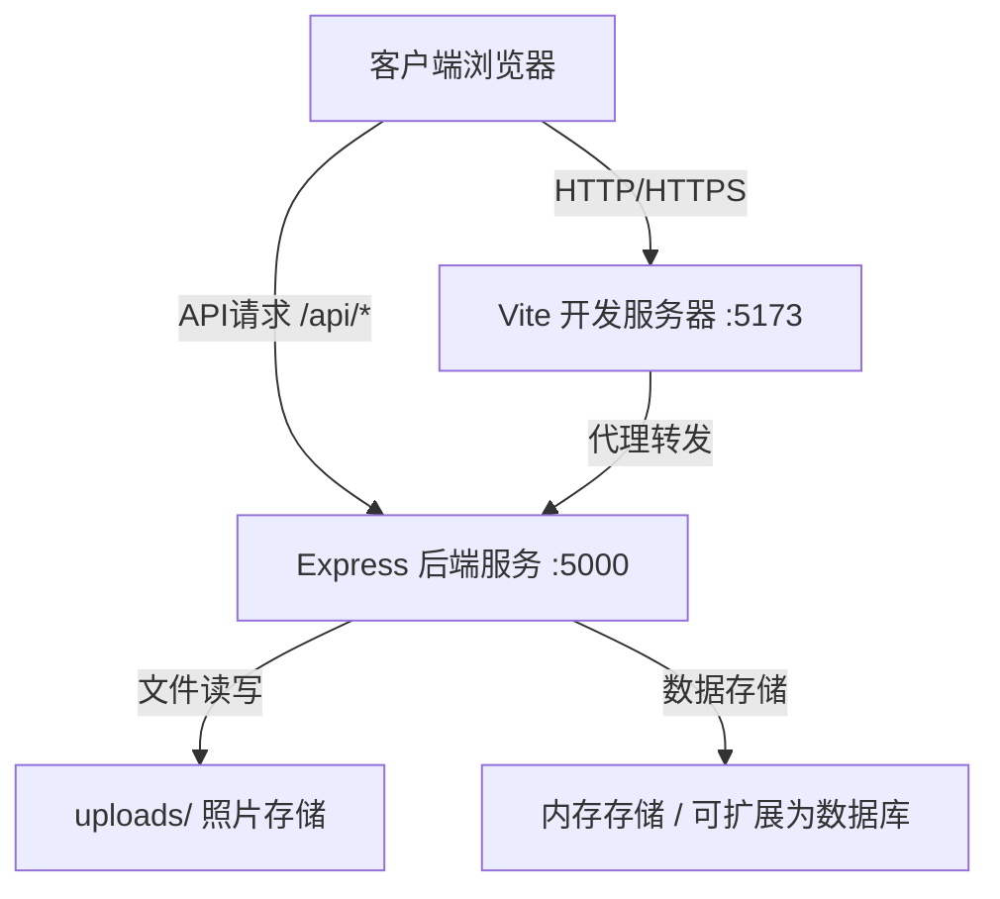

# 城市记忆档案馆 - 技术架构文档

## 1. 系统架构

### 1.1 整体架构图



### 1.2 技术栈选型

| 层级 | 技术选型 | 版本 | 说明 |
|------|---------|------|------|
| 前端框架 | React | 18.x | 组件化UI开发 |
| 前端语言 | TypeScript | 5.x | 类型安全 |
| 构建工具 | Vite | 5.x | 快速开发构建 |
| 地图库 | Leaflet | 1.9.x | 轻量开源地图库 |
| HTTP客户端 | axios | 1.x | API请求处理 |
| 后端框架 | Express | 4.x | Node.js Web框架 |
| 文件上传 | multer | 1.4.x | 处理multipart/form-data |
| 跨域处理 | cors | 2.8.x | 跨域资源共享 |
| ID生成 | uuid | 9.x | 生成唯一标识符 |

### 1.3 约束说明
- 不使用任何UI组件库，所有组件手动实现
- 不使用状态管理库（Redux、Zustand等），使用React原生state管理
- 不使用动画库（react-spring、framer-motion等），所有动画使用CSS transition/animation手动实现

---

## 2. 目录结构

```
项目根目录/
├── .trae/
│   └── documents/
│       ├── PRD.md
│       └── technical-architecture.md
├── uploads/                          # 照片上传存储目录
├── src/
│   ├── frontend/
│   │   ├── App.tsx                  # 主应用组件
│   │   ├── MapView.tsx              # 地图视图组件
│   │   ├── TimelineView.tsx         # 时间线视图组件
│   │   └── styles/
│   │       └── index.css            # 全局样式
│   └── backend/
│       └── server.ts                # Express后端服务
├── index.html                       # 入口HTML
├── vite.config.js                   # Vite配置
├── tsconfig.json                    # TypeScript配置
├── package.json                     # 项目依赖和脚本
└── README.md                        # 项目说明
```

---

## 3. 数据模型

### 3.1 Photo 数据结构

```typescript
interface Photo {
  id: string;                     // UUID
  filename: string;               // 服务器存储文件名
  originalName: string;           // 原始文件名
  url: string;                    // 访问URL
  lat: number;                    // 纬度
  lng: number;                    // 经度
  date: string;                   // 日期 (YYYY-MM-DD)
  diary: string;                  // 日记内容 (最多200字)
  tags: string[];                 // 标签数组
  createdAt: number;              // 创建时间戳
}
```

### 3.2 搜索过滤状态

```typescript
interface SearchState {
  query: string;                  // 搜索关键词（标签）
  dateStart: string | null;       // 开始日期
  dateEnd: string | null;         // 结束日期
}
```

---

## 4. API 接口设计

### 4.1 上传照片

```
POST /api/photos
Content-Type: multipart/form-data
```

**请求参数**：
| 字段 | 类型 | 说明 |
|------|------|------|
| photo | File | 照片文件（单张不超过5MB） |
| lat | number | 纬度 |
| lng | number | 经度 |
| date | string | 日期 (YYYY-MM-DD) |
| diary | string | 日记内容 |
| tags | string | JSON字符串格式的标签数组 |

**成功响应** (201)：
```json
{
  "id": "uuid-string",
  "filename": "uuid.jpg",
  "originalName": "photo.jpg",
  "url": "/uploads/uuid.jpg",
  "lat": 39.9042,
  "lng": 116.4074,
  "date": "2024-01-15",
  "diary": "今天的旅行很棒...",
  "tags": ["风景", "美食"],
  "createdAt": 1705312800000
}
```

**错误响应** (400/500)：
```json
{
  "error": "错误信息"
}
```

### 4.2 获取所有照片

```
GET /api/photos
```

**成功响应** (200)：
```json
[
  {
    "id": "uuid-string",
    "filename": "uuid.jpg",
    "originalName": "photo.jpg",
    "url": "/uploads/uuid.jpg",
    "lat": 39.9042,
    "lng": 116.4074,
    "date": "2024-01-15",
    "diary": "...",
    "tags": ["风景"],
    "createdAt": 1705312800000
  }
]
```

### 4.3 搜索照片

```
GET /api/photos/search?query=风景&dateStart=2024-01-01&dateEnd=2024-01-31
```

**查询参数**：
| 参数 | 类型 | 说明 |
|------|------|------|
| query | string (可选) | 标签关键词 |
| dateStart | string (可选) | 开始日期 |
| dateEnd | string (可选) | 结束日期 |

**成功响应** (200)：返回匹配的Photo数组

---

## 5. 前端模块设计

### 5.1 App.tsx - 主应用组件

**职责**：
- 管理全局状态：照片列表、搜索状态、高亮照片ID
- 管理上传模态框状态和表单
- 协调MapView和TimelineView之间的交互
- 处理搜索过滤逻辑

**核心状态**：
```typescript
const [photos, setPhotos] = useState<Photo[]>([]);
const [searchState, setSearchState] = useState<SearchState>({
  query: '',
  dateStart: null,
  dateEnd: null
});
const [highlightedPhotoId, setHighlightedPhotoId] = useState<string | null>(null);
const [isUploadModalOpen, setIsUploadModalOpen] = useState(false);
```

**核心方法**：
- `fetchPhotos()`: 从API获取所有照片
- `handleSearch(query, dateStart, dateEnd)`: 处理搜索
- `filterPhotos(photos, searchState)`: 过滤照片（前端快速过滤，<100ms）
- `handlePhotoClick(photoId)`: 处理时间线卡片点击，高亮地图标记
- `handleMarkerClick(photoId)`: 处理地图标记点击
- `handleUpload(formData)`: 处理照片上传

### 5.2 MapView.tsx - 地图视图组件

**Props**：
```typescript
interface MapViewProps {
  photos: Photo[];
  highlightedPhotoId: string | null;
  onMarkerClick: (photoId: string) => void;
  onMapClick?: (lat: number, lng: number) => void; // 用于上传时选择位置
}
```

**职责**：
- 初始化Leaflet地图实例
- 渲染照片标记点和悬浮缩略图
- 处理标记点点击和弹性动画
- 处理高亮标记点的呼吸闪烁动画
- 性能优化：限制同时渲染的标记点数量（≤200）

**核心实现**：
- `useEffect`初始化地图，设置冷色调底图
- 自定义标记点图标：SVG圆形渐变
- 标记点点击动画：CSS keyframes实现scale弹性动画
- 高亮动画：3次呼吸闪烁后转为金色常亮
- 缩略图卡片：悬浮在标记点上方，带圆角、边框、阴影

### 5.3 TimelineView.tsx - 时间线视图组件

**Props**：
```typescript
interface TimelineViewProps {
  photos: Photo[];
  filteredPhotoIds: Set<string>;  // 匹配的照片ID集合
  onCardClick: (photoId: string) => void;
}
```

**职责**：
- 渲染弯曲的时间河流SVG
- 按日期逆序排列照片卡片
- 实现卡片沿河流曲线布局
- 处理卡片悬停放大和日记显示
- 实现搜索过滤的视觉效果（上浮/下沉）
- 实现卡片进入动画

**核心实现**：
- SVG路径绘制弯曲河流，SVG滤镜实现水波荡漾
- IntersectionObserver实现卡片进入视图动画
- 卡片悬停：CSS transform: scale(1.1) + transition
- 搜索过滤：匹配项添加光晕动画，未匹配项opacity: 0.2并下沉

---

## 6. 样式与动画实现方案

### 6.1 CSS变量定义

```css
:root {
  --color-bg: #FAF0E6;
  --color-text: #2C3E50;
  --color-divider: #BDC3C7;
  --color-river: rgba(135, 206, 250, 0.5);
  --color-marker-start: #ffffff;
  --color-marker-end: #4a90d9;
  --color-highlight: #FFD700;
  --color-glow: rgba(255, 235, 150, 0.6);
  --radius-thumbnail: 12px;
  --transition-fast: 0.3s ease;
  --transition-medium: 0.5s ease-out;
}
```

### 6.2 关键动画实现

**标记点弹性点击动画**：
```css
@keyframes markerBounce {
  0% { transform: scale(1); }
  50% { transform: scale(1.3); }
  100% { transform: scale(1); }
}
.marker-bounce {
  animation: markerBounce 0.3s ease;
}
```

**高亮呼吸闪烁动画**：
```css
@keyframes breathe {
  0%, 100% { opacity: 1; filter: brightness(1); }
  50% { opacity: 0.4; filter: brightness(1.5); }
}
.highlight-breathe {
  animation: breathe 0.5s ease-in-out 3;
}
```

**水波荡漾滤镜**：
```svg
<filter id="waterRipple">
  <feTurbulence type="fractalNoise" baseFrequency="0.01" numOctaves="2" result="noise"/>
  <feDisplacementMap in="SourceGraphic" in2="noise" scale="2" xChannelSelector="R" yChannelSelector="G">
    <animate attributeName="scale" values="0;2;0" dur="4s" repeatCount="indefinite"/>
  </feDisplacementMap>
</filter>
```

**卡片进入动画**：
```css
.timeline-card {
  opacity: 0;
  transform: translateY(20px);
  transition: opacity 0.5s ease-out, transform 0.5s ease-out;
}
.timeline-card.visible {
  opacity: 1;
  transform: translateY(0);
}
```

**搜索光晕效果**：
```css
@keyframes glowPulse {
  0%, 100% { box-shadow: 0 0 20px var(--color-glow); }
  50% { box-shadow: 0 0 40px var(--color-glow); }
}
.card-matched {
  animation: glowPulse 2s ease-in-out infinite;
  z-index: 10;
}
```

---

## 7. 性能优化策略

### 7.1 渲染性能
- **虚拟滚动/分页**：时间线使用IntersectionObserver，仅渲染可视区域卡片
- **标记点限制**：地图最多渲染200个标记点，超出时聚合或分页
- **CSS硬件加速**：transform和opacity动画使用GPU加速
- **避免强制同步布局**：批量DOM操作，使用requestAnimationFrame

### 7.2 搜索性能
- **前端缓存**：照片列表在前端缓存，搜索直接在内存过滤（<100ms）
- **防抖处理**：搜索输入防抖（300ms），避免频繁过滤
- **索引优化**：为标签建立Map索引，O(1)时间复杂度匹配

### 7.3 资源优化
- **图片懒加载**：时间线图片使用loading="lazy"
- **缩略图优化**：后端生成缩略图，前端显示150x150缩略图
- **CSS优化**：使用CSS变量，减少重复样式，避免昂贵的CSS属性

---

## 8. 开发与构建流程

### 8.1 脚本说明

| 脚本 | 命令 | 说明 |
|------|------|------|
| `npm run dev` | `concurrently "npm run dev:front" "npm run dev:back"` | 同时启动前后端 |
| `npm run dev:front` | `vite` | 启动前端开发服务器（端口5173） |
| `npm run dev:back` | `ts-node src/backend/server.ts` | 启动后端开发服务器（端口5000） |
| `npm run build` | `tsc && vite build` | 构建生产版本 |

### 8.2 开发代理配置

`vite.config.js` 中配置API代理：
```javascript
export default {
  server: {
    proxy: {
      '/api': 'http://localhost:5000',
      '/uploads': 'http://localhost:5000'
    }
  }
}
```

### 8.3 TypeScript配置

严格模式开启：
- `strict: true`
- `noImplicitAny: true`
- `strictNullChecks: true`

---

## 9. 关键实现注意事项

### 9.1 Leaflet集成
- 在组件卸载时正确销毁地图实例，避免内存泄漏
- 自定义DivIcon实现渐变标记点
- 缩略图使用自定义overlay，而非默认popup

### 9.2 上传功能
- 前端先选择照片，然后点击地图选择位置，最后填写元数据归档
- 文件大小校验在前后端都要做（≤5MB）
- 上传成功后立即刷新照片列表

### 9.3 时间线曲线布局
- 使用贝塞尔曲线生成河流路径
- 卡片位置通过path.getPointAtLength()计算
- 左右交替排列，避免重叠

### 9.4 搜索状态同步
- 搜索状态变化时，地图和时间线同时更新
- 过滤逻辑纯函数，便于测试
- 未匹配项在地图上也应半透明显示

---

## 10. 测试策略

### 10.1 功能测试
- 照片上传流程测试
- 地图标记点渲染和交互测试
- 时间线卡片渲染和动画测试
- 搜索过滤功能测试

### 10.2 性能测试
- 200个标记点渲染帧率测试（Chrome/Safari）
- 搜索响应时间测试（<100ms）
- 大数据量下滚动流畅度测试

### 10.3 兼容性测试
- Chrome最新版
- Safari最新版
- 响应式布局测试（<768px）
