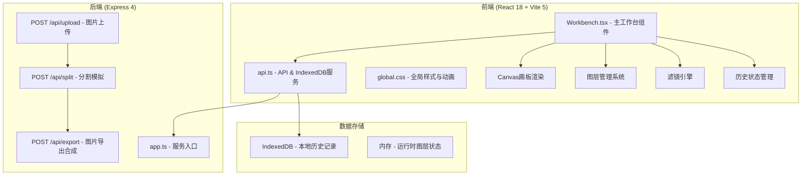

## 1. 架构设计



## 2. 技术描述

- **前端**：React@18 + react-dom@18 + TypeScript + Vite@5 + react-router-dom + idb + axios
- **后端**：Express@4 + TypeScript + ts-node + cors + multer + sharp
- **构建工具**：Vite@5
- **本地存储**：IndexedDB（idb库封装）
- **状态管理**：React useState/useReducer（变换历史栈最多15步）

## 3. 路由定义

| 路由 | 用途 |
|------|------|
| / | 首页 - 草稿上传与拼贴工作台 |

## 4. API 定义

### 4.1 上传图片
```typescript
// POST /api/upload
// Content-Type: multipart/form-data
interface UploadResponse {
  success: boolean;
  imageId: string;
  imageUrl: string;
  width: number;
  height: number;
}
```

### 4.2 模拟分割
```typescript
// POST /api/split
interface SplitRequest {
  imageId: string;
  regions: Array<{
    x: number;
    y: number;
    width: number;
    height: number;
    type: 'character' | 'background';
  }>;
}

interface SplitResponse {
  success: boolean;
  layers: Array<{
    id: string;
    type: 'character' | 'background';
    name: string;
    x: number;
    y: number;
    width: number;
    height: number;
    thumbnail: string; // base64
    dataUrl: string;   // base64 原图裁剪
  }>;
}
```

### 4.3 导出分镜
```typescript
// POST /api/export
interface ExportRequest {
  canvasWidth: number;
  canvasHeight: number;
  layers: Array<{
    id: string;
    dataUrl: string;
    x: number;
    y: number;
    width: number;
    height: number;
    rotation: number;
    scale: number;
    filter: string | null;
  }>;
}

interface ExportResponse {
  success: boolean;
  dataUrl: string; // base64 PNG 1920x1080
}
```

### 4.4 IndexedDB 数据模型
```typescript
interface CollageRecord {
  id: string;
  originalImage: string;      // base64
  layers: Layer[];             // JSON序列化
  exportedImage?: string;      // base64
  timestamp: number;
}

interface Layer {
  id: string;
  type: 'character' | 'background';
  name: string;
  dataUrl: string;
  x: number;
  y: number;
  width: number;
  height: number;
  rotation: number;
  scale: number;
  filter: string | null;
}
```

##