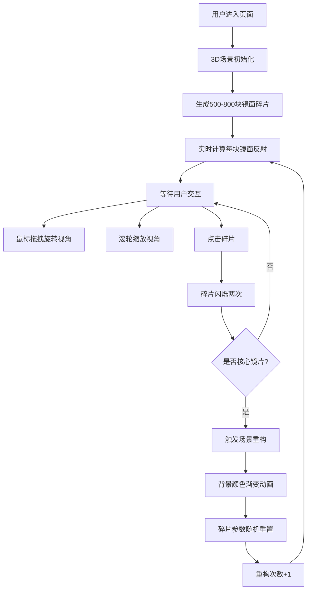

## 1. 产品概述
虚境·碎镜迷宫是一款沉浸式3D空间解谜应用，用户在无限反射的镜面碎片迷宫中探索，通过寻找并点击核心镜片来重构场景，体验递归式的视觉奇观。

- **核心目的**：提供独特的视觉艺术体验和互动解谜乐趣
- **目标用户**：喜欢艺术、解谜和3D视觉体验的互联网用户
- **产品价值**：通过实时反射和动态场景重构，创造令人惊叹的沉浸式视觉体验

## 2. 核心特性

### 2.1 用户角色
| 角色 | 注册方式 | 核心权限 |
|------|----------|----------|
| 普通用户 | 无需注册，直接访问 | 完整探索和交互体验 |

### 2.2 功能模块
1. **3D迷宫场景**：500-800块漂浮镜面碎片的程序化生成
2. **实时反射系统**：每块镜面实时反射场景内容并带扭曲效果
3. **交互系统**：鼠标拖拽旋转、滚轮缩放、点击选择
4. **场景重构机制**：点击核心镜片触发迷宫重新生成
5. **视觉特效**：边缘辉光、色散后处理、闪烁动画
6. **HUD界面**：重构次数显示、帧率监控

### 2.3 页面详情
| 页面名称 | 模块名称 | 功能描述 |
|----------|----------|----------|
| 主页面 | 3D渲染区域 | 全屏展示碎镜迷宫，支持鼠标交互 |
| 主页面 | HUD顶部 | 显示当前迷宫重构次数，实时更新 |
| 主页面 | HUD左下角 | 显示当前帧率，每500ms刷新 |

## 3. 核心流程

用户进入页面 → 3D场景加载完成 → 鼠标拖拽旋转迷宫 → 滚轮缩放视角 → 鼠标悬停查看碎片辉光 → 点击碎片触发闪烁 → 判断是否为核心镜片 → 是则触发场景重构 → 背景颜色渐变过渡 → 碎片位置/大小/旋转重置 → 反射内容刷新 → 重构次数+1

## 4. 用户界面设计

### 4.1 设计风格
- **主色调**：深空黑到深蓝的径向渐变（中心#050510，边缘#000000）
- **强调色**：淡蓝色辉光（#4da6ff）、亮白色闪烁（#ffffff）
- **过渡色**：深蓝#0a0a2e ↔ 墨绿#0e1a0e
- **字体**：无衬线现代字体，数字使用等宽字体
- **整体风格**：暗色科幻、未来感、沉浸式

### 4.2 页面设计概述
| 页面名称 | 模块名称 | UI元素 |
|----------|----------|--------|
| 主页面 | 3D场景 | 镜面碎片（金属正面0.9金属度/0.1粗糙度，半透明背面0.3透明度），边缘淡蓝辉光，动态色散效果 |
| 主页面 | HUD顶部 | 半透明背景，白色16px字体，居中显示"重构次数: N" |
| 主页面 | HUD左下角 | 绿色12px字体，显示"FPS: N" |

### 4.3 响应式
- 桌面端优先，全屏自适应
- 支持窗口大小变化时自动调整渲染分辨率
- 触摸设备支持手势操作（基于OrbitControls）

### 4.4 3D场景指引
- **环境**：纯虚空背景，径向渐变从中心深蓝到边缘纯黑
- **光照**：环境光 + 两盏平行光，营造金属反射质感
- **相机**：PerspectiveCamera，初始距离15单位，看向原点
- **相机运动**：OrbitControls控制，旋转速度0.5，阻尼0.1，缩放范围0.5-5.0
- **构图**：碎片呈球壳状分布在半径5-15单位空间，围绕中心点
- **交互动画**：点击闪烁（0.3s亮白，两次共0.6s），悬停辉光增强（0.2→0.5），点击抖动（5px偏移，0.1s）
- **后处理**：色散效果Shader，强度0.15
- **性能预算**：800块碎片时帧率≥30FPS，交互响应≤50ms
