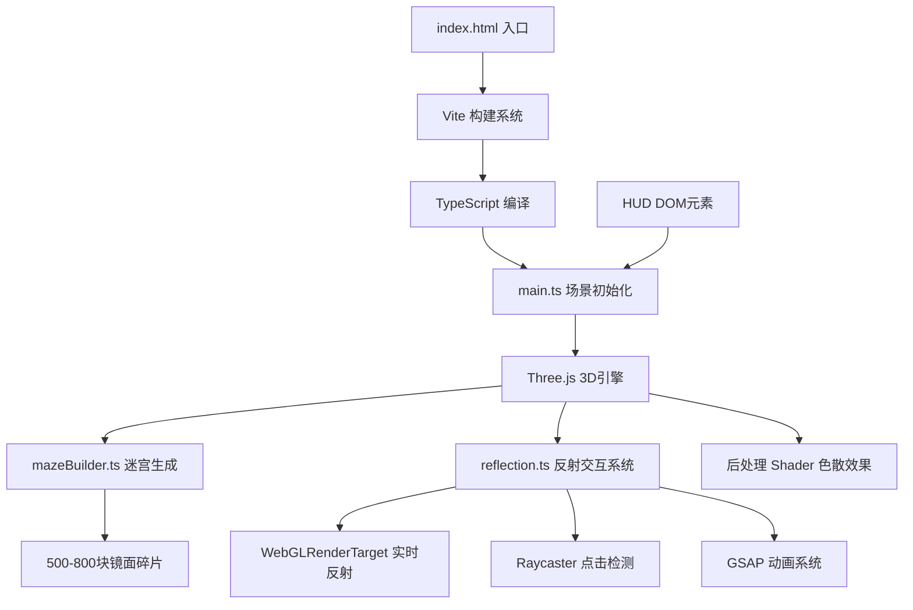

## 1. 架构设计



## 2. 技术描述

- **前端框架**：原生 TypeScript + Three.js（无React/Vue，按需求指定）
- **构建工具**：Vite 5.x
- **3D引擎**：three@0.160.0 + @types/three
- **动画库**：gsap@3.x
- **类型系统**：TypeScript 5.x（严格模式）
- **模块系统**：ES Module

## 3. 文件结构

```
project-root/
├── package.json
├── vite.config.js
├── tsconfig.json
├── index.html
└── src/
    ├── main.ts          # 场景初始化、渲染循环、HUD管理
    ├── mazeBuilder.ts   # 迷宫程序化生成逻辑
    └── reflection.ts    # 反射计算、交互检测、场景重构
```

## 4. 核心模块定义

### 4.1 MirrorFragment 接口
```typescript
interface MirrorFragment {
  mesh: THREE.Mesh;
  edge: THREE.LineSegments;
  renderTarget: THREE.WebGLRenderTarget;
  reflectionMaterial: THREE.ShaderMaterial;
  uvOffset: THREE.Vector2;
  isCore: boolean;
  baseSize: THREE.Vector2;
  basePosition: THREE.Vector3;
  baseRotation: THREE.Euler;
}
```

### 4.2 MazeConfig 配置
```typescript
interface MazeConfig {
  fragmentCount: number;      // 500-800
  minSize: number;            // 0.5
  maxSize: number;            // 2.0
  minSpacing: number;         // 2.0
  maxSpacing: number;         // 5.0
  shellRadius: number;        // 15.0
  coreCount: number;          // 250
}
```

## 5. 关键技术实现

### 5.1 实时反射渲染
- 为每块碎片创建独立的 WebGLRenderTarget（512x512分辨率）
- 使用反射相机（位置=碎片位置，方向=碎片法线反向）渲染场景到RT
- 自定义Shader将RT作为纹理采样，应用UV偏移实现扭曲效果

### 5.2 性能优化策略
- 反射目标降低分辨率（256x256），权衡画质与性能
- 每帧仅更新部分碎片的反射（交错更新策略）
- 使用 InstancedMesh 批量渲染边缘线条
- 材质复用，减少Draw Call

### 5.3 交互系统
- Raycaster 检测鼠标与碎片碰撞
- 点击时使用GSAP实现闪烁动画（颜色Tween）
- 核心镜片触发重构：GSAP控制背景色渐变，同时重置所有碎片变换

### 5.4 后处理效果
- 自定义色散ShaderPass，分离RGB通道轻微偏移
- 强度0.15，随时间轻微波动增强动态感
