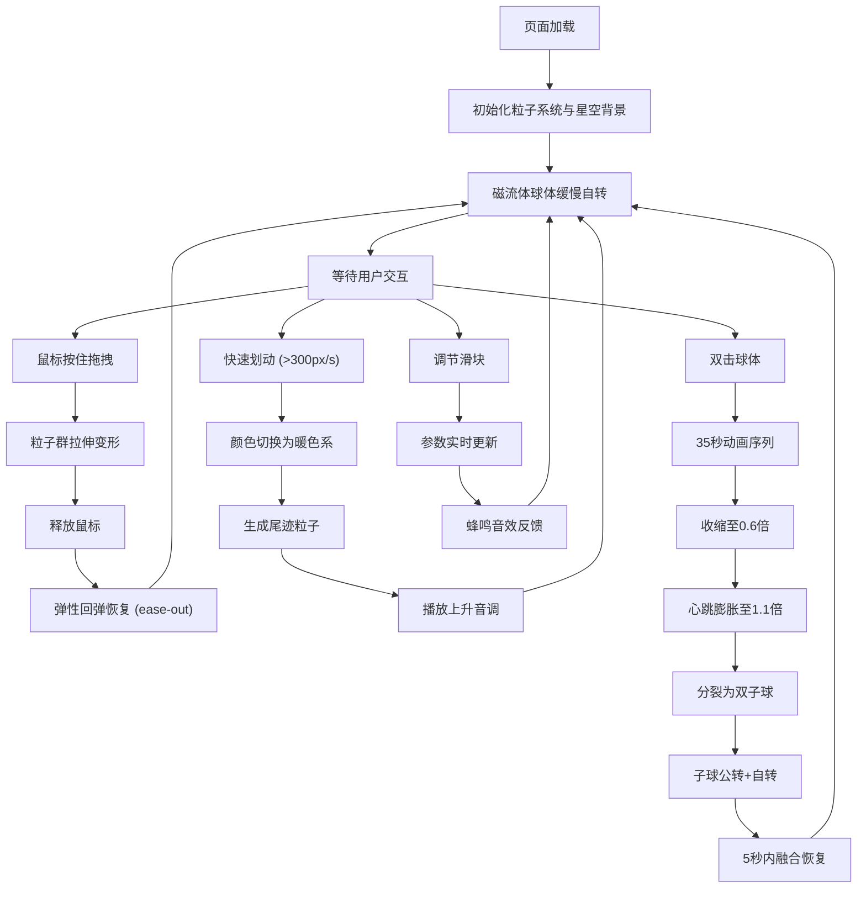

## 1. 产品概述

一款基于浏览器的交互式磁流体雕塑数字艺术应用，用户通过鼠标手势操控太空中的虚拟磁流体形态，产生沉浸式视觉与听觉反馈的创意体验。

- 核心目的：提供通过自然手势操控抽象流体形态的创意体验，填补浏览器中缺乏此类沉浸式交互艺术的空白
- 目标用户：数字艺术爱好者、创意设计师、寻求放松体验的普通用户
- 市场价值：浏览器即可运行的低门槛创意艺术体验，可用于展示、冥想、创意激发等场景

## 2. 核心功能

### 2.1 用户角色

| 角色 | 注册方式 | 核心权限 |
|------|----------|----------|
| 访客用户 | 无需注册 | 完整使用所有交互功能、调整参数 |

### 2.2 功能模块

1. **磁流体粒子系统**：500-800个动态粒子构成球状磁流体，带光晕效果，粒子间网状连接线
2. **手势交互系统**：鼠标拖拽拉伸、快速划动触发特效、双击触发动画序列
3. **视听反馈系统**：颜色渐变切换、尾迹粒子效果、Web Audio合成音效
4. **参数控制面板**：连接线粗细、回弹速度、尾迹数量三个可调节滑块
5. **星空背景系统**：动态闪烁的深空背景，增强沉浸感

### 2.3 页面详情

| 页面名称 | 模块名称 | 功能描述 |
|----------|----------|----------|
| 主页面 | 磁流体球体 | 500-800粒子构成直径约300px球体，淡蓝色光晕，10秒自转周期 |
| 主页面 | 粒子连接线 | 半透明浅蓝紫色细线随机连接，随手势变化数量与颜色 |
| 主页面 | 拖拽交互 | 按住左键拖拽粒子群跟随拉伸，最长1.5倍直径，释放后ease-out回弹 |
| 主页面 | 划动特效 | 速度>300px/s时切换暖色系，生成尾迹粒子，播放上升音调 |
| 主页面 | 双击动画 | 35秒序列：收缩→心跳膨胀→分裂双子球→公转→融合恢复 |
| 主页面 | 控制面板 | 右下角悬浮毛玻璃面板，三个滑块调节参数，带蜂鸣音效 |
| 主页面 | 星空背景 | 100颗随机大小白点，1-3秒闪烁周期，深空紫到墨黑渐变 |

## 3. 核心流程

用户进入页面后，中央显示缓慢自转的磁流体球体，背景为闪烁星空。用户可通过鼠标进行各种交互操作：
- 悬停观察球体自转与粒子流动
- 按住拖拽体验磁力牵引拉伸效果
- 快速划动触发颜色变化与尾迹特效
- 双击触发完整动画序列
- 通过右下角滑块调整视觉参数

## 4. 用户界面设计

### 4.1 设计风格

- **设计风格**：暗色调科幻风格，深空主题，未来感与有机流体形态结合
- **主色调**：深空紫 (#1a1a2e) → 墨黑 (#0d0d1a) 渐变背景
- **强调色**：冷色模式 #00d4ff（青蓝色发光），暖色模式 #ff6b35 → #ffd700（橙红到金黄）
- **粒子色**：默认淡蓝紫光晕，划动时橙红到金黄渐变
- **连接线**：浅蓝紫色，半透明
- **文字色**：#00d4ff 发光文字，带辉光效果
- **面板样式**：半透明毛玻璃背景 (rgba(0,0,0,0.5))，圆角10px，弱阴影
- **字体**：现代无衬线字体，科技感与可读性平衡
- **动效**：所有交互带0.2-0.5秒平滑过渡，无突兀跳变

### 4.2 页面设计概述

| 页面名称 | 模块名称 | UI元素 |
|----------|----------|--------|
| 主页面 | 磁流体球体 | 中央70%视口宽度，300px直径，粒子带1.5px淡蓝色光晕，缓慢自转 |
| 主页面 | 边框装饰 | 15px深色渐变边框 (#1a1a2e → #16213e) |
| 主页面 | 星空背景 | 100颗1-3px白点，随机闪烁，渐变背景 |
| 主页面 | 连接线网络 | 0.5px线宽，透明度0.3，浅蓝紫色，随机连接 |
| 主页面 | 控制面板 | 右下角悬浮，150x200px，毛玻璃效果，z-index最高 |
| 主页面 | 滑块组件 | 三个垂直排列滑块，#00d4ff色系，发光描边 |
| 主页面 | 尾迹粒子 | 8px→2px渐变缩小，1秒内淡出消失 |

### 4.3 响应式设计

- **桌面端 (>768px)**：磁流体占中央70%视口宽度，控制面板悬浮右下角（150x200px）
- **移动端 (≤768px)**：磁流体缩放至90%视口宽度，控制面板移至底部并横向排列
- **触摸优化**：支持触摸拖拽操作，调整手势识别阈值适应移动端

### 4.4 性能指标

- 拖拽操作时帧率不低于 50fps
- 尾迹粒子生命周期计算开销增加不超过 5%
- 滑块调整后画面响应时间不超过 100ms
