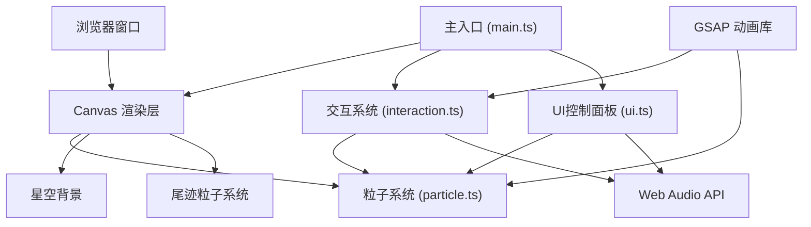

## 1. 架构设计



## 2. 技术描述

- **前端框架**：原生 TypeScript + HTML5 Canvas（无UI框架）
- **构建工具**：Vite 5.x
- **动画库**：GSAP 3.x（用于缓动动画、时间线控制）
- **音频系统**：Web Audio API（原生，合成音效）
- **项目初始化**：Vite vanilla-ts 模板

## 3. 项目文件结构

| 文件路径 | 职责描述 |
|----------|----------|
| /package.json | 项目依赖配置（typescript、vite、gsap） |
| /index.html | 入口页面，Canvas元素占满全屏 |
| /vite.config.js | Vite构建配置，开发服务器端口3000 |
| /tsconfig.json | TypeScript配置，严格模式，ES模块目标 |
| /src/main.ts | 主入口，初始化Canvas、各模块、事件监听、主循环 |
| /src/particle.ts | 粒子类定义，粒子系统管理，连接线渲染 |
| /src/interaction.ts | 鼠标/触摸事件处理，手势识别，粒子变形驱动 |
| /src/ui.ts | 控制面板UI组件，滑块交互，参数同步 |

## 4. 核心模块设计

### 4.1 粒子系统模块 (particle.ts)

**Particle 类**
```typescript
class Particle {
  x: number;          // 当前x位置
  y: number;          // 当前y位置
  ox: number;         // 原始x位置（球体上的基准点）
  oy: number;         // 原始y位置
  vx: number;         // x方向速度
  vy: number;         // y方向速度
  radius: number;     // 粒子半径
  color: string;      // 当前颜色
  baseColor: string;  // 基础颜色
  glowSize: number;   // 光晕大小
  life: number;       // 生命值（尾迹粒子用）
  maxLife: number;    // 最大生命值
}
```

**ParticleSystem 类**
```typescript
class ParticleSystem {
  particles: Particle[];         // 主粒子数组
  trailParticles: Particle[];    // 尾迹粒子数组
  centerX: number;               // 球心X
  centerY: number;               // 球心Y
  baseRadius: number;            // 球体基准半径
  rotation: number;              // 当前旋转角度
  rotationSpeed: number;         // 自转速度
  connectionWidth: number;       // 连接线粗细
  trailCount: number;            // 尾迹粒子数量
  bounceDuration: number;        // 回弹时长
  isWarmMode: boolean;           // 是否暖色模式
  colorTransition: number;       // 颜色过渡进度 0-1

  init(count: number): void;
  update(dt: number): void;
  render(ctx: CanvasRenderingContext2D): void;
  applyStretch(targetX: number, targetY: number, intensity: number): void;
  bounceBack(): void;
  spawnTrail(x: number, y: number, count: number): void;
  triggerSplitAnimation(): void;
  setConnectionWidth(width: number): void;
  setBounceDuration(seconds: number): void;
  setTrailCount(count: number): void;
}
```

### 4.2 交互模块 (interaction.ts)

**InteractionManager 类**
```typescript
class InteractionManager {
  canvas: HTMLCanvasElement;
  particleSystem: ParticleSystem;
  audioManager: AudioManager;
  
  isDragging: boolean;
  lastMouseX: number;
  lastMouseY: number;
  lastMoveTime: number;
  velocityX: number;
  velocityY: number;
  speedThreshold: number;  // 300px/s
  
  onMouseDown(e: MouseEvent): void;
  onMouseMove(e: MouseEvent): void;
  onMouseUp(e: MouseEvent): void;
  onDoubleClick(e: MouseEvent): void;
  calculateSpeed(): number;
  handleFastSwipe(): void;
}
```

**AudioManager 类**
```typescript
class AudioManager {
  audioContext: AudioContext;
  masterGain: GainNode;
  
  playSwipeSound(): void;      // 划动上升音调 220Hz→880Hz, 0.3s
  playSliderBeep(): void;      // 滑块蜂鸣音效
  init(): void;
}
```

### 4.3 UI模块 (ui.ts)

**ControlPanel 类**
```typescript
class ControlPanel {
  container: HTMLElement;
  particleSystem: ParticleSystem;
  audioManager: AudioManager;
  
  connectionWidthSlider: HTMLInputElement;
  bounceDurationSlider: HTMLInputElement;
  trailCountSlider: HTMLInputElement;
  
  createSlider(label: string, min: number, max: number, value: number, step: number): HTMLInputElement;
  onConnectionWidthChange(value: number): void;
  onBounceDurationChange(value: number): void;
  onTrailCountChange(value: number): void;
  init(): void;
}
```

## 5. 动画序列设计

### 5.1 双击35秒动画序列 (GSAP Timeline)

```
0s - 3s:    收缩至0.6倍大小 (ease-in-out)
3s - 5s:    心跳膨胀至1.1倍 (elastic-like pulse)
5s - 8s:    分裂为两个子球体，各含一半粒子
8s - 30s:   子球体各自自转 + 围绕中心公转
30s - 35s:  5秒内融合回原球体，恢复默认颜色和旋转
```

### 5.2 回弹动画

使用 GSAP 的 ease-out 缓动，时长由滑块控制（1-3秒），粒子从拉伸位置平滑过渡回原始球体位置。

## 6. 性能优化策略

1. **Canvas 分层**：星空背景使用离屏Canvas预渲染，降低重绘开销
2. **粒子池化**：尾迹粒子使用对象池复用，避免频繁GC
3. **距离检测优化**：连接线使用网格空间划分，减少 O(n²) 计算
4. **帧率控制**：使用 requestAnimationFrame，根据性能动态调整粒子数
5. **尾迹生命周期**：统一在一次循环中更新所有尾迹，批量渲染

## 7. 响应式适配

| 断点 | 磁流体尺寸 | 控制面板布局 |
|------|-----------|-------------|
| >768px | 视口宽度70% | 右下角悬浮，纵向排列 (150×200px) |
| ≤768px | 视口宽度90% | 底部横向排列 |

通过 `window.matchMedia` 监听视口变化，动态调整Canvas尺寸和粒子系统参数。
