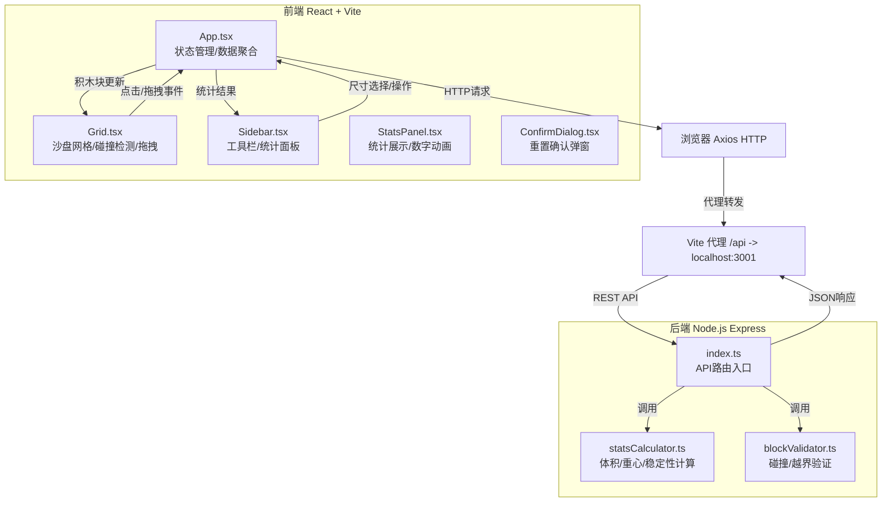
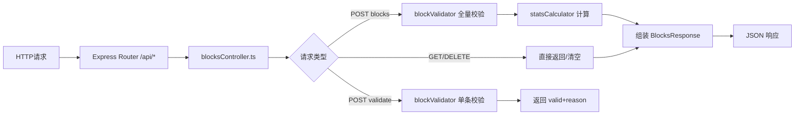
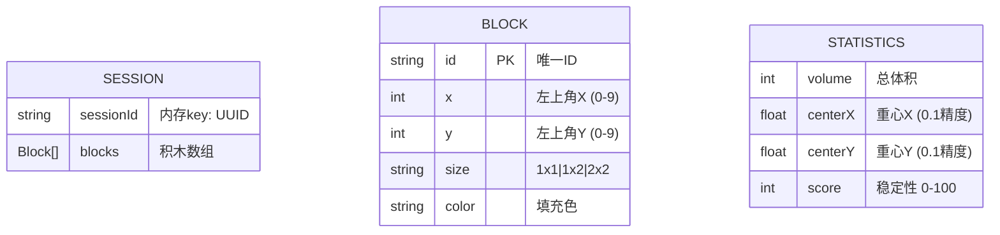

# 积木·平衡大师 技术架构文档

## 1. 架构设计



**文件调用关系与数据流向**：
1. 用户交互 → Grid.tsx（鼠标点击/拖拽/滚轮） → 事件回调 → App.tsx
2. App.tsx 更新 blocks 状态 → 验证合法性 → Axios POST /api/blocks → Express
3. 后端 index.ts → 接收 blocks 数组 → statsCalculator 计算 → 返回 Statistics
4. App.tsx 接收 Statistics → 传递给 Sidebar/StatsPanel → 动画渲染

## 2. 技术选型说明

| 层级 | 技术栈 | 版本 | 说明 |
|------|--------|------|------|
| 前端框架 | React | 18.x | Hooks API，函数式组件 |
| 前端构建 | Vite | 5.x | HMR热更新，开发/生产构建 |
| 语言 | TypeScript | 5.x | 严格模式 strict: true |
| HTTP客户端 | Axios | latest | 请求封装，错误处理 |
| 动画库 | GSAP | latest | 工具图标平滑缩放，0.3s ease-out |
| 样式方案 | SASS | latest | SCSS模块化，变量系统，响应式mixins |
| 后端框架 | Express | 4.x | RESTful API服务 |
| 后端TS运行 | ts-node-dev | latest | 开发热重载 |
| 跨域 | cors | latest | 生产部署/开发跨域支持 |

## 3. 项目结构与路由

### 3.1 目录结构

```
auto142/
├── package.json              # 前后端统一依赖 + 脚本
├── vite.config.js            # Vite配置 + /api代理
├── tsconfig.json             # 前端TS配置（clientRoot）
├── tsconfig.server.json      # 后端TS配置（serverRoot）
├── index.html                # Vite入口HTML
│
├── src/
│   ├── client/               # 前端源码
│   │   ├── main.tsx          # React挂载入口
│   │   ├── App.tsx           # 主组件、全局状态、API调用
│   │   ├── Grid.tsx          # 沙盘网格、积木渲染、碰撞/拖拽
│   │   ├── Sidebar.tsx       # 工具栏、尺寸选择器、操作按钮
│   │   ├── StatsPanel.tsx    # 统计面板、数字动画
│   │   ├── ConfirmDialog.tsx # 重置确认对话框
│   │   ├── types/
│   │   │   └── index.ts      # 类型定义（Block/Statistics/Size）
│   │   ├── hooks/
│   │   │   └── useApi.ts     # Axios封装Hook
│   │   └── styles/
│   │       ├── variables.scss  # 色板/尺寸变量
│   │       ├── global.scss     # 全局样式重置
│   │       ├── grid.scss       # Grid组件样式
│   │       ├── sidebar.scss    # Sidebar/统计样式
│   │       └── animations.scss # 动画keyframes/mixins
│   │
│   └── server/               # 后端源码
│       ├── index.ts          # Express启动、API路由定义
│       ├── controllers/
│       │   └── blocksController.ts  # 请求处理层
│       ├── services/
│       │   ├── statsCalculator.ts   # 统计计算服务
│       │   └── blockValidator.ts    # 验证服务
│       └── types/
│           └── index.ts      # 服务端类型定义
│
└── public/
    └── favicon.ico           # 站点图标
```

### 3.2 前端路由
单页面应用，无多路由。所有功能聚合在首页根路由 `/`。

## 4. API定义

### 4.1 类型定义（TypeScript）

```typescript
// src/client/types/index.ts
export type BlockSize = '1x1' | '1x2' | '2x2';

export interface Block {
  id: string;
  x: number;         // 左上角格子X（0-9）
  y: number;         // 左上角格子Y（0-9）
  size: BlockSize;
  color: string;     // 放置时指定填充色
}

export interface Statistics {
  volume: number;     // 总体积（1x1=1, 1x2=2, 2x2=4）
  centerOfMass: {
    x: number;        // 重心X，精确0.1（0-9范围）
    y: number;        // 重心Y，精确0.1
  };
  stabilityScore: number; // 0-100
}

export interface BlocksResponse {
  success: boolean;
  data: {
    blocks: Block[];
    statistics: Statistics;
  };
  message?: string;
}
```

### 4.2 REST API接口

| 方法 | 路径 | 用途 | 请求体 | 响应 |
|------|------|------|--------|------|
| GET | `/api/blocks` | 获取当前所有积木 + 统计 | - | `BlocksResponse` |
| POST | `/api/blocks` | 全量更新积木（放置/删除/拖拽后） | `{ blocks: Block[] }` | `BlocksResponse` |
| POST | `/api/blocks/validate` | 预校验放置/移动合法性 | `{ blocks: Block[], candidate: Block, excludeId?: string }` | `{ valid: boolean, reason?: string }` |
| DELETE | `/api/blocks` | 重置清空所有积木 | - | `BlocksResponse` |
| POST | `/api/statistics` | 单独重新计算统计 | `{ blocks: Block[] }` | `{ success: boolean, data: Statistics }` |

### 4.3 请求/响应示例

**POST /api/blocks**
```json
{
  "blocks": [
    { "id": "b1", "x": 2, "y": 3, "size": "1x1", "color": "#a3c8ff" },
    { "id": "b2", "x": 5, "y": 5, "size": "2x2", "color": "#a3c8ff" }
  ]
}
```

**Response 200 OK**
```json
{
  "success": true,
  "data": {
    "blocks": [ ... ],
    "statistics": {
      "volume": 5,
      "centerOfMass": { "x": 4.4, "y": 4.6 },
      "stabilityScore": 87
    }
  }
}
```

## 5. 服务端架构



**服务分层**：
- **Controller层（blocksController.ts）**：解析请求、参数校验、调用Service、响应格式化
- **Service层**：
  - `statsCalculator.ts`：体积累加、加权重心、稳定性算法
  - `blockValidator.ts`：越界检测、碰撞检测、尺寸展开计算

**稳定性评分算法**：
- 沙盘几何中心 = (4.5, 4.5)（索引0-9，共10格）
- 重心与中心欧氏距离 D = sqrt((cx-4.5)² + (cy-4.5)²)
- 最大可能距离（对角）= sqrt((9)² + (9)²) / 2 ≈ 6.364
- 评分 = max(0, 100 × (1 - D / 6.364))
- 体积=0时评分为0（空沙盘无意义）

## 6. 数据模型

### 6.1 内存数据结构（服务端无持久化）



**注**：服务端采用内存存储（简化版单用户模型），以进程级全局变量维护 blocks 数组。生产环境如需多用户支持可替换为 Redis/数据库 Session。

### 6.2 积木尺寸展开规则（碰撞/体积计算基础）

| size | 占用格子 (相对左上角) | 体积单位 |
|------|----------------------|---------|
| 1x1 | `[[0,0]]` | 1 |
| 1x2 | `[[0,0], [1,0]]`（横向占2格） | 2 |
| 2x2 | `[[0,0], [1,0], [0,1], [1,1]]` | 4 |

放置/移动合法性判定：展开后的每个格子必须同时满足：
1. X ∈ [0,9]，Y ∈ [0,9]（不出界）
2. 格子不被其他 Block 展开后占用（不重叠）

### 6.3 前端本地存储

- 浏览器刷新不丢失：可选 `localStorage.setItem('jimu-balancer-layout', JSON.stringify(blocks))`
- 导出文件：`layout.json` 格式 `{ version: '1.0', blocks: Block[], createdAt: ISOString }`
